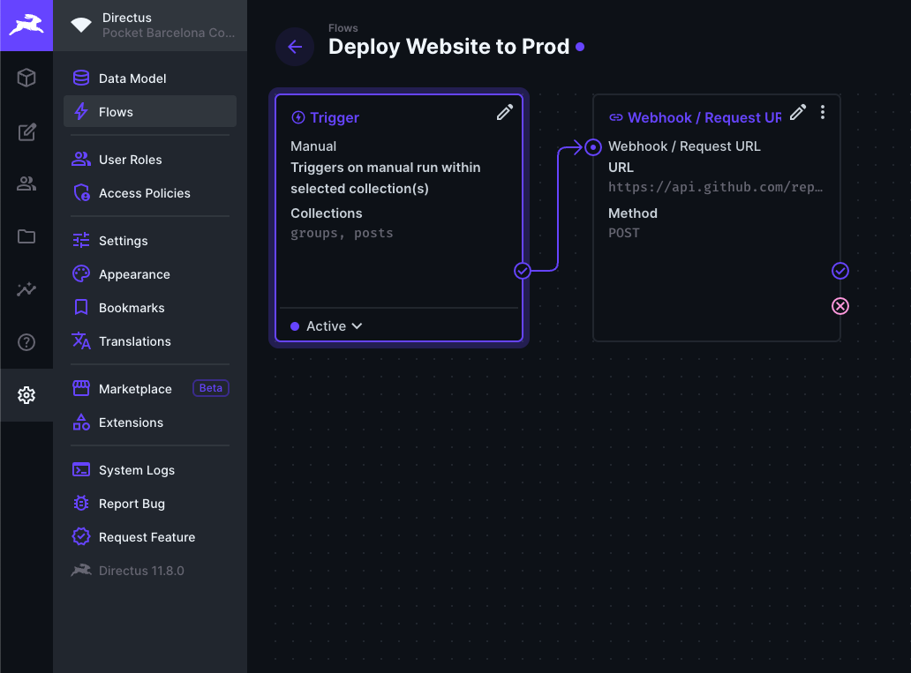
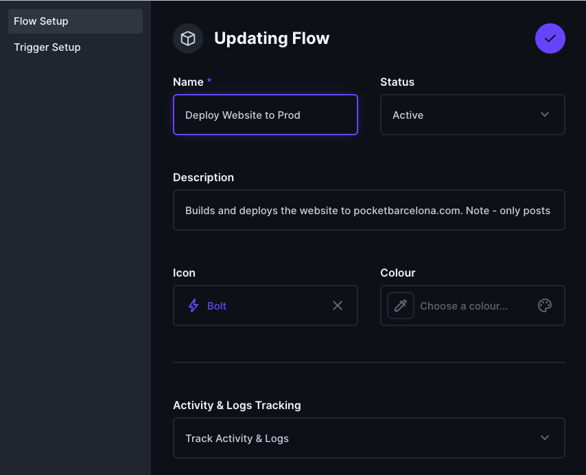
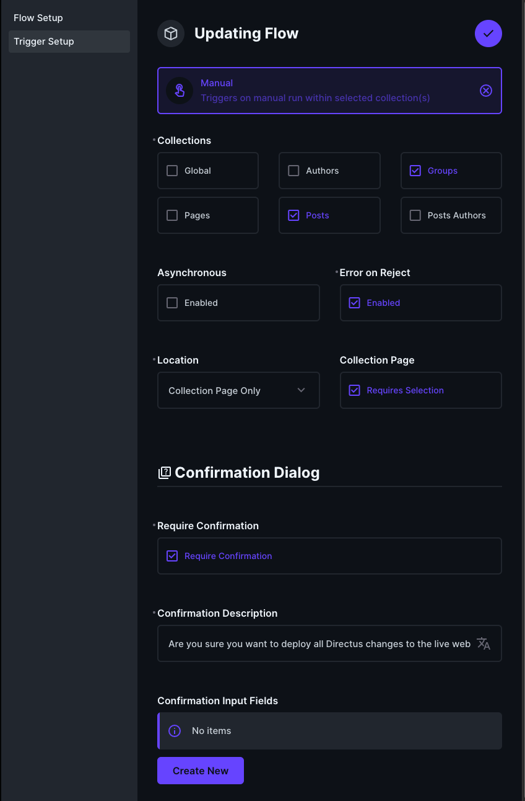
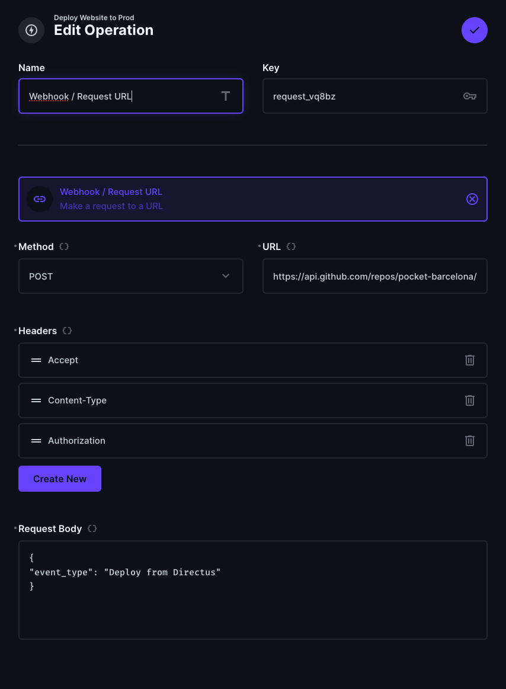

# How to setup a Directus Flow to deploy the website to Github Pages from Directus

More help here: https://github.com/directus/directus/discussions/12591

## Create github PAT (personal access token)
https://github.com/settings/apps


Go to **Directus -> Settings -> Flows**

Method: `POST`
URL: `https://api.github.com/repos/pocket-barcelona/bcn-english-speakers/dispatches`

Headers: (get Github PAT first)

```
Accept: application/vnd.github.v3+json
Content-Type: application/json
Authorization: token XXX
```

Request body:
```json
{
  "event_type": "Deploy from Directus"
}
```

## Screenshots




