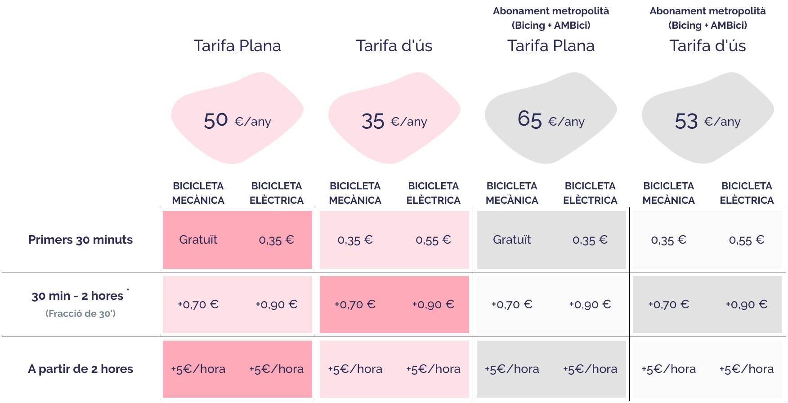
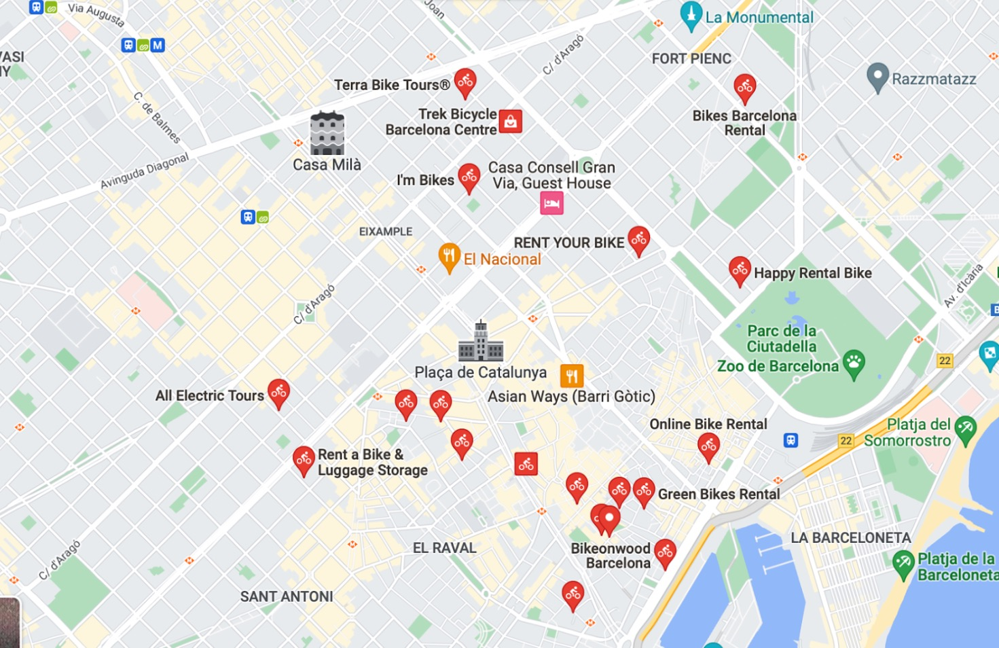

## Contents

## Big little city

Barcelona is a big little city, which makes it the kind of place where bands would stop on a world tour, but it’s small enough to walk around most of it in a day. Owing to its Mediterranean climate and 2,524 hours of sunshine each year (almost 7 hours a day), walking and cycling are pleasant experiences.

My recommended app for public transport is CityMapper (available on both Android and iOS) –– it covers all the different options to get around the city and if you set your Barcelona home location, it will quickly tell you the best ways to get back using all available transport methods. It is not Barcelona-specific and works in a number of other European cities.

The public transport in Barcelona is run by TMB (Transports Metropolitans de Barcelona), the local authority. The [TMB](https://www.tmb.cat/en/home) (Transports Metropolitans de Barcelona), which is the local authority for public transport. The [TMB website](https://www.tmb.cat/en/home) has route planners and details about the bus, rail, metro and other services (and has some limited English options).

Read more: [Barcelona transport cards](/blog/6-barcelona-travel-cards)

While it is nice to walk and cycle in the sunshine, there are plenty of other options to get you around the city, from buses, trains, and electric motos to the tram and metro –– so let's have a look at each option.

## Walking in Barcelona

As previously mentioned, Barcelona is a great city to walk around –– you can enjoy all the buildings and scenery without polluting the city, plus it's a chance to absorb some vitamin D!
  
Some of the more distant attractions like Park Güell, Sagrada Familia, Mt. Tibidabo, Montjuïc and the Fòrum might be a bit too far to walk to, but you can see most of the central attractions on foot. Barcelona caters well for pedestrians on the whole, with large pavements and other wide streets (Ramblas) which allow you to take in the architecture.

## Cycling in Barcelona

Getting around Barcelona by bike is an excellent experience. The biking infrastructure is getting better and better, with a large network of dedicated bike lanes along with abundant options for getting a bike. Apps like CityMapper or Google Maps show the fastest routes around the city using these lanes and paths, and in my experience, unless it is over a 1-hour walk away, cycling is the best and fastest way to get around.

There are several options to get bikes in Barcelona, and which you choose depends on your length of stay and other factors. There are many e-bike options as well if you want to get around with less effort (important in the summer months as it is often too hot in the daytime to get anywhere without working up a sweat).

### Bicing

For long-term stays, you are best to get [Bicing](https://www.bicing.barcelona/es/) (website in ES/CAT only), which is the city bike scheme administered by the local government (TMB). [AMBici](https://www.ambici.cat/en/) is the metropolitan version introduced in early 2023, covering areas like L'Hospitalet de Llobregat, Sant Boi, Badalona, Castelldefels, etc. Here are the prices (updated Jan 2024):

The city has more than 500 Bicing stations; at each station, mechanical and electric bikes are available for rent. You can either use the SMOU application to unlock bikes or they will send you a physical card. To sign up, you will need a DNI or NIE/TIE, as the system is intended for residents only.

The SMOU app works reasonably well on both Android and iOS and also allows you to reserve a bike for 5 minutes. If the station at your destination is full, you can get an additional 10 minutes for free to find another space. CityMapper works well with Bicing to show you local stations’ availability and also the availability at your destination.

I use Bicing most days as a resident and it is usually the best way to get around for anything more than a 10 to 15-minute walk.

### Bike Rental

Like most cities, there are dozens of places offering bike rentals in Barcelona. The prices are very reasonable and the bikes are usually well-maintained. You’ll find several traditional rental stores dotted around the city, and prices usually go from €5 an hour to around €30 per day, depending on the type of bike you hire.

There are also a number of app-based transportation solutions that offer bikes or e-bikes on a per-minute basis. These include:

[Cooltra](https://cooltra.com/en/rent-by-minutes-hours/) offers e-bikes and electric motos all around the city. Their app is on iOS and Android and is available in English. They charge by the minute (€0.17 for a basic bike, €0.26–€0.28 for a moto) or you can have unlimited use for 8 hours (€19), 24 hours (€29) or 48 hours (€39).

[Yego](https://en.rideyego.com/how-it-works/barcelona) offers e-bikes and electric motorbikes in a jaunty green colour, which can be found and unlocked using their app. You pay by the minute (€0.32), or you can purchase various packages which save you a bit of money.

[Donkey Republic](https://www.donkey.bike/cities/bike-rental-barcelona/) also has numerous bikes dotted around the city and an app available in English. They offer rentals for a monthly membership fee, by the day (€16), or for shorter periods starting from as little as €1.70 for 15 minutes. Their full pricing system is available in the app. Donkey Republic is not just in Barcelona, so if you have a membership in your home city, then you will be able to use the bike system here, too.

[Kleta](https://www.kleta.com) offers bike rental by the month in Barcelona for both mechanical and e-bikes, with prices starting from less than €20 per month based on a regular bicycle on a 12-month subscription.

[RideMovi](https://www.ridemovi.com) is another app for bikes and e-bikes as well as e-scooters. As they operate in several cities across Europe, the price list varies by location and type, so you have to download the app to view costs.

## Public Transport

The city has a well-developed public transport network that includes buses, trams, and a funicular railway. The transportation system in Barcelona is operated by Transports Metropolitans de Barcelona (TMB) and integrated with the metro, allowing passengers to use the same tickets and passes on all modes of transport.

The [bus](#bus) network in Barcelona covers the entire city and its suburbs, with over 140 lines. Many of the bus lines also run 24 hours a day, making them a convenient option for getting around at night.

The [tram](#tram) network in Barcelona consists of 4 lines that serve the city centre and the suburbs. Trams are a popular option for tourists as they offer a scenic way to see the city, with many of the tram routes passing through popular landmarks and neighbourhoods.

The funicular railway in Barcelona connects the city centre with the Montjuïc hill, providing access to popular attractions such as the Montjuïc Castle and Poble Espanyol.

In addition to the metro, bus, tram, and funicular railway, the city of Barcelona also has several suburban railways that serve the metropolitan area. These include the Ferrocarrils de la Generalitat de Catalunya (FGC) and the Renfe (Spanish National Railways).

Overall, the public transportation system in Barcelona is comprehensive and efficient, making it easy for visitors and residents to get around the city and its surroundings.

### Metro

The Barcelona [metro](https://www.tmb.cat/en/barcelona-transport/map/metro) is a rapid transit system that serves the city of Barcelona and its metropolitan area in Spain. It is operated by the TMB and is one of the busiest and most extensive metro systems in Europe. A single ticket is €2.40 and is valid for 30 minutes from first entrance usage.

The network has eight lines that are colour-coded for easy identification, and you can find a map [here](https://www.tmb.cat/documents/20182/96078/Plànol+xarxa+de+Metro/f5578f40-5a66-46ba-907c-cf31e0d368c0). The lines are:

* L1 (Red)
* L2 (Purple)
* L3 (Green)
* L4 (Yellow)
* L5 (Blue)
* L9 (Orange)
* L10 (Light Blue)
* L11 (Light Green)

The metro lines serve the city centre as well as the suburbs, with stops at major landmarks and attractions such as the Sagrada Família, Park Güell, and the beach. The metro runs from 5:00 am to midnight (and [later on weekends and holidays](https://www.tmb.cat/en/barcelona/operating-hours-metro-bus)), with trains arriving every few minutes during peak hours.

Barcelona also has a network of buses, trams, and a funicular railway that connects the city centre with the Montjuïc hill. Several suburban railways serve the metropolitan area, too.

As you can see, the Barcelona metro is a convenient and efficient way to get around the city and its surroundings.

### Bus

The [bus network](https://www.tmb.cat/en/barcelona/buses/lines) in Barcelona is a comprehensive and efficient system that serves the city and its suburbs. It is also operated by Transports Metropolitans de Barcelona (TMB) and integrated with the metro, so you can use the same tickets and passes on both modes of transportation. A single ticket is €2.40 if you don't have a pass, and the buses accept cash and contactless payments.

There are over 140 bus lines in the Barcelona bus network, with many running 24 hours a day. Once again, the bus lines serve all areas of the city and its suburbs, with stops at major landmarks and attractions.

The buses in Barcelona are modern and comfortable, with many equipped with air conditioning and low floors for easy accessibility. Most of the buses also have free Wi-Fi, making them a convenient option for travellers who need to stay connected while on the go.

In addition to the regular bus lines, Barcelona also has a network of tourist buses that offer hop-on, hop-off services. These buses are a popular option for tourists as they allow passengers to see the city at their own pace and visit the main landmarks and attractions.

### Tram

The [tram](https://www.tram.cat/en) is probably the method I use the least in Barcelona –– but it serves its purpose on occasion and is a quite cool way to travel. Right now there are two main lines and they are not connected, though there are plans to join them in the next few years. You can find a [map of the tram network here](https://www.tram.cat/cms/media/3290/atm_glob_octubre_2021.pdf) .

It is useful if you are at an event at Port Forum (like Primavera Sound) and need to get back to one of the main stations (like Plaça Glories), and you can use any transport card to get around on them. A single ticket, like the bus, metro and train in zone one, is €2.40.

### Motos

One of the things I love about Barcelona is the ease of getting around the city. This has been made even easier due to the abundance of electric motos, which are pretty much available in most places at most times and are a cost-effective way of getting around the city (more so if there are two of you). You download the app, send them a copy of your driving licence for validation, find a bike, get your helmets and go! Just be mindful that there are zones where these biomes are allowed. These cover most of the city, but please check beforehand.

You can park a moto in a few different places in Barcelona, but it's always best in a designated space to ensure you don't get a ticket. Parking is possible on pavements and other areas, but it's not so cut and dry in my opinion –– so much so that they have a PDF you can check all the [rules on here](https://areaverda.cat/sites/default/files/fitxer_estatic/Flyer-motos-voreres-eng-interactiu.pdf).

Several companies offer this service, and new ones come and go all the time, so here is my pick of them. Note these are all my own affiliate links and you get some free minutes/credit for using them, which is better than just signing up (however, it's not hard to remove it, so feel free to do so if you like).

Most of them work out between €0.25–€0.30 per minute, but it's worth buying bundles if you are staying in Barcelona for some time.

[Acciona](https://acciona-motosharing.onelink.me/8HVM/e50d02fb) - My favourite. The bikes are fast and there are a lot of them. Some good offers for minute packs and the bikes themselves are well-built.

[Cooltra](https://cooltra.com/) - Functional bikes, not really very fast (which is mostly fine). Also has some decent offers for minute packs at various times of the year.

[Yego](https://www.yego.mobi/deeplink/coupon/CDBIIGHGDP) - Jaunty green bikes that are slow but comfortable and just about get the job done (and each bike has its own name, which is unique). Tip: Never go as a two and try to get up the hills in Gracia, you will be faster walking.

### Electric Scooters

By these, I mean the things that you stand up on (and the version with an electric motor). There are a couple of e-scooter options in Barcelona that you activate with an app, or you can hire them for an hour or longer at most of the bike rental stores.

### Taxis

I am not a fan of taxis in Barcelona. I have been overcharged many times when they realised that I am a foreigner, and some are not very clean. But compared to other cities, they are not bad value when they are not trying to squeeze more money out of you. If you have to get a taxi, it is worth knowing the following:

* Airport taxis run on somewhat fixed prices, costing around €35 from T1 to Plaça de Catalunya. They are readily available at the airport taxi rank.
* Uber is in Barcelona, but in a limited capacity, which makes it quite useless as there are just not enough cars right now. Don't expect this to change anytime soon as the taxi drivers just protest and then protest some more until they get their own way (and block the streets and attack rival drivers, but that's another story).
* Cabify, however, is like Barcelona’s Uber –– the cars are modern and clean and the entire service is very professional. Highly recommended, but you need to have the app for a certain amount of time before you can use it (because, well, taxi drivers protested…) so get it installed before you travel.
* You can also use the app FreeNow, which is like a not-so-good Uber. The drivers get reviewed, the route they are taking is clear, and it runs either on a fixed charge or by the meter. You can pre-book at certain hours, too. There is also no surge pricing, and it uses the existing Barcelona taxi network. 

### Train

There is a rail network that goes out of most directions in Barcelona. Generally, it is not that useful because the metro is much better and the trains are infrequent. However, there are some exceptions. There is a direct train from Passeig de Gracia and Sants that terminates at the airport (Terminal 2), on which you can use your T-Casual. They are only once every 30 minutes, but this is easy enough to plan around and it will get you to the airport in 20-30 minutes. 

Tickets are cheap compared to other cities, and you can go and visit some cool neighbouring towns to get to quieter beaches during the summer.

There is also a ski train that offers both a ski pass and transport to the closest resort, which costs about €45 and goes from Plaça d'Espanya.

Most trains in Barcelona go into Sants (like to Madrid), with some regional ones going into Estació de França, Estación Nord and Plaça d'Espanya.
