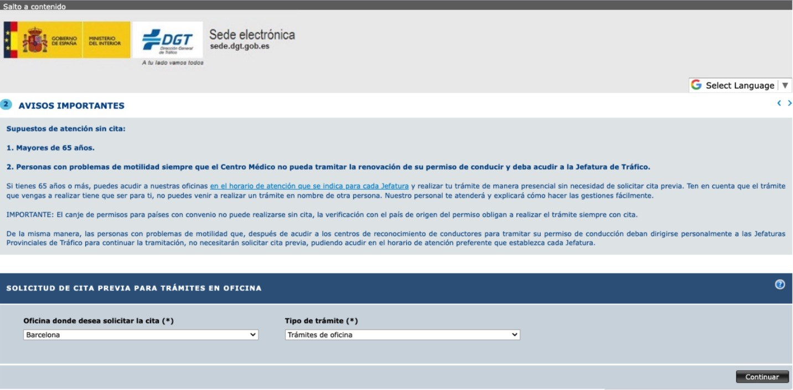

## Contents

## Who is it for?

This guide is intended for people who have a UK driving licence and would like to exchange it for a Spanish one in accordance with the new UK-Spain governmental agreements dated 16th March 2023. More information can be found here: <a href="https://www.gov.uk/guidance/living-in-spain#driving-in-spain" target="_blank">https://www.gov.uk/guidance/living-in-spain#driving-in-spain</a>.

Note: **The below is the process that I took and you should use it as a guide only, making sure to adapt it to your specific case.**

## The Process

In order to change your UK driving licence into a Spanish one, we have broken the process into 3 parts:

1. The medical test (“Psicotécnico prueba para conducir”)
2. Obtaining the “Check code” from the UK DVLA
3. Doing the final exchange of the UK to Spanish licence

-----

## Part 1 - The medical test (Psicotécnico prueba)

**Documents you will need:**

- ID: Passport
- TIE/NIE (passport might be enough)
- Original UK Licence
- A PDF of the confirmed “cita previa” for the medical test. This can be in digital format on your phone or printed.

<a href="https://www.cmurquinaona.com/certificados-medicos/canje-carnet-conducir/" target="_blank">You can make a *cita previa* here</a>

Note: ***It could be possible to get one for the same day, or at least within a few days. I did mine in the afternoon, but they’re open during normal business hours. It is also possible to phone the office and ask them if you have a specific question.***

**Price**: €50 (paid by card or cash)

The address of where I went is here: ***Centre Mèdic Urquinaona, C/ de Fontanella, 20, 08010 Barcelona*** (https://www.cmurquinaona.com/) There is more than one office, though, and there are lots near to the DGT office on Gran Via.

During the test you will speak to the nurse/doctor about:

- Your height, your weight, and your general health
- How much you smoke/drink per week (e.g. at the weekends)
- They will take your blood pressure
- They will ask basic medical questions, like if you take medication or have any known health conditions, etc.
- If you wear glasses, they will check your eyesight by reading the letters on the wall. They will also probably ask you to identify the colours of red, yellow, and green.

Next, you will see the psychologist where you will do a hand/eye coordination test.

- First, you will have a quick practice before doing the real test
- For the real test, you will need to coordinate two dots inside a channel on a primitive computer game-type console. The test takes about 2 minutes.

After you pass this, they will stamp your certificate and you will pay the €50. Note: the certificate is valid for 3 months.

## Part 2 - Obtaining the “Check Code”

In order for Spain to officially look up your UK driving details, they need this code. <a href="https://www.gov.uk/view-driving-licence" target="_blank">You can get the code here</a>.

**Documents you will need:**

- Your driving licence number
- Your national insurance number for the UK
- The postcode on your driving licence

This is relatively quick and you need to download the document and print it for step 3 below. You can also do this before the medical, if you like.

## Part 3 - Exchanging your UK licence card for a Spanish one

First, make sure you have your medical certificate and UK DVLA check code (read above)

### Headshots

You will need to get some photos taken for your new licence. I went here:

Address: Fotos a l'instant, C/ de Trafalgar, 1, 08010 Barcelona

**Price**: About €5-6.

This will take you about 10 minutes and you can just walk in. You will get 4 passport-style photos. There are, of course, many photo booths around in certain metro stations, as well as shops which offer this service.

### Exchange Cita Previa

Next, create a “cita previa”. You need to create a cita for a “tramites de oficina”. <a href="https://sedeclave.dgt.gob.es/WEB_NCIT_CONSULTA/solicitarCita.faces" target="_blank">Here's the link</a>.

The website is not reliable, so you will need to keep trying! Once you get one, it will likely be in the next few days, or tomorrow at the earliest. You can get the cita at Barcelona or Sabadell. The Barcelona office is bigger but the Sabadell office might be more laid back.

Then, you need to print this form - Solicitud de canje - “Trámites de conductores”
<a href="https://sede.dgt.gob.es/sede-estaticos/Galerias/modelos-solicitud/03/Mod.03-ES.pdf" target="_blank">Link here</a>.

**Be sure to check “canje” halfway down the page!**

 

**Documents you will need (could depend on your case):**

- Printed “Trámites de conductores” form (you can fill it in digitally and print it, or print it and fill it in with a pen!)
- Printed DVLA Check code (1 page)
- Optional: Printed Empadronamiento (I actually didn’t need this, but probably because my TIE has my address. If you don’t have TIE, then it might be necessary)
- TIE (don’t need empadronamiento) (If not TIE, you will need your NIE + Empadronamiento)
- A form of ID. (For me, I used my TIE, but I guess a passport would also work if you don’t have a TIE)
- The existing UK physical licence card
- The certificate that you got from the medical test (Psicotécnico prueba)
- At least 1 passport-style photo of yourself

<strong>Note</strong>: If you intend to get the International Driving Licence (IDL) so that you can drive in the UK or other European countries using your new Spanish licence, then you will need an additional photo of yourself for this document.

-----

### International Driving Licence (IDL)

Usually the IDL requires a separate “cita previa” but in my case the lady was accommodating in the Sabadell office and she asked me if I wanted an IDL, too. You could try to ask for it when you are in the BCN office and they might process it there and then. The IDL cost me €10,51 and is valid for 1 year. You should receive it on the spot, rather than in the post.

### The DGT office - Barcelona

The DGT office is here:
<a href="https://goo.gl/maps/UFtLApLVVo55JFg3A" target="_blank">Dirección General de Tráfico, Gran Via de les Corts Catalanes, 184, 08038 Barcelona</a> (15 minutes walk from Plaza de España).

<strong>Note</strong>: Arrive at the DGT office 15 minutes early as there will probably be a queue, but it doesn't seem to matter so much about the timing. Once you get the exchange done, you will concede your UK driving licence and you will receive a temporary Spanish driving licence, which is immediately valid. They will then send you the real Spanish licence in the post in approx 30-45 days. The exchange procedure will cost €28,87 and can be paid by cash or card.

---

## Bonus - Logging into the miDGT app on your smartphone

Once you have your licence you will be able to login and use the <a href="https://sede.dgt.gob.es/es/appmidgt/" target="_blank">miDGT app</a>. This app contains a digital version of your licence.

Once you've downloaded it, you will need to login using one of the methods, such as @Clave or a Digital Certificate.

To login using your Digital Certificate, which you must have previously obtained, you will need to import the certificate to your phone.

<strong>Note</strong>: To get a Digital Certificate you will need to arrange a _cita previa_ and go through that process first. In Spanish, do a search for this: "Certificado FNMT de Persona Física"

**Below is an example on the iPhone to illustrate the process:**

1. You first need to get the certificate file on to your iPhone. Locate your digital certificate file which you received or saved. One option is to email it to yourself as an attachment (mine was a `.p12` file but it could also be a `.pem` file possibly).
2. Then, download the certificate file to the **Files** app on your iPhone (the file can be in any folder).
3. Next go to **Files** and try to open it (iPhone will say "Profile Downloaded" - Review the profile in the Settings app if you want to install it).
4. Go to **Settings** -> **General** -> **VPN & Device Management**. You should see a downloaded profile. Action it, to install it. Note - it will probably ask for the password of the Digital Certificate.
5. Once it's installed, you will see the Configuration Profile section on the phone has your certificate installed.
6. Now, go to the **miDGT app** and choose login (the option will probably say Clave). In there, there is an option to login with your Digital Certificate and it should present you with the profile you just installed. You are now logged in!

