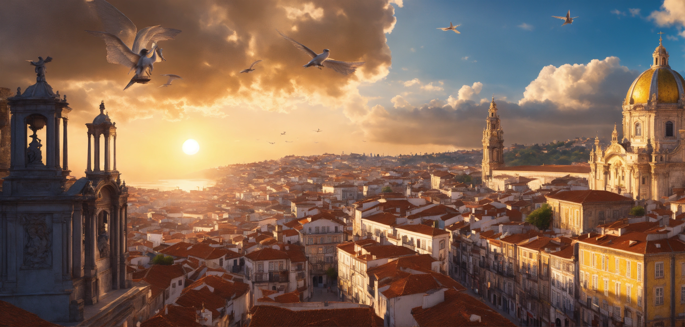

Mount Tibidabo offers incredible breathtaking views over Barcelona with its lofty viewpoints and a curiously placed theme park for children at the top. You will also find a Christ statue, in somewhat of a similar style to the “Christ the Redeemer” statue in Rio de Janeiro, although not as large by comparison, but spectacular nonetheless. While Tibidabo is a place for tourists, there are many ways in which one can enjoy the mountain and arrive at its summit.

## The essentials

Tibidabo is enjoyed by tourists and locals alike and also attracts walkers and cyclists and in general is accessible to all.

A standard tourist trip up Tibidabo should include a ride on the Tibidabo Tram followed by a steep ascend on the connecting Funicular cable train, dropping you off at the top of Tibidabo, literally right next to the [Temple Expiatori del Sagrat Cor](https://en.wikipedia.org/wiki/Temple_Expiatori_del_Sagrat_Cor) (church) and the entrance to the Tibidabo Amusement Park.

For those not interested in the amusement park, the Tibidabo Viewpoints alone and the Church will prove to be sufficiently interesting. Inside the church, you could also take the lift to the top and be met with an even higher viewpoint, at an impressive altitude of about 575m. As of 2023, this ticket will set you back €5 per person and there’s a lift that takes you up, leaving you with a staircase to the foot of Christ.

**Below are some detailed routes and how to approach Tibidabo.**

## Tourist Route

The classic tourist route to the top begins at Avenida Tibidabo, which is a short train journey from Plaza Catalunya (FGC L7 line, not the metro). At Plaça de Catalunya, you will find an entrance near to Cafe Zurich at the south-west side of the plaza. Note, you can use the standard **T-Casual** ticket for this trip, in case you were wondering!

When you reach Av. Tibidabo, you will cross the road ahead and should see the blue Tibidabo Tram. Tickets can be bought on board from the conductor and discounts are available in conjunction with Barcelona voucher books, e.g. €1 off. These books can usually be found at the tourist information in Plaça de Catalunya (or other packages such as the City Sightseeing Buses). The tram will then take you up the hill to the connecting funicular station. For those who prefer the walk, it’s a steady 15-20 minutes and relatively easy.

When you arrive at the funicular station, you can head inside and buy your funicular tickets at the kiosk. You will be getting a return ticket (‘ida y vuelta’, in Spanish - ‘there and back’. The tickets cost around €X for a return. The funicular will take you all the way to the top of the mountain, it’s that simple! To return, you simply do the route in reverse, or descend on one of the many hiking paths (more info below...)

Note: the route above is easy and accessible to all, offering minimal walking. If the tram is not running due to maintenance or weather conditions, there should be a replacement bus, or you can simply walk the tram route (I have walked it many times and had no problems!). Check the tram and funicular operating times before you leave, especially on festive holidays.

---

## Bus Route
Tibidabo is served by the TMB (Barcelona Metropolitan Transport) network and so it is possible to reach the summit with a standard T-Casual ticket (or equivalent), although not as obvious. The way to do it is to take the S1 or S2 FGC train to “Peu del Funicular” from Plaça de Catalunya, where you will change for the funicular at a station called “Vallvidrera Inferior” (which is basically at the same place as where the train drops you off. In fact, you won’t have to stamp your ticket again, just walk up the steps through the station!) You will be ascending to Vallvidrera Superior (the final stop on the funicular, since the middle stop is for people wanting to walk the “Carretera de las Aigües”).

From the top funicular station, you will go to the right out of the station and follow the road up, where you will find the connecting 111 bus (T-Casual ticket being valid). The 111 bus is fairly frequent (every 10-15 mins) and takes you all the way to the top. Note, it is also possible to walk the bus route (and many do, in fact we recommend it) and will take about 30 minutes or less. Those who do walk are rewarded with some amazing views over Barcelona about half of the way up as well as a close up view of the spectacular Collserola Tower, designed by the British architect Norman Foster.

---

## Cycle Route
For the intrepid cycler wanting to reach the summit by bike, there are a few different options. Just to put it in context, I cycled the route (in my case starting at La Sagrada Familia) and I was at the summit after 1hr30m, but the route can probably be done closer to 1 hour directly. Below is the route I took.

### Cycling up
From Sagrada Familia (or Plaça de Catalunya, wherever you choose to begin...), cycle up Diagonal until you reach the L’illa Diagonal shopping centre then head ‘right’ up through the Sarria neighbourhood (following a map) until you reach the funicular at ‘Vallvidrera Inferior’. Note: the route can be popular with cyclists and you may need to queue with the bike at the funicular station, but probably not for too long). Also, it should be possible to go from Plaça de Catalunya to Peu del Funicular on the train, if you wish to severely reduce the cycling).

At the funicular, get off at Vallvidrera Superior (aka, the top, skipping the stop at “Carretera de las aigües”) and then head up the road to the right (Carrer de les Alberes) following the 111 bus route. You will be cycling and looking out over Barcelona and a close up view of ‘Torre de Collserola’, the huge telecommunications tower on the hillside. Just after halfway up, remember to turn left at the mini roundabout, probably seeing the bus and other walkers also heading up to the top. The last section is steep, but nothing a basic mountain bike cannot handle. You will reach the top and be rewarded with the spectacular ‘Mirador Tibi’ viewpoint.

### Cycling down
For the downward journey it is obviously unnecessary to take the funicular and for those looking for the downhill adrenaline rush, I can recommend the following route.

From ‘Plaça del Tibidabo’, take the road which heads round to the left of the Temple of the Sacred Heart of Jesus, uphill slightly, before the road starts to descend, weaving back on itself after 3-5 mins of cycling. At the junction (Google Maps lat/long: [41.422602, 2.120716](https://maps.app.goo.gl/xtQx4mpgY5bEx2Xi8)) take a left turn onto ‘Carretera de Vista Rica. Note: a right is also possible, which can eventually lead to Carretera de las aigües and the Funicular del Tibidabo base station, if more suitable. From the junction, cycle down to ‘Mirador de l'Arrabassada’, then continuing on the winding road you will eventually reach ‘Ronda de Dalt’ near ‘Penitents’ metro station. From here on, you can simply follow the roads back towards Diagonal (metro station) through the Gracia neighbourhood.

### Route summary

**Ascent**: About 200m / **Descent**: About 500m.

**Journey time**: Between 1.5 - 2 hours, depending on the route and waiting times at the funicular.

---
## Walking Route
It is possible to walk to the summit of Tibidabo and there are various options.

One quick way would be to start at Plaça de Catalunya a get the train to Peu del Funicular, then connect with the funicular at the Vallvidrera Inferior station, taking it to the top (second and final stop) then walk to the top following the 111 bus route up Carrer de les Alberes.
Those wishing to walk the entire thing should arrive at Av. Tibidabo train station and then walk the tram route up to the funicular base station. From here, take the footpath to the left of the station (Carrer d'Eduard Fontserè leading to Carrer del Guarda Anton) which will take you to Carretera de las aigües and then eventually after some time to the start of Carretera de Vallvidrera al Tibidabo via Carrer del Torrent de la Font del. This route would be about 6.5km and take about 2 hours done casually.
For those looking for more nature, consider starting at Baixador de Vallvidrera and following the path up to the communications tower [INSERT WIKILOC LINK]. This route is steady and can be done in a couple of hours to the top.

## By Car or Taxi

There is official, dedicated parking at Tibidabo (check maps online) and arriving by car isn’t an issue. The only thing is, you will have to walk up the last 300 or so metres on foot to reach the top.

It is also common to see people arriving in taxis and coaches. These tend to park up behind the church on the other side, near to where the 111 bus stop is.
Additional Tips
At the top of Tibidabo, there is a place to eat and get a coffee or beer, etc, but it is often very busy. In my opinion, the restaurant could be better but should be enough in an emergency. There will be additional places to eat and drink, if you choose to pay entrance to the amusement park. We recommend you to take a litre or more of water each on your visit, particularly in the hot summer months. There are toilets at the top, right by the funicular station. Additionally, check the opening and closing times of the funicular and amusement park, prior to your arrival as you don’t want to be stranded at the top missing the last funicular!

## Nearby Hikes
As a lover of hiking, I can recommend these routes, which encapsulate Mount Tibidabo.
Mount Tibidabo to Molins de Rei. The route will take you about 3 hours from Tibidabo to Molins de Rei centre/train station [INSERT WIKILOK LINK]
Vallvidrera Superior to Avenida Tibidabo via Mount Tibidabo [INSERT LINK]
Vallvidrera Superior to Baixador de Vallvidrera via Tibidabo [INSERT LINK]
A little background
Designed by Enric Sagnier, the Temple of the Sacred Heart of Jesus church, which graciously adorns the mountain summit, took 60 years to construct and is so-called due to the Sacred Heart of Jesus sculpture on top of the church, by Josep Miret Llopart. The word ‘Tibi dabo’ is derived from Latin essentially meaning ‘exceedingly high mountain’ and the phrase ‘Tibi dabo’ forms part of the inscription in the central dome of St. Peter's Basilica in the Vatican City, although in this case refers to Jesus' words to St. Peter in Matthew 16:19.

Tibidabo can be reached via the aforementioned Tibidabo Funicular, which was the first of its kind in Spain.

## What’s nearby?
Visitors in the area should consider a trip to ‘CosmoCaixa Barcelona’, a science museum and Gaudí enthusiasts might enjoy a trip to Bellesguard Gaudí, a neo-Gothic home designed by the man himself, both of which are relatively close by to the Tibidabo funicular base station.

There is also the Observatori Fabra (https://observatorifabra.cat/), which is an observatory & viewpoint and in the summer they host exclusive candle lit dining experiences.

---

### References

- https://www.barcelona-tourist-guide.com/en/attractions/tibidabo-barcelona.html
