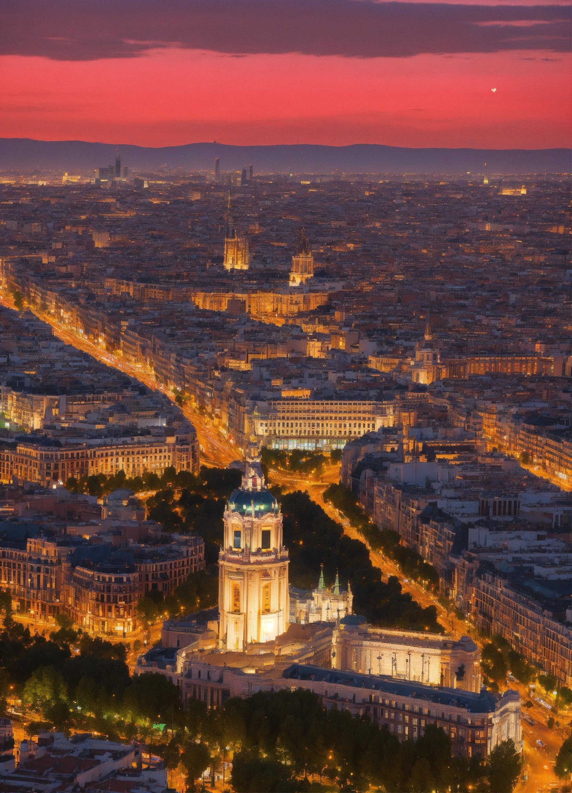

> Note: Images will be after each heading
> TODO - add location google maps sharing links

## Sants / Montjuïc & Poble Sec Neighbourhoods

### Viewpoint from Plaza España / Las Arenas Shopping Centre

Anyone who has been to Plaza de España (Plaça d’Espanya in Catalan) will probably have noticed the former bullring building, which is now a huge indoor shopping centre - Arenas de Barcelona. There is a nice viewpoint from the top of the building. If you’re in the area, it’s definitely worth a visit.

> Pro tip! You can access this viewpoint for free. Simply go inside the shopping centre and go up the escalators to the top. No need to pay for the lift outside!

### The view from the National Palace
The ‘Palau Nacional’ as it’s locally called, is a hit with the tourists and locals alike. For almost zero effort you will be awarded a picturesque view over the Magic Fountain and other parts of Montjuïc and the city. 

The classic viewing spot is from the steps right outside the MNAC - Museu Nacional d'Art de Catalunya, which is a grand Catalan contemporary art museum.

> Pro tip! We also recommend walking 100 metres to the north-east of the building, where you will find another vantage point looking out over Barcelona and the Poble Sec neighbourhood.

### The view from the Castle of Montjuïc

The Castle offers you the highest viewpoint from Montjuïc, but not the highest in Barcelona by any means. If you want the view from the top you will be obliged to pay entrance to the Castle. Well worth it though as the views from the top are staggering. You will be able to see a full 360 degree panoramic view of Barcelona, not to mention explore the castle, its exhibitions and the surrounding area.

For those a little short on time, the view from the castle walls is similarly stunning, especially out over the sea.

> Pro tip! There is a very nice scenic trail in between the castle entrance and the ‘Mirador de l'Alcalde’ (see below) through the woodland, where you can also capture some stunning views out over the sea.

### The view from Mirador de l'Alcalde Montjuïc

Despite being further down than that Castle, this viewpoint still offers a stunning 180 degree view out over the mediterranean. It’s a good spot for watching the birds circling over Montjuïc and the rocky terrain makes for a stunning view. Also, it’s usually not so busy as most tourists go directly to the castle. In the local vicinity you will find parking spots on the main road, if you come by car/taxi, plus there’s usually a food & snack stand selling coffees-and-the-like a few metres away.

> Pro tip! Don’t forget to walk up to Jardins del Mirador. The small gardens (just up the steps) are very photogenic and people often bring a beach towel so they can have a small picnic, read or just enjoy the view.
The view over Poble Sec Neighbourhood
There are many views of the Poble Sec neighbourhood from the hillside of Montjuïc. Here are a few of the best.

### Plaça de Carlos Ibáñez Mirador 

### Parque del Mirador del Poble Sec

### Mirador de la Piscina Municipal de Montjuïc

### Mirador del Migdia

The viewpoint from ‘Migdia’ is lesser-known, even by Barcelona locals, but one of our favourites! Mainly because it’s off the beaten track and requires a bit of walking to get there (although there is a huge car parking spot nearby). If you’re visiting the Castle, you should certainly consider passing by here as it offers you one of the only views over the Cemetery and over towards the Airport. Also, it’s not much effort if you’re already at the Castle, just walk down the side of the castle walls and eventually you’ll arrive.

> Pro tip! There’s a cool little secluded bar closeby (La Caseta del Migdia). Even if you don’t make it to Migdia Viewpoint, you can still have a cold beer for the effort!

### View from Torre de Comunicacions de Montjuïc
Popular with people wanting to watch the sunset, this viewpoint is often devoid of crowds, so if you’re looking for a quiet spot to watch the sunset over Barcelona then this should be high on your list. Incidentally, the whole area is photogenic, so be sure to take a long walk around the areas nearby, such as Plaça d’Europa, Palau Sant Jordi and of course the Lluís Companys Olympic Stadium, all some 100 metres apart.

> Pro tip! Check to make sure there’s no major music events happening when you visit as it can get very busy and some areas are fenced off due to events taking place. Visits during the daytime are generally safe, though.

—--

## Gràcia Neighbourhood

### Mirador de Joan Sales (viewpoint over Park Güell)

One of my personal favourites, and for me better than the view from the park’s Greek Theatre where the crowds normally gather, this viewpoint offers breathtaking views over the Barcelona skyline. The main route up is to enter the park as usual and walk up to the viewpoint via Casa Trias, which also offers a great view of the city.

### El Carmel and The Bunkers (Turó de la Rovira)
The hill itself is called Turó de la Rovira and on top you will find the village of El Carmel, but people refer to this one as “The Bunkers of Carmel” (in English, or simply just “The Bunkers”).

> Pro tip! There is more than one way to get here and we have a separate Guide to The Bunkers of Carmel.

### The view from Pont de Mühlberg

This viewpoint is similar to the one from the Bunkers of Carmel, but a bit further down. Depending on which way you scale the hill to reach the bunkers, you might cross the bridge on your way. The views out over Barcelona are excellent and won’t require you to reach the top!

> Pro tip! There is an excellent trail which starts at Guinardó Park and ends up at Park Güell, via Carmel Park. The route offers many amazing views over Barcelona. Link to Wikiloc.

---

## Horta & El Guinardó Neighbourhoods

### Mirador 5 - Parc del Guinardó

To do

### Mirador 3 - Parc del Guinardó

Todo

### Mirador del Parc del Guinardó

Why does this one get a mention? Well, for the staggering view of La Sagrada Familia for a start. Not to mention the up and close view over Barcelona in general, where you can nearly touch the buildings!

### Mirador de Montbau

To do

### View from Castell de Torre del Baró

Yes, you heard it - there is more than one castle in Barcelona, although this one isn’t nearly as big as the one on Montjuïc! Nevertheless, it offers a great view of the city from a perspective that most don’t see (unless you happen to live in that area, of course!)

### **BONUS**: View from Carrer Torrent de Melis, 138

This is an unofficial viewpoint, but we’ll give it a mention anyway! The locals get this one thrown in for free, but if you live down in Barcelona centre, you’ll have to undertake the uphill trip before you can arrive.

The location of the viewpoint is here: https://goo.gl/maps/9EbDKGcMENDPymuN7

> Pro tip! There’s a little route which takes you from Camp de l’Arpa up a series of escalators and lifts, to make the walking easier. We highly recommend that you follow this route.

---

## Tibidabo, Vallvidrera & Collserola

### Tibidabo Panoramic View
AND Temple of the Sacred Heart of Jesus

### Vallvidrera Superior
AND: Ctra. de Vallvidrera al Tibidabo

### View from Espai Mireia
AND Mirador dels Xiprers

### Mirador Maria Gispert

---

## The Beaches, Diagonal & El Maresme

### Mirador Mediterraneo Montjuic

### Mirador Maresme

This viewpoint is also known as “Mirador M” (according to Google) and looks right down the beach fronts of Barcelona towards the W-Hotel. It’s usually always without other people with it being a little less obvious and requires a bit of walking to arrive.

> Pro tip! Be sure to come by bike, but you can get there by walking. Also, make sure that big music festivals are not on (such as Primavera festival) otherwise you might not be able to get access.
