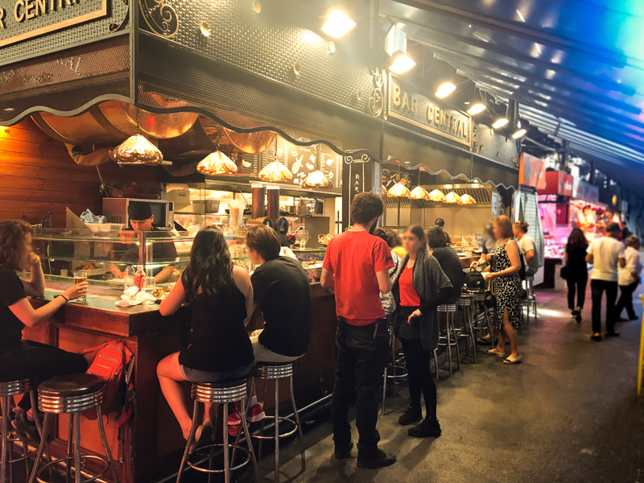
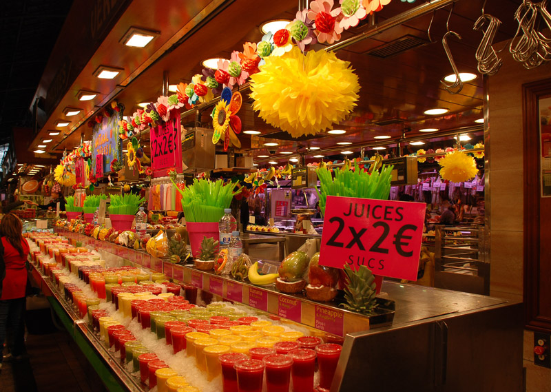
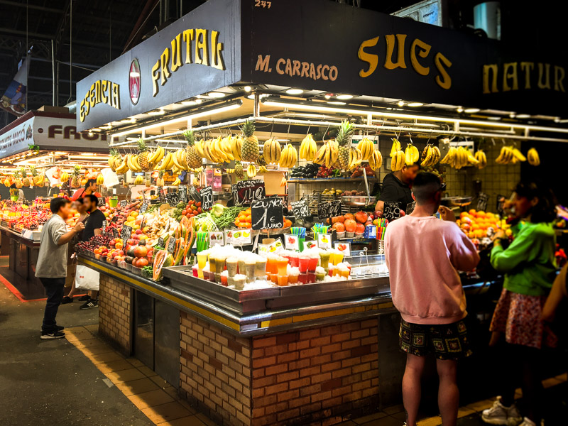
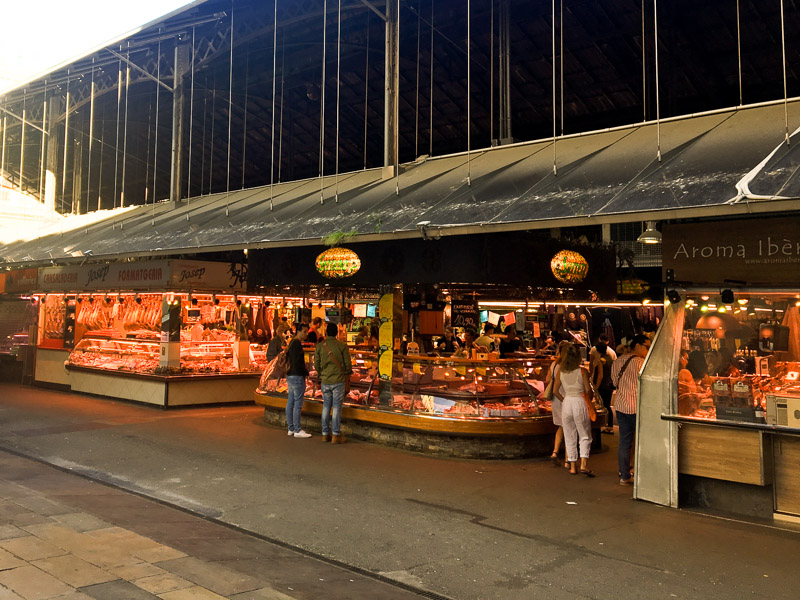
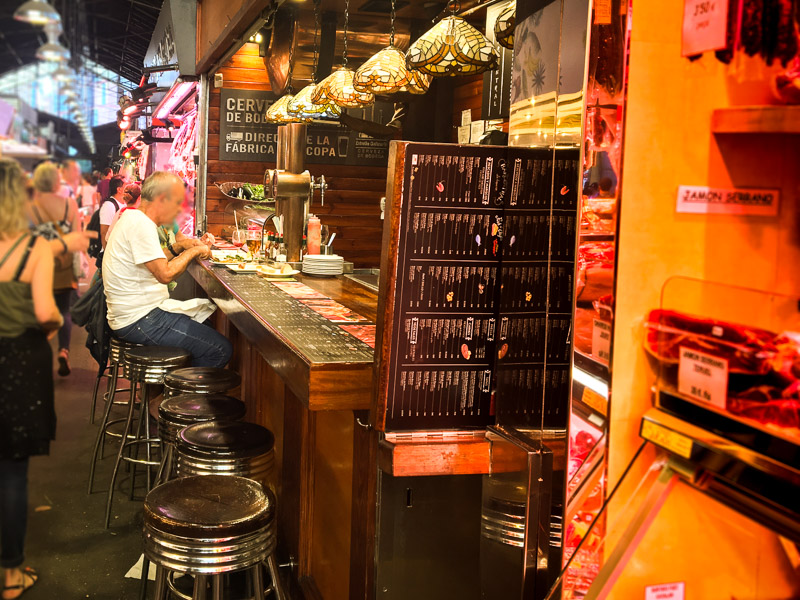
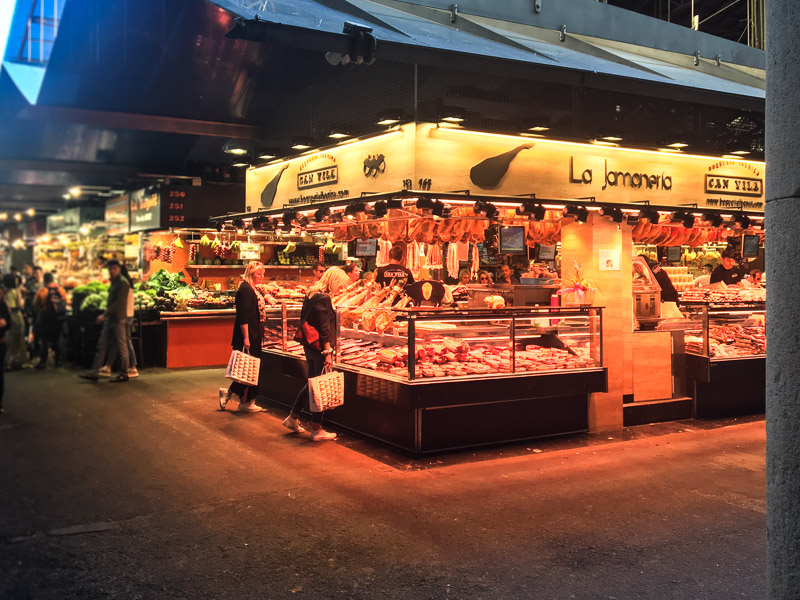
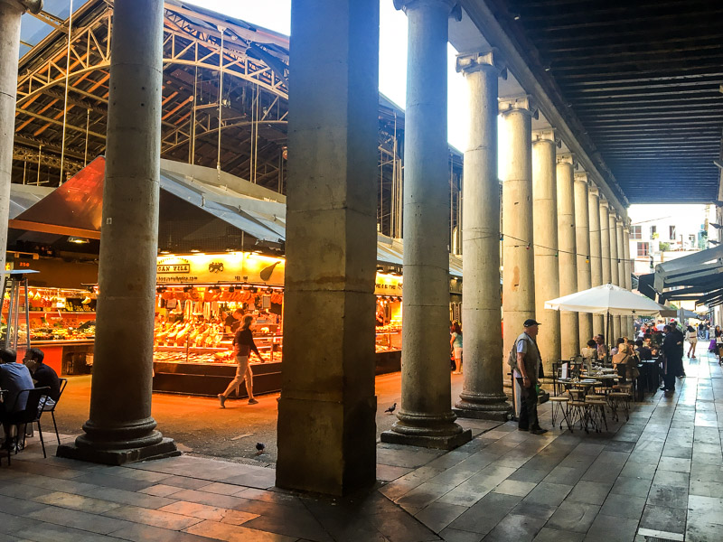

## Contents

Located just off La Rambla in Barcelona’s Old Town, La Boqueria has been pulling in the locals for centuries and offers visitors from far and wide a fine array of quality produce and an authentic, colourful experience of the city’s vibrant culinary scene. Come to gaze at the market’s historic architecture and soak up the rich atmosphere of sights, sounds and smells; stay to taste the delights of La Boqueria’s multitude of stalls.

## The essentials

While this sprawling bazaar can be accessed from all sides, for the full effect you should enter directly from La Rambla, where you will be greeted by the iconic sign hinting at its more formal title: *Mercat de Sant Josep de la Boqueria*.

A trip to Barcelona is hardly complete without a walk down Las Ramblas (a.k.a ‘La Rambla’ in Catalan), so most come on foot. From afar, La Boqueria is most easily reached from the Liceu metro station (L3), which is just a couple of minutes’ walk away and takes you straight out on to La Rambla.

La Boqueria is open from 8 am until 8:30 pm and has a lot to offer. You might visit just to pick up a snack or fresh juice, or take away something fresh to eat later. There are also many stalls and bars selling hot and cold meals, such as paella and tapas, around the perimeter of the market – so it is possible to do lunch or dinner amongst the buzz and bustle of the day’s trade. Specialists selling fine oils, nuts and seasonings are a great source of inspiration for gifts, too.

Due to the high number of visitors, especially in the peak summer months and just like any busy tourist hotspot, it is wise to be vigilant with your valuables and your wallet, bag or purse. And don’t forget to be patient and polite with the sellers (especially if you’re still practising your Spanish or Catalan). Point rather than touch at what you want to buy, and always ask before taking photographs or videos of people while they work.

## Recommended

La Boqueria is a hit with tourists and locals alike, so it’s a good idea to come closer to the beginning or the end of the day.

In order to browse with greater ease, it’s best to arrive in the morning (the market officially opens its doors at 8 am). It’s hard to think of what La Boqueria doesn’t sell, so you’ll value the time to eye up what’s on offer and get a handle on the geography of the place.

Alternatively, grab a plate of paella in the early evening and stroll round as the stalls wind down and make their final sales of the day.

The displays of fish and seafood in the middle of the market are a must-see, and it is highly recommended to try the *jamón ibérico* and some of the cheeses on offer.

## A little background

Today, La Boqueria covers an area of 2,500 m² and contains around 300 different stalls. Markets have been operating in this part of the city for at least 800 years. It all began with traders setting up shop there to avoid taxes, as at one time it lay beyond the official city limits.

A permanent market has existed at La Boqueria since the 1830s, following the demolition of the fire-damaged Convent of Saint Joseph and the construction of a square with classical arcades, which can be seen running along its perimeter. Various modifications and adaptations have since been made, with a metal roof added in 1914 to protect traders from the elements and, more recently, an underground car park and rear extension extending and modernising the site.

## What’s nearby?
Having visited La Boqueria, you could exit towards the side or rear into the Raval neighbourhood and head up Carrer dels Àngels towards the MACBA Museum, or enjoy a coffee at Plaça del Bonsuccés and take in the Jardins de Rubió i Lluch nearby.

You might also simply leave the market back onto Las Ramblas, where you have Gran Teatre del Liceu to the south or The Gothic Quarter (El Gótico) to your east, where we recommend La Basilica de Santa Maria del Pi.

For those keen on hitting the shops, Carrer de la Portaferrissa and Carrer del Pi in El Gótico are both good options and within easy walking distance.
