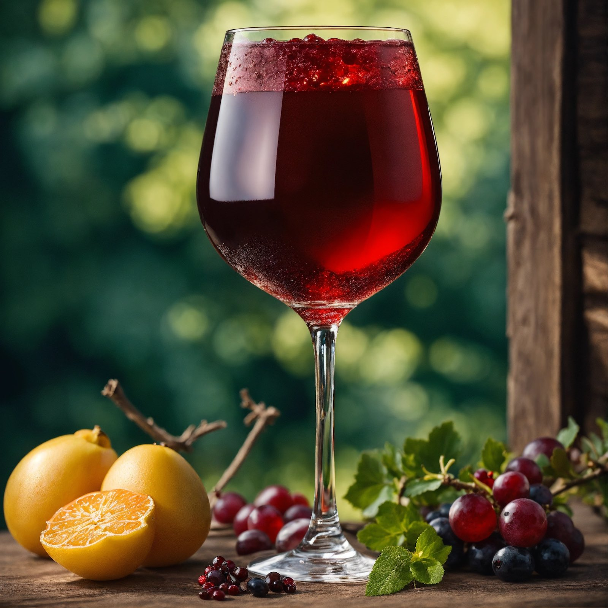

## Don’t drink Sangria!
You might love it back home, but Sangria isn’t drunk in Barcelona –– at least I’ve never heard of any Spanish person ordering it before. You will find it in tourist traps though, such as on Las Ramblas or in the bars next to Sagrada Familia.

## Don’t drink Tinto de Verano!
People also like to drink Tinto de Verano on a hot day back home, but most people don’t drink it here (unless it's summer!). It’s more popular with youngsters, and anyway, it’s actually from Cordoba!

Also, don’t order calimocho (red wine + coke) expecting it to be available in local bars –– it’s from the Basque Country!

## Don’t eat paella
Yes, that’s right, I said it!

**Spoiler**: Paella is from Valencia!

If you absolutely have to, then make sure to not eat at a touristy restaurant as the paella won’t be traditional and it’ll just be expensive (and probably from the freezer). Also, the locals don’t eat paella for dinner, it’s a lunch thing! And one last thing –– paella in Barcelona will be more seafood-based, which some argue isn’t the traditional recipe. But we’ll leave those arguments to the locals!

(Insert link to Paella guide here)

## Don’t order black rice (arroz negro)!
Arroz negro, while very tasty, is also originally from Valencia. Having said that, you will find some decent black rice here in Barcelona.

## Don’t go to a Flamenco show!
So you do a Google search for “things to do in Spain” and Flamenco comes up in the top 3. Sure, they have shows, but it’s not native to Barcelona. You’ll want to go to Andalucía for that.

## Don’t try to watch bullfighting!
While it (unfortunately) still goes on in some autonomous communities of Spain, Bullfighting has been banned in Catalunya since 2010. Instead, you could do a trip to La Monumental, where you are more likely to find open-air events and music these days.

## Don’t eat tapas!
OK, you can and a lot of people do, but it’s originally from the south of Spain. And while we’re on the subject, if you’re used to getting a free “tapa” with a beer, you’ll set yourself up for disappointment because tapas isn’t really given away at bars in Barcelona like it is in Andalucía.

## Don’t order patatas bravas!
Again, you can, but keep in mind that patatas bravas actually originated from Madrid, so anything they do here is just a copy or a take on the original. A lot of the time you will find fried frozen potatoes for €6+ with a cheap sauce on top, so watch out for this rubbish!

**Disclaimer**: It's true that there are some awesome bravas to be found in Barcelona and <a href="https://www.instagram.com/bravasbarcelona/" target="_blank">some people have intagram accounts</a> dedicated to finding the best!

## Don’t call the city “Barça” or “Barca”!
That’s right! A lot of people think that Barcelona is called “Barça” (Bar-sa) as the short name, but Barça actually refers to <a href="https://www.fcbarcelona.com/" target="_blank">the famous football club</a>. It’s also incorrect to call it “Barca” (without the ‘ce trencada’ character for the letter ‘c’) because this means “small boat” in Catalan. The correct nickname for Barcelona is actually “Barna”.

So remember: **Barça** = Football team, **Barca** = Boat, **Barna** = Barcelona.

## Don’t order a pint of beer!
Barcelonians drink medianas, copas or cañas but not pints (although you can order a pinta or jarra in a lot of places, and not just touristy ones). Also, they use the metric system, so a ‘pint’ here is actually 500 ml and not 568 ml.

## Don’t smoke on the beach!
Smoking on the beach is forbidden, a rule that recently came into effect in 2022. Respect the local laws and don’t light up on the beach.

## Don’t say “Lo siento…”!
In English, we like to say “I’m sorry…” or “Sorry…” but here it's not normal. People say “perdon” or “perdona”, “disculpe” or “me disculpe”, or “permiso”, depending on the context and what you are doing/have done.

## Don’t expect to go for dinner at 6 pm!
Sure, since there are so many restaurants it is possible, but you might find that a lot of eateries are only open from 8 pm, especially in the summer or peak months. It’s common to eat a lot later here in Spain, so you’ll find yourself having to adapt to a later schedule.

## Don’t walk on the street topless
We are, of course, referring to mainly guys here, but t-shirtless behaviour should be limited to the beach only.

## Don’t pay for your drinks at the bar!
In most cases, if you are drinking on a terrace outside, you’ll find that it’s table service, so you’ll pay at the end. You can indeed pay at the bar, but sometimes you’ll just be asked to go and sit back down. You may also have to practise some patience in comparison to the more urgent service back home! 

## Don’t order “chips”!
The age-old confusion between “chips” and “crisps” is still yet to be resolved across borders, but if you’re used to ordering chips and receiving fried potatoes (yes, you Brits!) then think again. If you order chips, you will receive potato crisps in a packet, which may or may not be what you expected.
