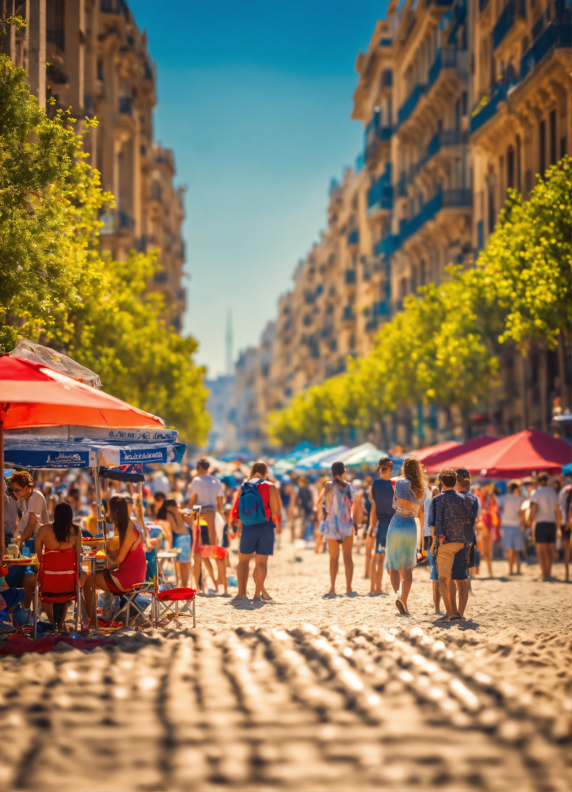

As an iconic global city, Barcelona brims with world-renowned sights like La Sagrada Familia, Park Güell, and Casa Batlló. However, the true essence of the Catalan capital reveals itself not in its postcard-perfect monuments, but in its local secrets. This insider’s guide will take you beyond the tourist-laden streets, unearthing the city's most delightful hidden gems.

## Secret Squares and Gardens

In a city as alive and vibrant as Barcelona, it can sometimes feel like every corner echoes with the footsteps of fellow travellers. However, for those willing to explore, the city reveals pockets of tranquil greenery and secluded plazas, a world away from the well-trodden paths. These secret squares and gardens, nestled in the labyrinthine alleys of Barcelona's old quarters, serve as serene oases in this bustling metropolis.

At the heart of the Gothic Quarter, away from the main arteries teeming with tourists, hides the quaint Plaça de Sant Felip Neri. Time seems to slow down in this idyllic square. The quaint plaza, with its baroque church, is a picture of tranquillity framed by buildings steeped in history and ancient cobblestone pavement. The square tells tales of a past Barcelona, whispering stories of resilience through the shrapnel scars etched onto the church walls from the Spanish Civil War. Soak in the serene atmosphere and savour a cup of coffee at one of the small cafes flanking the square.

For nature lovers, the city offers clandestine retreats with breathtaking views. One such retreat is the lesser-known Mossèn Costa i Llobera Gardens. Perched on the slopes of Montjuïc Hill, it's often overshadowed by its famous neighbours: the Montjuïc Castle and the Magic Fountain. But for those in the know, this garden is a verdant paradise. Home to one of the most important collections of cacti and succulents in Europe, the Mossèn Costa i Llobera Gardens present a stark yet beautiful contrast to the typical Mediterranean landscape.

Meandering through the garden's rocky paths feels like a mini desert adventure, with a backdrop of spectacular panoramic views of Barcelona’s cityscape and the azure Mediterranean Sea. Whether you're a succulent enthusiast or simply in search of a peaceful sanctuary, this garden is a delightful divergence from the city's bustling rhythm.

By straying from the beaten path, you can discover these and many other secret squares and gardens that offer quiet moments of respite. These spaces, rich in history and natural beauty, provide an intimate perspective of Barcelona beyond its headline attractions, inviting visitors to experience the city's authentic charm and tranquil side.

## Off-the-Beaten-Path Markets

While the vibrancy and spectacle of Mercat de la Boqueria is undeniably appealing, a deeper and more authentic culinary exploration awaits in Barcelona's quieter, local-favored markets. Hidden from the typical tourist route, these markets serve as vibrant microcosms of the city's culture, offering fresh produce, tantalizing delicacies, and a genuine peek into the day-to-day life of Barcelona's residents.

A mere fifteen-minute walk from Passeig de Gràcia, nestled within the stately grid of Eixample, lies the elegant Mercat de la Concepció. Often overlooked for its more famous counterpart, this market dates back to 1888 and is an architectural gem. With its striking modernist design, it offers an atmospheric setting to browse a bounty of local produce, from colorful piles of fruits and vegetables to a variety of Catalan cheeses and meats.

As you wander through the aisles of Mercat de la Concepció, take the time to engage with the friendly vendors, most of whom have been part of the market community for decades. Don't forget to sample some traditional Catalan foods, perhaps a succulent 'botifarra' sausage or a slice of creamy 'mató' cheese.

In contrast, the Mercat de Sant Antoni, located at the edge of the trendy neighborhood of the same name, is a striking blend of the old and the new. Housed in a recently renovated metal structure that spans an entire city block, this expansive market is a neighborhood mainstay. Sant Antoni's morning buzz with locals haggling for the freshest seafood, ripest vegetables, and succulent cuts of meat is a spectacle that truly immerses you in the city's rhythm.

However, Sant Antoni's appeal extends beyond its daytime offerings. On Sundays, the market transforms into an open-air book and coin market, drawing a crowd of collectors and curious onlookers. Meanwhile, surrounding the market, the neighborhood comes alive with pop-up stalls selling vintage clothes and artisanal crafts, adding a bohemian flair to the whole experience.

By venturing off the beaten path to these local markets, you'll not only encounter a gastronomic treasure trove but also find yourself immersed in the city's vibrant, everyday heartbeat. As you sample local delicacies and interact with residents, you'll gain a deeper understanding and appreciation of Barcelona's unique culture and lifestyle. So, step away from the guidebooks and follow the locals - a truly authentic Barcelona experience awaits.

## Hidden Artistic Masterpieces

In a city synonymous with the masterworks of Picasso, Miró, and Gaudí, there's an extraordinary piece of art that often gets overlooked by tourists. Shrouded in the shadow of its famous neighbour, the Sagrada Familia, the Hospital de la Santa Creu i Sant Pau is a resplendent beacon of Art Nouveau architecture that deserves just as much admiration and awe.

First, a bit of history. The Hospital de la Santa Creu i Sant Pau was designed by the Catalan architect Lluís Domènech i Montaner, a contemporary of Gaudí and a leading figure of the Modernisme movement. The complex, built between 1902 and 1930, served as a fully operational hospital until 2009. Today, it stands as a testament to the fusion of functionality, aesthetic pleasure, and a commitment to creating a healing environment for patients.

Unlike its more famous counterpart down the street, this UNESCO World Heritage site offers you the luxury of time and space. Here, you can appreciate the artistry without jostling with crowds. Stroll through the complex's meticulously manicured gardens, where the peaceful sounds of nature complement the visual feast of Modernist architecture.

The complex's pavilions, each more stunning than the last, showcase a range of architectural styles. Look out for intricate sculptures, colourful mosaics, and detailed stained glass windows, all woven into a visual symphony that celebrates Catalonia's cultural heritage. Pay special attention to the Administration Pavilion, which houses the stunning Sala Hipòstila, a grand hall adorned with mosaics, sculptures, and a striking stained-glass ceiling.

Within these walls, you'll also find rotating art exhibitions and a museum, shedding light on the hospital's intriguing history and its significant role in Barcelona's cultural and social evolution.

After exploring the interiors, don't miss the opportunity to enjoy a coffee or a light meal at the café on the grounds. As you relax, gaze out over the serene gardens and breathtaking buildings, soaking in the beauty and tranquility that make this place so unique.

The Hospital de la Santa Creu i Sant Pau, Barcelona's hidden architectural gem, awaits your discovery. As you wander through its beautiful buildings and gardens, you'll not only be stepping back in time but also gaining a deeper understanding of the city's rich cultural tapestry. In a city famed for its artistic heritage, this lesser-known masterpiece stands as an unforgettable part of Barcelona's architectural legacy.

## Authentic Dining

In Barcelona, the heart of Catalonia, you’ll find an irresistible blend of culinary traditions. While the restaurant-lined La Rambla might be your first port of call, the city's authentic dining treasures often lie tucked away in local neighbourhoods. Shrug off the tourist-trap eateries and venture off the beaten path to discover the true tastes of Barcelona.

In the vibrant neighbourhood of Sant Antoni, nestled amongst its bustling local market and trendy boutiques, lies Els Sortidors del Parlament. This tapas bar and restaurant seamlessly merges tradition with a modern touch. Exposed brick walls and barrels of local wine set the stage for a warm, rustic ambiance. Their menu boasts an array of Catalan delights, each dish a tribute to the rich local produce.

Try the botifarra, a traditional Catalan sausage served with creamy white beans and a drizzle of olive oil. Or perhaps the escalivada, a dish of smoky grilled vegetables usually comprising eggplant and peppers, served with crusty bread. Each bite immerses you deeper into the fabric of Catalan culture.

Make sure to save room for dessert. You can't leave without tasting the Crema Catalana, a creamy custard base topped with a hard caramel shell. Its sweet and slightly citrusy flavor profile is the perfect end to your meal.

Another culinary gem is El Vaso de Oro in Barceloneta, a neighbourhood famous for its sandy beach and seafood. This narrow, standing-room-only bar is a favourite among locals, known for its buzzing atmosphere and exquisite dishes. The star here is the tapa of 'solomillo', a tender and juicy sirloin steak tapa, perfectly accompanied by a frothy glass of their signature draft beer, brewed in-house.

You could also sample their fresh seafood tapas; gambas al ajillo (garlic prawns) or chipirones (baby squid), caught daily from the nearby Mediterranean Sea. Each dish, meticulously prepared, showcases the essence of Catalan cuisine - fresh ingredients, simple preparation, and an abundance of flavor.

Both Els Sortidors del Parlament and El Vaso de Oro provide not only tantalizing food but also an immersive cultural experience. You'll dine where the locals dine, savor dishes passed down through generations, and experience the city's dynamic culinary scene firsthand.

Exploring Barcelona's food culture is a journey of discovery, one that takes you to the heart of the city's identity. As you venture away from the well-worn tourist trail, you'll uncover the authentic tastes of Barcelona, each bite an unforgettable symphony of Catalan flavors. So, step into the local eateries and let your tastebuds lead the way.

## Neighborhood Strolls

While the Gothic Quarter's labyrinthine streets and historic buildings are iconic, the soul of Barcelona beats just as powerfully in its lesser-known neighborhoods. A stroll through these vibrant quarters allows you to feel the city's pulse, experience local culture, and find hidden gems often missed by the casual tourist.

Take a detour from the city center and immerse yourself in the bohemian vibe of Gràcia. Once an independent village, Gràcia still retains its unique character and village-like charm amidst the cosmopolitan city. As you wander its narrow, winding streets, you'll be greeted by a blend of traditional Catalan culture and a modern, eclectic energy.

Gràcia's lively plazas are social hubs where you can witness the neighborhood's community spirit. From elderly residents engaged in lively conversations to street musicians serenading passersby, each plaza exudes a warmth and vitality that are quintessentially Gràcia. Don't miss out on Plaza del Sol, a vibrant square brimming with cafes, where locals gather to enjoy a drink and the ever-present festive atmosphere.

The neighborhood is also famous for its annual Festa Major, a week-long street festival where residents compete to decorate their streets in the most extravagant themes. If you're lucky enough to visit during this time, the explosion of colors, creativity, and community is a sight to behold.

On the other side of the city, Poblenou presents a stark contrast to Gràcia's village-like ambiance. Once an industrial heartland, Poblenou has reinvented itself as Barcelona's tech and creative hub. Amidst the cutting-edge tech offices and design studios, you'll find art galleries, trendy boutiques, and an innovative culinary scene.

Poblenou's transformation, however, hasn't erased its past. You'll find traces of the neighborhood's industrial heritage in the form of converted factories, giving Poblenou a unique, edgy character. The neighborhood is also home to the serene Rambla de Poblenou, a leafy boulevard leading to the beach. Lined with shops, restaurants, and cafes, this Rambla offers a tranquil, local alternative to its bustling namesake in the city center.

Whether you're indulging in a lazy brunch at a sidewalk cafe, exploring avant-garde art installations, or simply enjoying a leisurely walk to the beach, Poblenou offers a refreshing, contemporary perspective on Barcelona's evolving identity.

Exploring Barcelona's diverse neighborhoods of Gràcia and Poblenou, each with its unique charm and character, takes you off the conventional tourist path and offers a richer, more nuanced view of the city. As you stroll through these neighborhoods, you'll not only witness Barcelona's multifaceted personality but also experience the everyday rhythm and vibrancy that truly defines this city.

## Local Festivals

Barcelona's appeal extends beyond its architectural marvels, culinary delights, and sun-drenched beaches. One of the city's most captivating charms is its effervescent festival culture, offering unforgettable experiences that will immerse you in local traditions, community spirit, and vibrant celebrations. To truly understand and appreciate Barcelona's cultural richness, timing your visit to coincide with these local festivals is a must.

One of the city's most beloved events is the Festa Major de Gràcia. Held annually in August, this week-long street festival is a grand showcase of community creativity and Catalonian culture. Each street in the Gràcia neighborhood is transformed into an elaborate, themed display through the collective efforts of its residents. From underwater paradises to jungle extravaganzas, the variety and creativity of the decorations are astonishing. As you wander through the whimsically adorned streets, you'll be surrounded by live music, traditional dances, workshops, and a contagious sense of camaraderie. The festival not only illuminates the streets of Gràcia but also the spirit of community that lies at the heart of Barcelona.

If your visit falls in late June, don't miss the chance to experience the Sant Joan festival. This magical night marks the summer solstice, the longest day of the year, and is considered the most important night in the Catalan calendar. As night falls, Barcelona's beaches come alive with bonfires, fireworks, and celebrations. The locals gather for parties with music, dancing, and 'coca', a typical Catalan sweet bread enjoyed especially on this night. As the firecrackers light up the sky and the waves lap the shoreline, you'll be swept up in the joy and excitement that encapsulates the Sant Joan festival.

Each of these festivals provides a unique and unforgettable cultural experience, immersing you in the traditions and collective joy that characterize Barcelona's vibrant local scene. The unforgettable memories you'll create as you dance with the locals, marvel at the street decorations, and participate in age-old traditions will provide a deeper, more authentic appreciation of Barcelona's soul.

Barcelona's famous sights are undeniably alluring, but the city's true magic lies in its local secrets—the enchanting, less-traveled spaces that offer a deeper understanding of its heart and soul. With this guide, you're equipped to uncover the hidden gems of Barcelona, immersing yourself in the city's authentic charm and experiencing Barcelona not as a mere visitor, but as a local. From neighborhood strolls to local festivals, prepare to embark on a captivating journey through Barcelona's less-traveled paths.
Summary
Barcelona's famous sights are undoubtedly worth visiting. Still, the city's magic lies in its local secrets – those enchanting, less-traveled spaces that offer a deeper understanding of its heart and soul. With this guide in hand, you're set to uncover the hidden gems of Barcelona, immersing yourself in the city's authentic charm.

