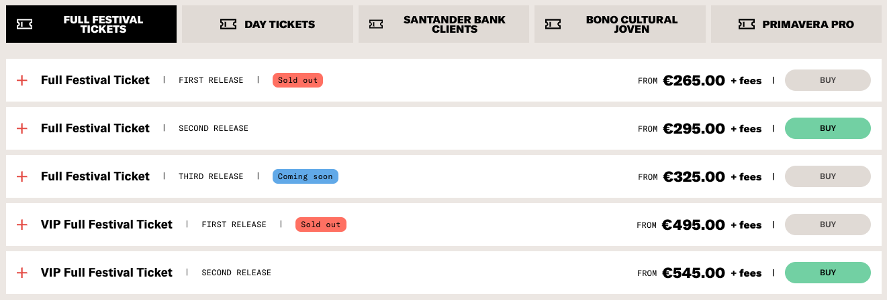
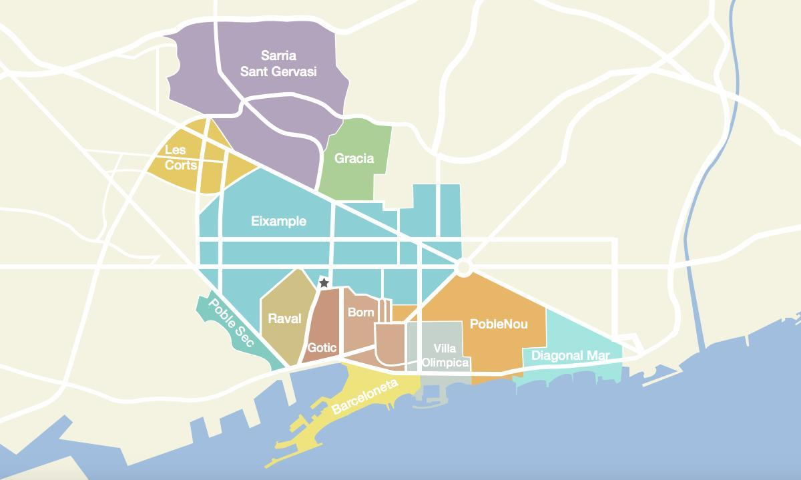
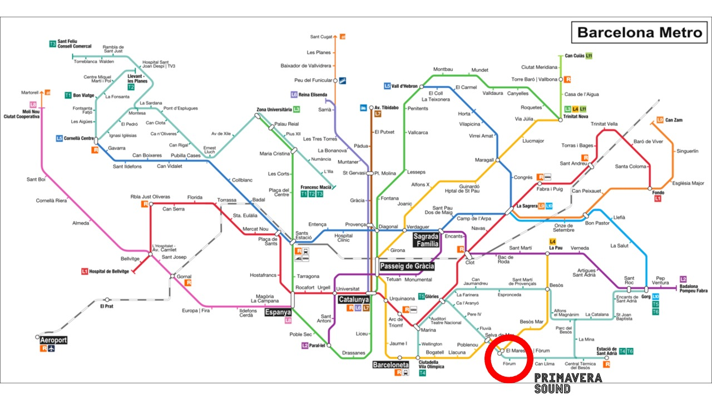
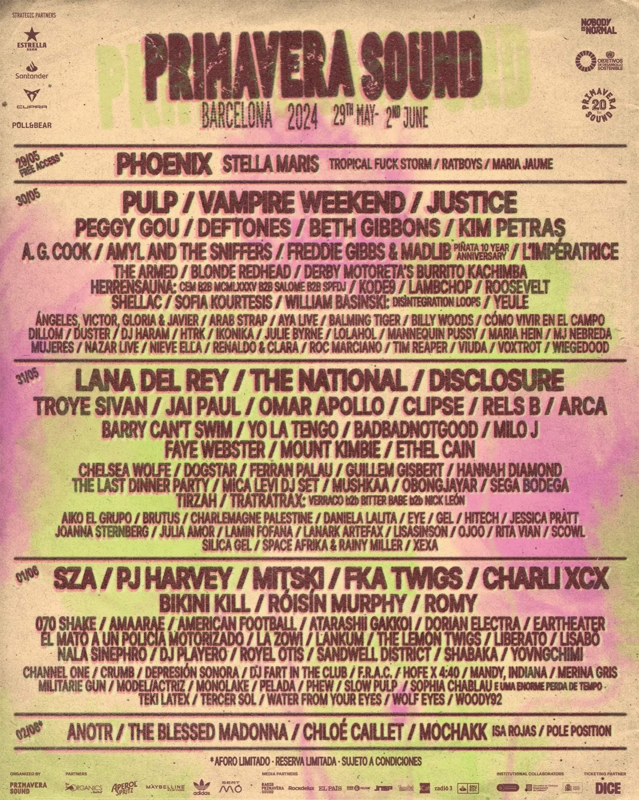

## Contents

## Primavera Sound
Welcome to the ultimate guide for the Primavera Sound music festival in Barcelona! This blog post is your all-in-one resource, packed with up-to-date information to help you make the most out of this vibrant event. Whether you’re a first-timer or a seasoned festival-goer, this post will answer all your questions and ensure a fantastic experience at Primavera Sound.

## Key Details of Primavera Sound 2024

### Location and Dates

- **Where**: Primavera Sound 2024 will take place in Barcelona, Spain​​ at the Parc del Fòrum.
- **When**: The festival is scheduled for May 29th to June 1st, 2024​​.

### Ticket Pricing

- General Admission: The basic full-festival ticket costs EUR 265 (plus fees) for the first release and EUR 295 (plus fees) for the second release.
- VIP Tickets: For those seeking a more exclusive experience, VIP tickets are available for EUR 495 (plus fees) for the first release and EUR 545 (plus fees) for the second release.​​

**Tickets**

[Tickets can be checked here](https://www.primaverasound.com/en/tickets?e=primavera-sound-barcelona-2024-may-30-jun-01-2024).

### Accommodation

Primavera Sound is uniquely set in the heart of Barcelona, eliminating the need for camping. There are numerous accommodation options, catering to all preferences and budgets:

- **Hotels**: Options like the Princess Hotel, known for hosting festival artists, and Marriott’s AC Hotel Barcelona Fórum offer luxury and proximity to the festival grounds​​​​.
- **Hostels**: For budget-friendly options, hostels like St Christopher’s Inn and Zero offer comfort and convenience, with features like bunk curtains for day sleepers​​​​.
- **Airbnb**: Numerous Airbnb options are available, both in the city centre and near the Parc del Fórum and suitable for different group sizes and budgets​​​​​​.

If you are considering an Airbnb, you’ll want to find a place that is well-connected to the festival site. And if you are planning to explore Barcelona during your stay, then somewhere with good transport links that is close to the centre would also be a smart choice.

Below is a quick summary of the neighbourhoods, but you can find our [full neighbourhood guide here](/blog/7-a-guide-to-barcelonas-neighbourhoods).

#### Diagonal Mar
Perfect location for the festival, more residential and about a 20-minute trip to the centre.

#### Poblenou
Hipster up-and-coming beach-side neighbourhood with a lot of nice restaurants, bars and the Glòries shopping centre.

#### La Vila Olímpica
Built for the Olympics in 1992 and well connected to both the festival (10 mins) and the city centre (10 mins). Also near the beach.

#### El Born
The heart of the city can get noisy, but it is within walking distance of all the main sites and has good proximity to the Tram and metro L4 (the closest line to Primavera) – it’s only about 15 minutes from the festival site. Great nightlife if you have the energy. 

#### El Gótico
Like El Born, this centrally located area with medieval streets is near everything. However, it can be a bit shady at night, so watch out for pickpockets.

#### El Raval
The “edgy” neighbourhood. Amazing location about 20 minutes from the festival with lots to see and do, but be careful at night.

#### La Barceloneta
Right on the beach and just a short walk to the city centre, Barceloneta is on the L4 line and takes just 15 minutes from the festival site via public transport or 10 minutes in a taxi.

#### L'Eixample
A huge neighbourhood that’s mostly residential but has a great selection of bars and restaurants and depending on the location, a good connection to the festival. For easier access, the centre or the right side (Dreta de l'Eixample) are your best bets.

#### Gràcia
A residential area that has a nice vibe and cool bars and restaurants. It is on the L4 line so getting to the festival will be about 25 mins depending on location.

---

## Getting to the festival & getting around

The festival is at the bottom right corner of Diagonal Mar on the map below and is connected by the L4 (yellow) metro line. “**El Maresme | Fòrum**” is the closest stop, approximately a 5-minute walk to the festival. 

You can also get the Tram (there is a Port Fòrum stop right outside) which connects you to Poble Nou and Villa Olimpica.

I highly recommend getting <a href="https://citymapper.com/" target="_blank">Citymapper</a> (on iOS and Android) to get around the city. It has all the public transport options, even those for rental bikes by some companies.

You have a few different [travel card options](/blog/6-barcelona-travel-cards), but most people will be fine with a **T-Casual**, which is around €11 and includes 10 trips across the public transport network (including the overland train to the airport T2 with a free connection to T1, as well as the 46 bus which goes to both terminals). 

### Festival free shuttle bus

The festival offers a free shuttle bus from the festival site to Plaça de Catalunya. Below are the shuttle bus details:

### Parc del Fòrum -> Plaça de Catalunya:

- Thursday from midnight to 5 am
- Friday from 2 am to 5 am
- Saturday from 3 am to 7 am

### Plataforma marina (main stages) -> Plaça de Catalunya:

- Thursday, Friday and Saturday from midnight to 4 am

## Motos & Bikes

You can also rent electronic motorbikes and bikes from any of the following companies (using the below affiliate links will get you some promotional credit and I will earn some free credit too). Be sure to sign up in advance as you need to get your licence validated.

- [Acciona](https://acciona-motosharing.onelink.me/8HVM/e50d02fb)
- [Cooltra](https://link.cooltra.com/redeem-promo-code?code=hfrxb) (also has e-bikes)
- [Yego](https://www.yego.mobi/deeplink/coupon/CDBIIGHGDP) (also has e-bikes)

For taxis, I always recommend using an app – [FreeNow](https://m.free-now.com/JGMc/afte6ygg) is the one I use most as it allows you to leave a review and track the route that is being taken, plus it uses local taxis. I am not a fan of hailing from the street as they often will try to take a longer route, and they can be quite unprofessional in my experience.

You also have [Uber](https://referrals.uber.com/refer?id=wtkjxt2y8zf8), although you will need to sign up in advance. Uber in Barcelona is also not really very good, with long wait times and high prices. The better option is [Cabify](https://cabify.com/i/janad117), which offers good prices and cars (and also has other transport options in the app).

## Weather

**Temperature Range**: During late May and early June, Barcelona typically experiences average high temperatures around 21.5°C (71°F) and average lows around 13.7°C (57°F)​​.
**Sunshine and Rain**: Expect around eight hours of sunshine daily with only a moderate chance of rain, averaging about 5 days in May​​.

## Food & Drink

### Food
**Selection**: There are a huge number of food trucks offering a nice selection for all food tastes, with many vegetarian and vegan options. Expect to pay around €8-€12 for a decent meal.

### Drink Prices
**Costs**: Drink prices at the festival are reasonable. A small beer costs around €3.50, a large one €5, and a glass of wine approximately €4 (plus a €1 deposit for the reusable cup)​​.

## Band Announcements
**Lineup**: The lineup has been announced (on 21st November 2023), with other artists usually added as we get closer to the festival.

## Summary

[Primavera Sound](https://www.primaverasound.com/) in Barcelona is an extraordinary event that merges world-class music with the charm of a vibrant city. The 2024 edition promises an unforgettable experience, set against the beautiful backdrop of Barcelona from May 29th to June 1st. With a variety of ticket options, plentiful accommodation choices, and a city buzzing with cultural attractions, it’s an event not to be missed. Keep in mind the moderate drink prices, and plan for a range of weather conditions. While the excitement builds, the artist lineup remains a highly anticipated announcement. Stay tuned for more updates as they become available. Get ready for an amazing festival experience in one of the world’s most enchanting cities!
