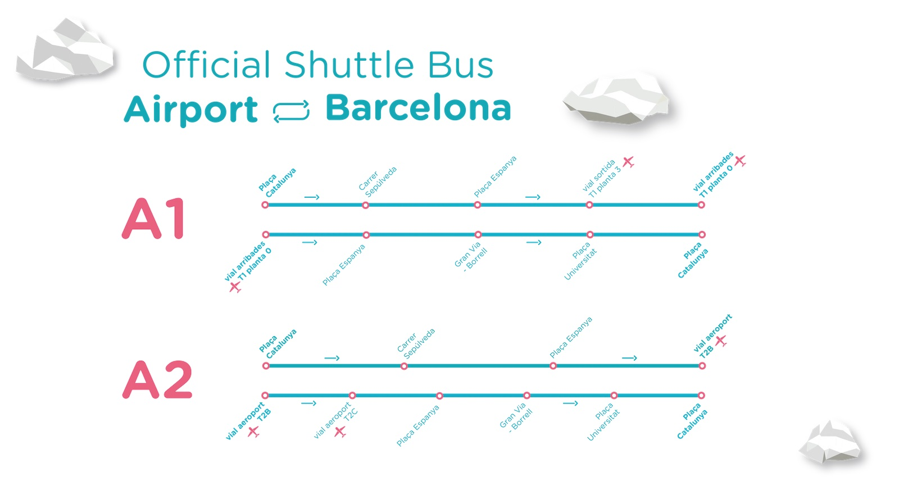

## Contents

## Barcelona Airport

Barcelona Airport (BCN), or officially Josep Tarradellas Barcelona-El Prat Airport, is the main airport serving the city of Barcelona and its metropolitan area. It is located about 12 kilometres southwest of the city centre and is the second busiest airport in Spain, handling around 50 million passengers annually.

Barcelona Airport has two terminals: **Terminal 1** and **Terminal 2**. T1 is the larger of the two and serves most airlines, while T2 hosts a smaller number of flights, mainly from low-cost carriers. The airport is well-connected to the city and its surroundings by several public transportation options, including the Aerobús airport shuttle, the metro, the train and taxis.

There is a wide range of amenities and services for travellers on offer, including a variety of shops and restaurants, free Wi-Fi, currency exchange and luggage storage. There are also several lounges available for travellers who want to relax before their flight.

Barcelona Airport is a hub for several major airlines, including Ryanair, Vueling, and Iberia, and serves destinations around the world. It is also a hub for the Air Nostrum regional airline.
Overall, Barcelona Airport is a modern and efficient airport that handles a large volume of passengers and serves as an important gateway to the city and its surroundings.

## Transport Links

Barcelona airport is very well connected to the city –– you can get from the terminal to the city centre in less than 30 minutes using a variety of transport options. The main methods are bus, train, metro, taxi and car.

## Buses

### Aerobús

My recommendation for getting to the city is the <a href="https://aerobusbarcelona.es/" target="_blank">Aerobús</a>. It covers both terminals (A1 for T1 and A2 for T2) and has a few stops along the way. It has space for luggage as well as USB chargers and free Wi-Fi, should you need them for the short amount of time you are on board.

At the time of writing, a single ticket is €6.75 a return is €11.65. The service is fast, taking only around 20 minutes from Terminal 2 to Plaça d’Espanya, depending on the traffic. Terminal 1 is slightly further away, around 25 minutes from Plaça d’Espanya. The final stop is Plaça Catalunya, which is about 35 minutes from the terminals. But again, this will depend on the time of day and city traffic.

The Aerobúses are very frequent and now run 24 hours a day (although at night the buses are more infrequent) –– you can find the <a href="https://aerobusbarcelona.es/trip/lines-timetables-and-real-time-information/?lang=en" target="_blank">full timetable here</a>. You can also pre-purchase the Aerobús ticket ahead of time and present it to the driver as a scannable QR code. This is usually my preferred method.

### Local Buses

[IMAGE of 46 bus]

The other option from T1 or T2 is the regular bus service, on which you can use [transport cards](/blog/6-barcelona-travel-cards) like your T-Casual. You can also pay in cash on the bus for a single (<a href="https://www.tmb.cat/en/barcelona-fares-metro-bus/single-and-integrated/choose-ticket" target="_blank">€2.55</a>). The main bus that goes to and from the airport is the <a href="https://www.tmb.cat/en/barcelona/buses/-/lineabus/46" target="_blank">number 46</a>, which heads to Plaça d'Espanya/Parallel. The 46 runs from about 5 am until the evening, where it stops just before midnight. After that, the night buses take over, and you can do a similar journey using the N17 or N18 services. For example, it’s possible to go from Terminal 1 on the N17 at 3 am and arrive in Plaça Catalunya 45 minutes later. The N18 also does a similar route but goes via T2 on the way. If you are at T2, then you would catch the N18 bus.

## Other buses
There are also buses from the airport heading to other local destinations, such as Castelldefels, Viladecans, Llobregat, and even Blanes, Figueres and Andorra (via the Andbus). Check the TMB website or use apps such as Google or CityMapper to check exact times and stops.

## By Train

### How to get to Barcelona airport by train

There is a train service that goes to and from the airport, offered by Renfe. It passes through El Clot-Aragó, Passeig de Gràcia, Barcelona-Sants, Bellvitge, El Prat de Llobregat (and many others) and originates in Sant Celoni. This train operates every day, and the service is every 30 minutes in and out of the airport train station. If you have a T-Casual ticket, it will also be valid on this train, without the need to pay for a premium airport ticket.

[IMAGE of airport station]

If you are coming by train, you will notice that you arrive in Terminal 2 (once you have walked over the raised footbridge from the station to the airport terminal). If you are flying from Terminal 1, you will need to go outside of Terminal 2, where you will find the free shuttle bus that goes between terminals. The bus is blue and green and completely free. It can take as long as 15 minutes to get to Terminal 1, however, so build this journey time into your trip. Similarly, if you are going from Terminal 1 to 2, you can also take this bus.

In addition to the Renfe service, there is also the Airport Metro (L9 Sud - South), a dedicated service between the airport Terminal 2 and Zona Universitaria, passing through many other stations on the way. This service is well documented on the <a href="https://www.barcelona-airport.com/eng/barcelona-airport-metro.php" target="_blank">Official metro website</a> and the <a href="https://www.tmb.cat/en/visit-barcelona/public-transport/metro-airport" target="_blank">TMB website</a>. One thing to note is that you cannot use a normal T-Casual metro ticket on this service –– it requires an airport-specific ticket at additional cost.

How to get from the airport to Barcelona centre by train
Going the other way, you will take the Renfe train from Terminal 2, which is located 5 minutes across the footbridge from the terminal. The last train is at 23:38 (this has been the case for at least 8 years) and is unlikely to change anytime soon. You can purchase tickets at the train station, including a T-Casual, which will be valid for another 9 trips during your stay in Barcelona. The cost is €12.15 (as of January 2024).

## By Taxi

### To and from Barcelona airport by taxi

When you arrive in either T1 or T2, you will notice lots of taxis –– just follow the signs in the terminal to the taxi rank outside. A taxi can be the quickest way to get to and from Barcelona and will typically take 25-30 minutes to get to the centre, depending on traffic. The cost is usually around €30–€35. If you have lots of luggage, it shouldn’t be a problem, and drivers will show you to the correct vehicles. Note: it’s not unheard of for drivers to ask for extra money when transporting a large amount of luggage, so be sure to establish a price before you get in.

### Booking a taxi
To arrive, you can use the FreeNow app on your phone to book a Barcelona official taxi (although this is unnecessary if you’re leaving the airport since there will be taxis waiting for you).

In addition to the official Barcelona taxis, it’s also possible to book a Cabify using their app. However, since they don’t come into the regular taxi stands, you will probably have to meet it on the road, where the regular cars drop off and pick up.

## By Car
To drop people off at Barcelona airport by car, you have a free window of 10 minutes. Any more than that and you will need to pay when leaving at the barrier.

Both terminals have huge parking lots, so you can park up and pay by the minute if you are collecting someone at arrivals (prices are something like €1.60 per hour).

There’s also a long-stay car park if you wish to leave your car there for several days –– check the <a href="https://parking.aena.es/reservas/web/obtenerPrecio.ac" target="_blank">Barcelona Airport website</a> for more information.