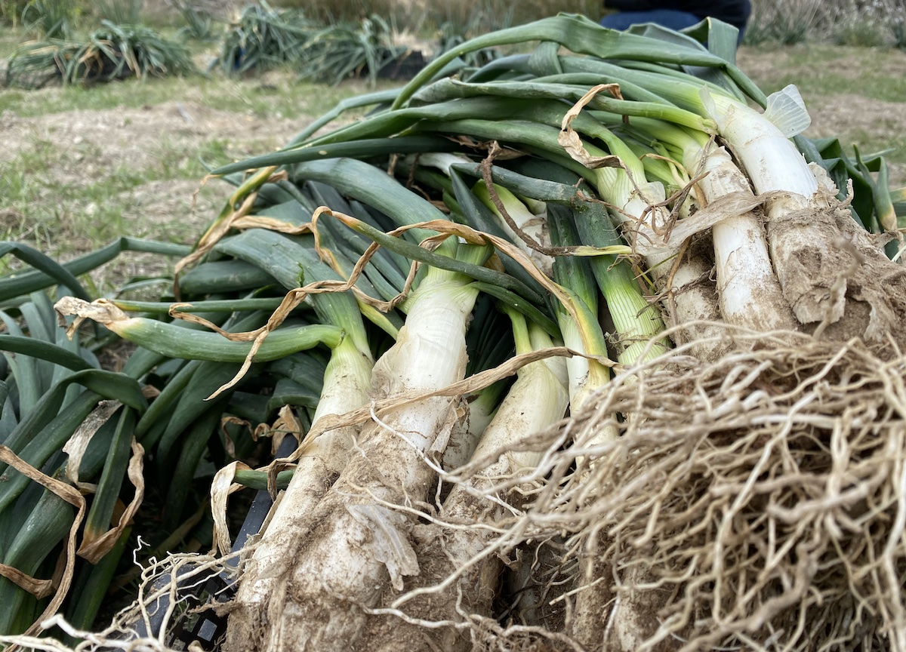
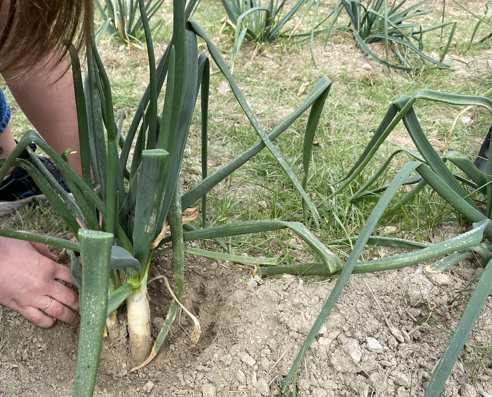
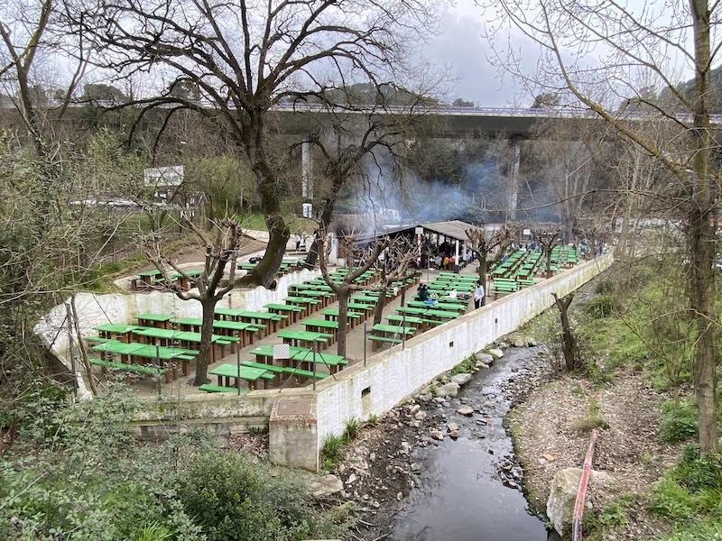
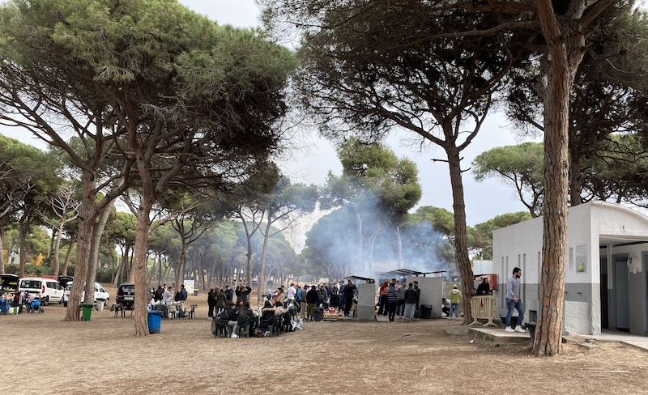

## Contents

## What is a Calçotada?

A calçotada is a Catalan tradition where people get together and eat calçots. If you live in Catalunya and you’ve not heard of a calçot, then it’s possible that you have not yet completed your Catalan onboarding!

The calçot season gets into full swing during the winter months, between about December to early March. The idea is to enjoy this very Catalan tradition with a large group of friends in a rustic restaurant, usually in the countryside, where you will eat calçots, bread, and char-grilled meats, such as butifarra, morcilla, chicken and a selection of grilled beef or lamb cuts.

That being said, the main focus is usually on the calçots, which are best accompanied by a special romesco sauce, which is made with toasted almonds or other nuts, roasted red peppers, garlic, and other tasty ingredients.

**Calçots are a type of green onion** that look like big spring onions or small leeks - but are indeed a different variety in their own right. They are grown using a special method, where soil is used to cover the bulbous part of the onion as it grows, forcing the vegetable to sprout up and giving the calçot its unique appearance and ultimately its flavour.

When it comes to calçotadas, you’ll probably want to find a restaurant that does all the cooking and prep for you. But it’s true that a lot of locals cook their own on the fire at one of the popular outdoor BBQ spots near Barcelona or around Catalunya.

**Below you will find a list of some of our favourite places to eat calçots!**

---

## Calçots in a restaurant

### Calçot restaurants in Barcelona

- <a href="https://maps.app.goo.gl/QHMeYroNeXzqwsVn6" target="_blank">Restaurant La Foixarda</a>
- <a href="https://maps.app.goo.gl/hMd6DxLfevAn2ZPQ8" target="_blank">Can Travi Nou</a>

### Calçot restaurants near Barcelona (best accessed by car)

- <a href="https://maps.app.goo.gl/eag23NpMbhHGcGxg8" target="_blank">Can Borrell</a>
- <a href="https://maps.app.goo.gl/pfCatKfg3ttSAS4N6" target="_blank">Can Carbonell</a>
- <a href="https://maps.app.goo.gl/71BTwoaX58Um27TP7" target="_blank">Restaurant Santa Creu d'Olorda</a>
- <a href="https://maps.app.goo.gl/jBYgWSW6SCnao5CeA" target="_blank">Can Cortada</a>

---

## Calçots - cook your own, near to Barcelona

There are a few places where you can cook your own calcots near to Barcelona, but we have chosen our 2 favourite spots, which are both relatively close to Barcelona and accessible by public transport.

### **Calçots @ Font de Les Planes**, Les Planes. [🔗 Instagram](https://www.instagram.com/fontdelesplanes/)

#### How to get there

##### By public transport

- Take the train (S1 or S2 train, not the metro) from Plaça de Catalunya to Les Planes station direct (20 mins, T-Casual zone 1 works, since Les Planes is the last station in zone 1).
- From the train station, walk over the bridge and down the road to the restaurant (5 mins walk).

##### By car

We’ll leave the directions up to you, but there is a car park. Just don’t arrive too late or you might struggle to get a space!

This place has fixed BBQs and tables for diners who are using the BBQs outside, with the metal cooking grill available to hire. You can also buy BBQ coal and wood (no booking, but first come, first served). These are available at the booth when you check-in. Note: BBQ coal is approximately €5 a bag (updated 2023) and the firewood is a fair price too, but you can only pay with cash (no cards!). You will also need to pay a cash deposit for the metal grill rental. Also important to note is that you will need to take everything else, such as all the food you’re going to eat, all cooking equipment, plates, drinks, etc.

There is also a large restaurant at the venue, but it’s recommended to make a booking by phone in advance.

---

### **Calçots @ Europa Barbacoa**, Gavà. [🔗 Website](https://www.europabarbacoa.es/)

Europa Barbacoa is a very popular spot where you can go and cook your own calçots (or whatever else you like) on the many BBQs provided.

#### How to get there

##### By public transport

Example route from Plaça de Catalunya: [here](https://maps.app.goo.gl/GArNPkcKVtA3s8WTA)
- Take the L95 bus from Rda. Universitat - Plaça Catalunya to Av. Europa - Vandellòs (T-Casual ticket, zone 1 valid).
- The bus passes by Plaça d’Espanya, so you can also jump on at any stop along the route.
- The journey time is about 45 minutes and the bus stops right outside the entrance to the space.

##### By car

By car, it’s about a 30-minute drive (from central Barcelona).

**Note**: You can hire chairs, which are usually €1 each, and tables for €4. Coal and firewood are available if you don’t want to bring your own. There’s also a big restaurant on the site, separate from the BBQ area, but the main attraction is the BBQ field. Surrounded by trees, it’s a nice spot with lots of space and you can just set up with a group wherever you like, with the BBQ area in the middle.

---

_And finally, some other popular places to eat calçots in 2024..._

### Calçots @ Cava Jaume Giró i Giró

Similar to Europa Barbacoa, this is a DIY BBQ place where you can host your own calçotada. But as the name suggests, it’s also a winery, located in the ‘cava town’ of Sant Sadurní d'Anoia (which is also home to the famous Freixenet winery). 

The BBQ spot is on a pretty, family- and dog-friendly patio and costs €13 per person, which includes not just rental and coal or firewood but a bottle of the winery’s own natural cava or wine. You can buy more bottles from the shop and there’s a bar for those wanting other drinks. 

#### How to get there

##### By public transport

Take the R4 ([Rodalies](https://rodalies.gencat.cat/es/inici/)) train from Plaça de Catalunya, Sants or another central station to Sant Sadurní d'Anoia. It takes about an hour. You’ll then need to walk through the town (which is very picturesque) for about 10 minutes. 

##### By car

By car, it’s about a 50-minute drive (from central Barcelona). 

---

### Calçots @ Can Coll (Collserola)

You will find Restaurant Can Coll nestled deep in the Collserola National Park north of Barcelona. It is best accessed by car, such as from the nearby Cerdanyola del Vallès. Nevertheless, they have lots of grills for you to cook calçots or general BBQ food.

📍 [Can Coll Location](https://maps.app.goo.gl/ihstSZYxZrs9YyjVA)

### Calçots @ Font Picant (Cabrera de Mar)

Deep in the mountains inland of Cabrera de Mar, just up the coast from Barcelona, you’ll find Font Picant. It’s a very exclusive spot and can only be accessed by car.

📍 [Font Picant Cabrera](https://maps.app.goo.gl/8mAbUdJbkGPwsAdD8)

Be sure to pay a visit to **Castell de Burriac** if you’re in the area. It requires a fair amount of uphill walking, but it’s well worth the visit!

