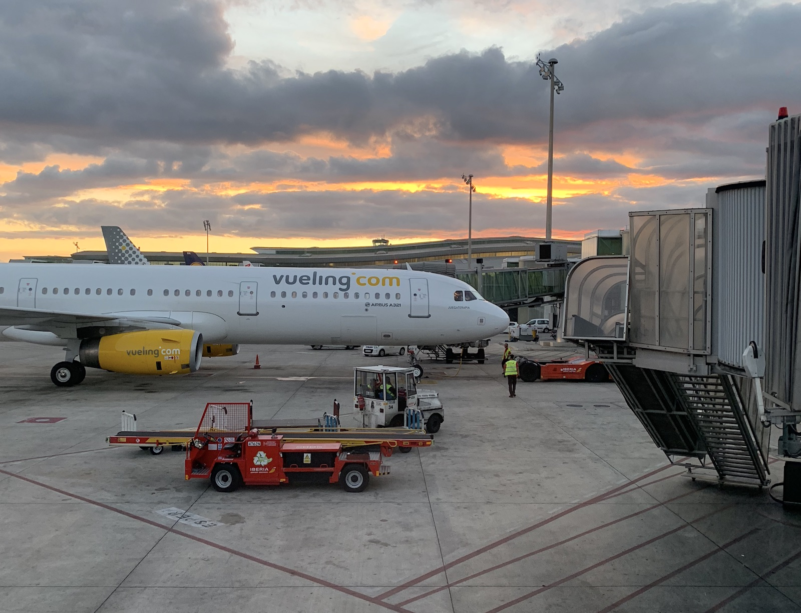

## Contents

## Intro
[IMAGE 1]

Information about skiing in Andorra is under-documented and mostly fragmented across multiple websites, intertwined with the marketing and e-commerce for ski resorts. It can be hard to know where to start, especially if you’re not from Spain/Europe, so we decided to write this article.

There are two main ski domains in Andorra. This article will cover the **Grandvalira** ski domain, which is the biggest, and the second, the **Vallnord**.

### Ski domains in Andorra

[Grandvalira](https://www.grandvalira.com/en/ski-map), comprising:

- Encamp (Funicamp)
- Canillo
- El Tarter
- Soldeu
- Peretol
- Grau Roig
- Pas de la Casa
  - In total, 210 km of ski slopes in winter
  - The highest point in the Grandvalira domain is “Pic de Cubil” at 2,640 m altitude, which overlooks the Encamp top station.

[Vallnord](https://vallnord.com/), comprising:

- [Ordino Arcalís](https://www.ordinoarcalis.com/en/)
  - 30.5 km of ski slopes in winter
  - Open 24th Nov 2023 – 7th April 2024
- [Pal-Arinsal](https://www.palarinsal.com/en)
  - 63 km of ski slopes in winter/60 km of mountain biking in summer

Note: Opening dates will change each year. Also, the skiable area will change since not all slopes and lifts are always open, so always check the websites and apps for up-to-date information.

Note: Opensnowmap.org has an excellent view of the ski domains –– here’s the <a href="https://www.opensnowmap.org/?zoom=13&lat=42.55372&lon=1.66409&layers=snowbase&marker=false#map=14/1.652/42.548&b=snowmap&m=false&h=false" target="_blank">Grandvalira OpenSnowMap</a> link. It also shows the colour of the runs, e.g. Blue = beginner, Red = intermediate, Black = expert.

## Key places to know when skiing in Andorra

- **Andorra la Vella** (also sometimes referred to as Andorra centre or Andorra main town): This is the main town of Andorra which you will inevitably pass through, even if you’re not staying there. Note: there are no ski lifts from here. Instead, you will find a built-up town with retail shops and duty/tax-free shopping, restaurants and hotels.
- [Grandvalira](https://www.grandvalira.com/): This is the name of the ski domain that encapsulates the seven sectors mentioned above with blue, red and black ski runs. It also has a training slope and offers over 210 km of excellent skiing when fully open.
- **Escaldes-Engordany**: Les Escaldes or Escaldes is an urban area in Escaldes-Engordany parish, Andorra. It is located near the nation's capital, Andorra la Vella. You will find hotels, spas, restaurants and shops here.
- **Encamp (Funicamp)**: This is the first town in the Grandvalira ski domain. There is a [huge ski lift](https://maps.app.goo.gl/D82LYGcZifQgbuUG7) from here which takes some 25 minutes to reach the summit (passing by a [halfway station point](https://maps.app.goo.gl/xpiEreXq3yRMUi17A), which is not really used by skiers in winter). The top station is [here](https://maps.app.goo.gl/ssNJYud3C1BykPsc8).
- **Canillo**: One of the small ski resort towns between Andorra la Vella and El Tarter. From here you can access the mountain from the ski lifts. You will also find shops, hotels and restaurants.
- **El Tarter**: A popular destination spot for skiers and boarders offering apartments, hotels and ski/board shops. It also has a ski lift. It’s similar to Soldeu, below (and located just before it) but doesn’t have a cable car –– only a chair lift. Nonetheless, it is still a well-visited spot. 
- **Soldeu**: This is one of the most popular destinations for skiers and boarders with everything from a huge ski lift cable car to ski/board rental and outdoors shops along with hotels, bars and restaurants. If you’ve not been to Grandvalira before, consider this as a place to start.
- **Grau Roig**: Offers access to the slopes in a much smaller resort.
- **Pas de la Casa**: A built-up France/Andorra border town, it has several major ski lifts, restaurants, bars with DJs on the slopes, ski/board rental shops, hotels, etc. Also gives access to France.

## How to get from Barcelona to Andorra
To get to Andorra, you have a few options. The best is by road since there are no train or plane options available. One thing that catches people out is that **Andorra is a country outside the EU**, and so a passport is required to enter the country. Border patrols spot-check cars travelling in, so you may have to present passports when you cross. If you come by coach, the driver will require you to have a passport to board at the coach station.

### By Car
The journey from Barcelona to Andorra la Vella (the main town) is around 3 hours. We’ll let you work out the best route, but here are some things to consider.

- The most common routes are to go via Manresa or Igualada, depending on where you’re coming from.
- The route can get very busy during ski season, so it can pay to go very early in the morning, like 7 am. This is particularly true for people going skiing for the weekend. For example, coming back on Sunday night, you might find yourself in heavy traffic leaving Andorra.
- You will most likely be staying at one of the ski resorts, such as Soldeu, since this gives direct access to the mountain. So allow an additional 20 minutes to an hour to get from Andorra la Vella to your resort, depending on traffic and road conditions.
- In the colder months, you may need snow chains on your car to access some roads, but this will be an exception for most.

### By Coach
[Andbus](https://andbus.net/) and [Alsa](https://www.alsa.com/en) are the main operators of coach services to and from Andorra. The buses (Autobuses) depart from Barcelona Estació del Nord ([map link](https://maps.app.goo.gl/5DVEF21Dat7ZHEQw9)). The journey time from Barcelona to Andorra la Vella is around 3.5 – 4 hours (approx. €36 return), depending on traffic, and you will be dropped off at the Andorra Bus Station ([Estación de Autobuses de Andorra](https://maps.app.goo.gl/68aL5HPMf3vgN7eMA)).

[IMAGE]

If you intend to sleep somewhere other than the bus station, you’ll find that local buses also pass by here. You’ll be able to get to one of the many ski station towns, which give access to the Grandvalira or Vallnord ski domains.

[IMAGE]

### Other Options
Aside from renting a car, you can also use lift-share services, such as [BlaBlaCar](https://www.blablacar.es/). You will generally find people offering space from Barcelona to Andorra all year round, for a reasonable price.

## How to get from Andorra la Vella to Encamp, Canillo, El Tarter, Soldeu or Pas de la Casa
From the Andorra la Vella coach station, local buses run relatively frequently to Encamp but stop at all the local stops on the way. The journey has been known to take 45 minutes, even though it’s not very far. *There is a bus service which goes from Encamp to Canillo -> El Tarter -> Soldeu -> Pas de la Casa, which is used usually by people visiting the slopes (operated by AndBus). The link is [here](https://andbus.net/en/time-and-rates).

[IMAGE HERE]

### Some things to consider when skiing in Andorra
- There is a bus which goes between Soldeu and El Tarter, but it can get busy and isn’t very frequent, so we don’t recommend relying on it. Instead, if you find yourself at Soldeu but you’re staying at El Tarter, the best option is to take the lift up and ski back down. Note: in the late evening, the run down back to El Tarter can be icy, being in the shadow of the hill. The same applies for Soldeu.
- It is possible to stay at any of the seven main Grandvalira destinations and access every other location. For example, you can set off from Encamp, have lunch in Pas de la Casa, and return to Encamp the same day. It’s a long way, but it’s certainly doable, even with almost all blue runs and some great skiing –– and even if you’re not an expert.
- The longest cable car is Encamp to the summit at approx 2,500 m, which takes 25 minutes. The cable car at Soldeu is relatively short in comparison and takes about 10 minutes. The rest of the domain is made up of chairlifts, T-bar lifts and rope lifts.
- There is a flying fox and toboggan at Canillo. They also have a ski school for kids.
- In Pas de la Casa, you will find that in most bars and restaurants, they speak French by default, but they can also speak either Catalan, Spanish or sometimes English. This is because Pas de la Casa is on the border with France and Andorra.
- If you’re a beginner, Grandvalira can be a good place to start, but anything other than the beginner slopes will be immediately intimidating. Having said this, I had only a few hours of previous skiing experience and after my third day of doing only blue runs, I was skiing with some confidence.

### Where to buy a lift pass for Grandvalira
Depending on where you are coming from, you might have an all-in-one package, which includes your hotel, ski/equipment hire and lift pass, so you won’t need to worry. If you are travelling from the rest of Spain or just doing things manually, then you can buy a lift pass in advance. The name in Catalan is “Forfait” and you can [buy the ski pass here](https://www.grandvalira.com/en/ski-pass-plus-andorra) for Grandvalira (note that the website is not always very reliable!).

**Note**: If you intend to go skiing for 14 days or more, it’s probably better value for money to buy the season pass. This usually has early-bird prices, so make sure to plan ahead. The daily lift pass is usually around €60 (online and ticket office prices can differ slightly). They also offer a “Forfait Plus” (Ski Pass Plus+), an on-demand pass that automatically charges you when you use it and which allows you to ski in both Grandvalira and Pal Arinsal/Ordino Arcalis domains. You can [read more here](https://www.grandvalira.com/en/ski-pass-plus-andorra).

### Other lift passes
There are various other types of lift passes to consider, depending on what you are planning to do. Not everybody uses the lifts to go skiing or snowboarding. Here’s an overview of what they offer from the official website:

- **Cable car visitor access**: This is for non-skiers/boarders who just want to take the cable car from Soldeu town to the Soldeu mountainside –– for example, parents taking their children for ski lessons on the beginner slopes close by or just people going to the Soldeu mountain bar.
- **Cable car mountain walking**: This is for non-skiers/boarders who wish to go hiking on the mountain, usually in those hinged snowshoes.
- **General lift pass**: Gives access to all the lifts for one day.
- **General lift pass, Forfait Plus**: This is a card you can use as and when you want; you’ll just be charged for the days you use it. It can be the most flexible option if you’re just going for a short holiday to Andorra for a few days or a week.
- **General lift pass, Forfait Season Pass**: This is a pre-purchased season ticket for people who regularly ski in Grandvalira.

In all cases, **the general lift passes allow access to all lifts on the Grandvalira domain**. That is, the cable cars (Telecabinas), ski chairlifts, T-bar lifts and rope pulley lifts, which you’ll find all over the mountain.

**Note**: Some of the ski lifts have two queues –– one for season ticket holders, which is the speedy queue, then one for everyone else.

[IMAGE X]

### What to take when going skiing/boarding to Grandvalira

If you’re doing your own ski trip, this is the main equipment/expenses you are likely to need (depending on whether you have your own gear).

- Ski hire (skis, boots and poles).
- Board hire (snowboard and boots).
- Helmet and visor. Note: we strongly recommend a helmet, even though you may see people on the slopes without one!

You would therefore need to take:

- Warm clothes: Usually ski/board trousers and a ski jacket.
- Gloves. We recommend ones with a grip to grab the poles/T-bars, so not woollen.
- Sunglasses: If not using a visor, sunglasses can be very useful.

Some additional points to consider from real experiences:

- The ski visor is optional in my opinion and I just wore sunglasses. This was true for December and February, where the weather was relatively good –– in fact, it was sunny.
- In December, the weather can actually be very sunny and warm, so you don’t want to wear too much. A lot of the ski bars have nicely decked terraces where you can have a drink in the sun! If it’s not too windy then just two layers and a ski jacket with waterproof trousers can be sufficient.
- Grandvalira has a dedicated app for skiing.
- Check what your insurance covers keeping in mind you’re in Andorra. Some/most insurance policies don’t cover skiing, especially off-piste skiing. 
- Most people take their phone skiing, so a jacket with a breast pocket can be useful here.
- Make sure you know what time the lifts are closing as you don’t want to get stranded far away from your hotel/apartment.
- Check the weather before and during your trip. Strong winds mean the lifts will be closed. You can check which slopes are open [here](https://www.grandvalira.com/en/open-slopes).
- Also check the snow forecast for snow levels. You can find the info on [this website](https://www.snow-forecast.com/resorts/El-Tarter-Soldeu/6day/mid). 
- The Grandvalira app has live webcam footage of the slopes, which can be useful.
- If you’re a competitive skier, check out the [Skitude app](https://skitude.com/), but you can also track your runs on here and get general stats.
- For Andorra traffic alerts, maps, estimated times and more, check out the [Mobilitat Andorra app](https://www.mobilitat.ad/app-mobilitat-andorra-ios-android).

### Where to hire ski or board equipment

#### Encamp

- [Pic Negre 14](http://www.picnegre.com/), Encamp ([Map](https://maps.app.goo.gl/59jYzokzoiV4yuXM9)). They often have promos on during the run-up to the season to grab a discount.
- [ESPORTS PIROT](https://esportspirot.com/tiendas/), Encamp ([Map](https://maps.app.goo.gl/BM6nGjSHEmr7mrdA6)).

#### Canillo

- Awaiting recommendations

#### El Tarter

- Awaiting recommendations

#### Soldeu

- Sports Calbo (next to the ski station)
- [SHUSSKI SOLDEU PIOLET](https://shusski.com/) ([Map](https://maps.app.goo.gl/Mixq2iq1NboUwaLq5)). 
- [SLIDEWAYZ Snowboard Shop](https://slidewayz.com/) ([Map](https://maps.app.goo.gl/MGzzCUGUkxH8HyB48)). Snowboard services, waxing, repair, etc. 

#### Peretol

- Awaiting recommendations

#### Grau Roig

- Awaiting recommendations

#### Pas de la Casa

- Awaiting recommendations

#### Online

You can hire ski/board equipment directly from the shops in Andorra –– just go to their website. Here are a couple of other online options:

- [Alpine Resorts](https://www.alpinresorts.com/en/ski-rental)
- [Snow Rental](https://www.snowrental.com/es)

### Where to stay in Grandvalira

If this is your first visit, we recommend staying in Soldeu, El Tarter or Pas de la Casa, where you will find the most nightlife, hotels and restaurants. Hotels usually offer breakfast and dinner buffets –– you will find yourself having lunch on the slopes at one of the many restaurants on the pistes. If you do eat on the slopes, consider the “menu del día” options, which can be pre-purchased, provided you know where you’re going to be.

### Other places to ski close by

If you are based in Barcelona and you want to go skiing, you might also want to consider La Molina, which is very popular since there is a direct train from Barcelona to La Molina. However, you’ll still need to take the bus from the train station up to the slopes. There’s a [combined ticket from Renfe](https://www.renfe.com/es/es/cercanias/rodalies-catalunya/ofertas-mas-populares/combinado-skitren), which you can buy from a Rodalies de Catalunya railway station in Barcelona. We will probably write a separate post about skiing in La Molina in the future.

—--

More stuff to add?:
Price of beer on the slopes
Types of food - e.g. open toasted sandwiches, burgers, full meals, crepes in Pas.
https://www.soldeuparadise.com/en 
