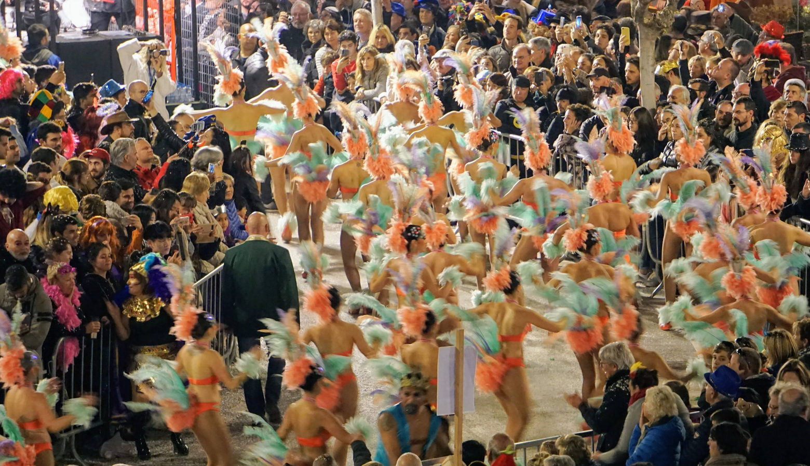
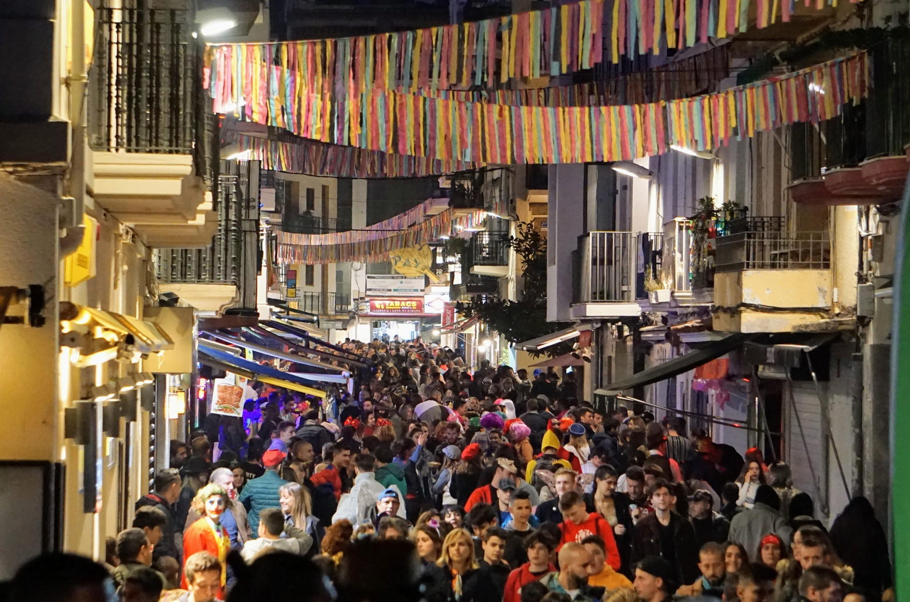
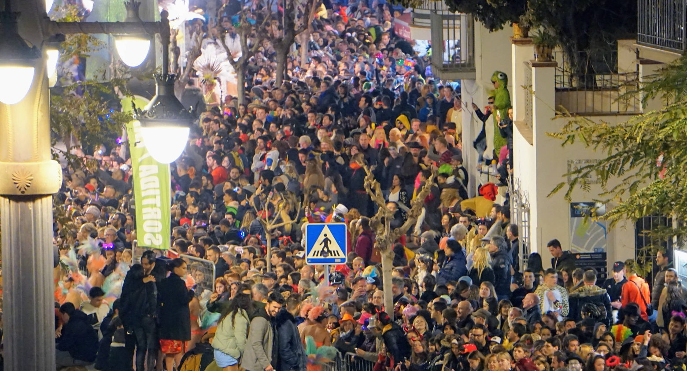
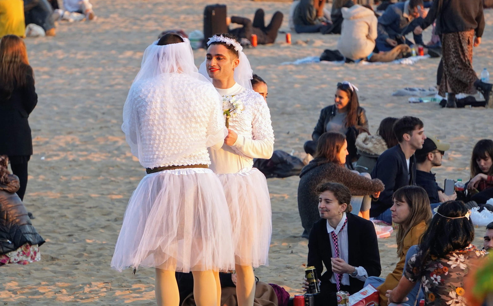

## Contents

## Unveiling the Carnival Spirit
Tracing its roots back to the Middle Ages, the carnival tradition across Europe was originally a display of medieval, folk, and pagan cultures. More than just a festivity, carnivals served as a societal valve, temporarily overturning the usual norms and indulging in satire to rejuvenate the community spirit. It's akin to a collective sigh of relief, where humour and role reversal not only entertain but reinforce societal bonds by allowing a momentary escape from everyday norms.

Today's carnivals continue this legacy of collective merriment and masquerade, blending creativity with flamboyance in a celebration that prioritises fun above all else. While the Sitges Carnival may not rival the scale of Rio de Janeiro's, it has steadily grown in popularity and significance, promising an unforgettable experience of joy and freedom. 

Here's everything you need to know to make the most of your visit to this vibrant festival.

## Getting Carnival-Ready: Dress Code and Arrival Tips

When it comes to blending in at the Sitges Carnival, dressing up is the secret spice. Although slipping into costumes, makeup, and masks isn't a strict rule, showing up in plain clothes might make you feel a bit out of place. The crowd is a kaleidoscope of imagination and creativity, with many donning elaborate, handcrafted costumes that showcase incredible ideas and craftsmanship. Year after year, the bar for these fantastic ensembles is raised higher, turning the streets into a vibrant runway of artistic expression. To truly stand out, consider going all out with a well-thought-out costume or even coordinating a group theme.

Remember, any effort to dress up is better than none. But if costumes aren't your thing, fear not—you won't be turned away for sticking to your everyday wardrobe. The carnival spirit embraces all.

The carnival's schedule is typically laid out well in advance, with details available on the official website as early as January. The highlight for many is the grand parade, a spectacle of colour, music, and dance that caps off the festival in the last week. Groups that wish to participate in the parade must register a year ahead and receive approval to showcase their elaborate costumes, choreographies, and floats.

The biggest crowds converge on the final weekend, with special parades for children and teenagers on Saturday, and the main event lighting up Sunday evening. This is when over a thousand participants, adorned in their carnival best, dazzle an audience that swells into the tens of thousands, all gathered to witness the spectacle along the town's scenic promenade.

For those planning to attend the 2024 Sitges Carnival, mark your calendars for the main parade on February 11th. It's worth noting that the dates shift annually, typically aligning with Easter, occurring 40 days prior. So, planning ahead is key to ensuring you don't miss out on this unforgettable celebration.

## Activities schedule:

### Saturday, February 10th

| Time                    |
| :---------------------- |
| **09:00** – Visit to the senior citizens' homes |                       
| **11:00** – Visit to the Municipal Market |
| **12:00** – Fancy Dress Bed Race starts in front of the Casino Prado. |
| **16:00** – Fardo Ball at Paseo de la Ribera, children’s playground area |
| **17:00** – Tequereque Party or carnival percussion party along the most emblematic streets 21:00 – Xató Dinner with Carrusel Show at Teatro Prado |

### Sunday, February 11th

| Time                  |
| :-------------------- |
| **12:00** – Children’s Parade of the Sitges Carnival |
| **19.30** – Rua de la Disbauxa – Adult Parade |
| **23:00** – 3 am Sitges Carnival 2024 dance and party at Hort de Can Falç (23:00-03:00, capacity limited to 400 people) |

For more info, visit the <a href="https://www.visitsitges.com/en/carnaval-sitges-2024/" target="_blank">Sitges Carnival website</a>.

---

## How to Get to Sitges From Barcelona

Journeying from Barcelona to the heart of the Sitges Carnival is a breeze, with most revellers opting for the train for its convenience and comfort. However, it's important to note that from early afternoon onwards, trains tend to fill up quickly. Planning your departure to avoid peak times can make for a smoother ride.

For those considering driving, be prepared for the challenge of finding parking. Spaces in central areas are snapped up early, so you may find yourself parking far from the action and facing a lengthy walk back to the festivities. Additionally, most parking spots are paid––and stumbling upon a free parking space can be like finding a needle in a haystack.

For those who wish to soak up the carnival atmosphere beyond just the weekend, booking accommodation in Sitges is a popular choice. Whether you're looking for the comfort of a hotel or the homeliness of an Airbnb apartment, there are many options. Yet, securing your stay well in advance of the carnival is crucial, as demand skyrockets and availability dwindles as the event draws closer.

Whether by train, bus, or car, planning your journey to Sitges with these tips in mind will ensure you arrive ready to dive into the carnival's vibrant festivities without a hitch.

### Heading Back: Sitges to Barcelona Post-Festivities

As the Sitges Carnival winds down, remember that the return train service to Barcelona shifts to a limited schedule after the festivities, running just one train per hour from 02:30 am. This reduction in frequency can be a surprise for those not prepared, leading to longer waits for transportation back to the city.

Though some bus services might increase their routes to accommodate the late-night crowd (and additional trains could be added to handle the demand), it's wise to check the official websites of the transport providers for the most up-to-date schedule information. Let Google Maps or City Mapper be your guides as well.

Fortunately, up until midnight, there's a consistent train service between Sitges and Barcelona, making it relatively easy to plan your departure after enjoying the carnival late into the night.

## Diving Into the Sitges Carnival Experience

### What to Expect

Gear up for an unforgettable blend of bustling crowds, booming music, and, typically, pleasant weather—which we're all hoping for this year as well. The Sitges Carnival is famed for its vibrant highlights: the _Rua de la Disbauxa_ (Parade of Debauchery) on Sunday night and the _Rua de l'Extermini_ (Parade of Extermination) on Tuesday night. Coming back strong after the pandemic hiatus, the _Rua de la Disbauxa_ recently saw a parade featuring 34 floats and over 1,200 participants, immersing the town in a spectacle of joy and creativity.

With the streets packed, expect most restaurants to be bustling with activity all day. But don't let crowded venues or the off-chance of inclement weather dampen your spirits.

### Gastronomic Delights
Sitges is a treasure trove of charming bars and eateries, not just along its scenic promenade but also within its quaint, narrow streets. These spots become lively hubs of activity during the festival, and snagging a seat in one of the sought-after restaurants might require a bit of patience. The local culinary scene shines with traditional dishes like the _xató_ salad and _tortilla_, alongside a plethora of other Spanish and Catalan treats. However, the carnival night is truly about embracing the street vibes, with many opting to enjoy their food and drinks picnic-style along the promenade or on the beaches.

### Weather Watch
The latest forecasts suggest a mix of wind and potential rain for the coastal area over the weekend, posing a challenge for the carnival's outdoor activities. While this might be disheartening, the carnival spirit often prevails, with many choosing to celebrate regardless. Sunday is currently expected to be rain-free, albeit a tad windy.

Staying updated with the latest weather predictions is key to enjoying the carnival to its fullest. Should the weather turn, the welcoming bars and restaurants of Sitges offer a cosy retreat, ensuring the fun continues, come rain or shine.

## Wrapping Up: The Sitges Carnival
Sitges, with its unique charm and vibrant atmosphere, is a destination that commands attention all on its own. When draped in the exuberant colours of carnival, it transforms into a priceless gem within Catalonia and Barcelona's rich cultural tapestry—a spectacle that beckons for active participation and appreciation.

Beyond its renowned film festival, the Sitges Carnival emerges as a pinnacle event on Barcelona's cultural calendar, captivating attendees with its lively spirit. It's an affair that transcends mere entertainment, offering a kaleidoscope of fun suitable for families, friends, and individuals of all ages.

Seize the moment to experience this once-a-year extravaganza, a highlight among February's cultural happenings that certainly warrants a prime spot on your event radar. For those with an adventurous streak, consider extending your carnival journey to Tarragona and Vilanova i la Geltrú to explore the varied festivities and atmospheres these locales offer.

And if you're looking for companionship or guidance, the English Speakers community often organises Meetups. Some members will probably head up to the carnival as well, so don’t forget to peek in the Meetup Group or ask in advance. Whether you're a longtime carnival-goer or a curious first-timer, the Sitges Carnival promises a whirlwind of joy, culture, and unforgettable memories.
