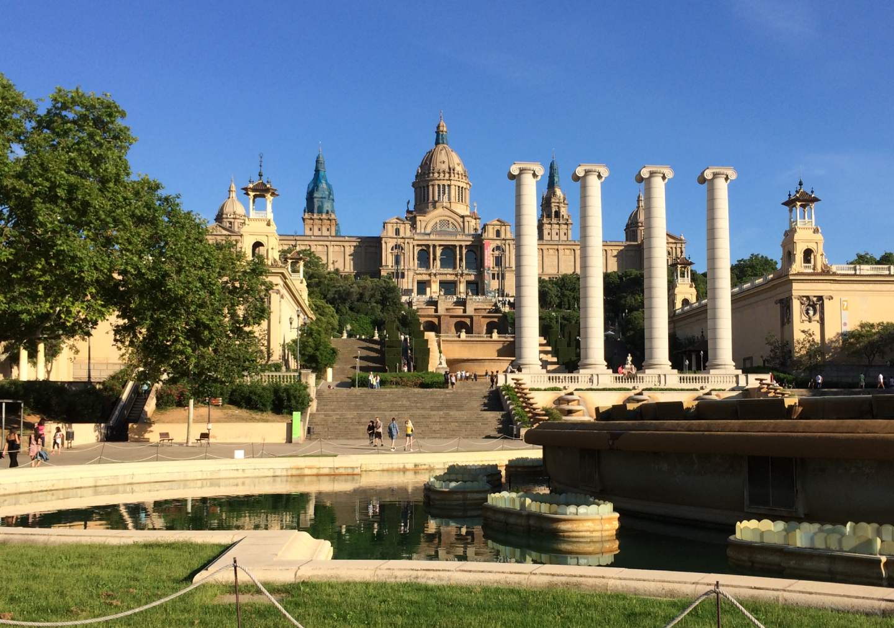

## Contents

## About Palau Nacional

Built as the jewel in the crown of the Universal Exposition of 1929, the enormous Palau Nacional was completed in just three years and now houses the Museu Nacional d'Art de Catalunya. Perched atop a grand stone staircase at the foot of Montjuïc, the design and scale of this “National Palace” invoke the splendour of the Spanish Renaissance, and views from its esplanade and terraces are some of the finest in the city.

## The essentials

**Palau Nacional** (English - *National Palace*) is surrounded by popular attractions and well-known landmarks, so it is served by a wide variety of transport links.

It is recommended to arrive via Plaça d'Espanya rail and metro station (L1, L3 & L8 and other rail services), and from there it is a short walk to the palace down Avinguda de la Reina Maria Cristina past the Torres Venecianes, a pair of monumental Venetian towers also built for the Universal Exposition of 1929.

Once you reach the stairs, you will arrive first at the Magic Fountain of Montjuïc, which on Friday evenings hosts a magnificent sound and light show (<a href="https://www.barcelona.cat/en/what-to-do-in-bcn/magic-fountain" target="_blank">Magic Fountain opening times</a>). You will pass by other elegant structures, each its own mini plaça (square), before reaching the palace itself.

While the Palau Nacional houses the <a target="_blank" href="https://www.museunacional.cat/en">Museu Nacional d'Art de Catalunya (MNAC)</a>, which charges an entrance fee, you can view the Great Hall of the palace for free. Tickets to MNAC include access to the palace roof and terraces, but a ticket just for these can be bought at MNAC for a small fee.

In any case, the free experience (without entrance) is more than sufficient. Most people arrive at the steps in front of the palace itself, which offer an excellent photogenic view across Barcelona, before enjoying the gardens and spaces around the palace, as well as the other tourist spots situated on Montjuïc.

## Recommended

We highly recommend making the most of your visit to Palau Nacional by taking in Museu Nacional d'Art de Catalunya (MNAC). Tickets to the museum are valid for two days (with a range of concessions and discounts offered) and give you access to the roof and terraces, offering stunning views of the city and the surrounding area. MNAC boasts an incredible collection of Catalan art from medieval times to the 20th century, displayed beautifully within the palace’s recently renovated interior.

Alternatively, explore the surrounding gardens and historic sites spread out across Montjuïc. The adventurous could even start at Palau Nacional and make their way up to Montjuïc Castle (Castell de Montjuïc).

If possible, time your visit to the Palau Nacional with a sound and light display scheduled at the <a href="https://www.barcelona.cat/en/what-to-do-in-bcn/magic-fountain" target="_blank">Magic Fountain of Montjuïc</a>.

## A little background

The building was originally meant to be in the Modernist style, but this was scrapped by the military government of the day and a Renaissance-style conception was selected in its place. The Palau Nacional of today was completed in only three years, just in time for the Universal Exposition of 1929.

The new design suited the nationalist politics of the day, with the palace’s central dome inspired by St Peter’s Basilica in the Vatican City and the lesser domes designed after the Cathedral of Santiago de Compostela. This style, and the rejection of its Modernist precursor, can be seen as a reaction against Modernism, the Art Nouveau movement, and the work of Antonio Gaudí.

Substantial renovations were undertaken at Palau Nacional as Barcelona prepared to stage the 1992 Olympics and were only completed in 2004 when the palace was finally reopened to the public.

## What’s nearby?

The area around Palau Nacional is rich in landmarks and attractions, with the physical legacy of the Universal Exposition of 1929 and the Olympic Games of 1992 hard to miss.

Behind the Palau Nacional are the Botanical Gardens (Jardí Botànic Històric) and the vast Joan Maragall Gardens (Jardins de Joan Maragall), where you will find another palace, the neoclassical Palauet Albéniz – though this is only open briefly on weekends. You will also be able to reach the Olympic Stadium and Olympic Rings, the Joan Miró art museum, the Greek Theatre (Teatre Grec) and a handful of hidden gems scattered over Montjuïc and the surrounding area.

In addition, Poble Espanyol is a 10-15-minute walk away – another frequented classic amongst tourists.
