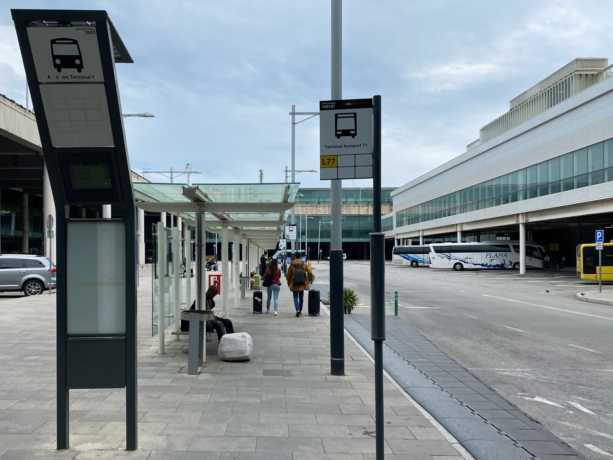

You have a few options when it comes to using public transport in Barcelona –– and even better, the tickets available represent great value compared to other major European cities. In this article, we will break down the different options, including cost, which you can use to get to the airport, and more.

## Contents

## [T-Casual](https://www.tmb.cat/en/barcelona-fares-metro-bus/single-and-integrated/t-casual)

This is the most common choice for infrequent travellers. At the time of writing, the price is €11.35 within zone 1. You can find the [zone map here](https://www.tmb.cat/en/barcelona-fares-metro-bus/single-and-integrated/zone-map). 

The card is good for 10 journeys across the Barcelona public transport network, including trams, buses, trains, the metro, and even the Montjuïc funicular. You have 75 minutes between the first and last validation.

You can use the T-Casual to get the train from the airport at T2 (there is a free shuttle in between terminals), and also the [46 bus](https://www.tmb.cat/ca/barcelona/autobusos/-/lineabus/46) which goes to both T2 and T1 from Placa Espanya. This is a little slower than the Aerobus as it makes more stops (around 15 mins longer), but it’s more cost-effective if you are not in a rush.

Note that this is not valid for the metro to airport terminals 1 and 2, only the train.

## [T-Usual](https://www.tmb.cat/en/barcelona-fares-metro-bus/single-and-integrated/t-usual)

This is a card valid for unlimited journeys in a 30-day period. At the time of writing, the cost is €20 for one zone –– this is a [reduced subsidy price](https://www.tmb.cat/en/barcelona-fares-metro-bus/single-and-integrated/transport-fares-reduction) introduced in September 2022 to help manage the costs of inflation, and which has now been extended through 2024. To buy one, you must have some form of national or other official ID. You’ll have to enter the number (e.g. NIE or passport number without any letters) into the ticket machine as you purchase.

You can use the T-Usual for the metro to the airport, which is useful as the tickets for this leg of the journey cost around €5.20 one way. I would recommend this for tourists who are spending a week or more in the city and want to get around along with getting to and from the airport using the metro (which is a bit slower than the Aerobus FYI).

## [T-Familiar](https://www.tmb.cat/en/barcelona-fares-metro-bus/single-and-integrated/t-familiar)

This is a multi-person ticket valid for 8 journeys. You can share it with one or several people –– just scan your ticket at the machine and pass it to someone else to use. It is valid for 30 days and cannot be used to get to the airport by metro. However, it can be used for the train that goes to T2 and the regular 46 bus. The price is currently €10. 

## [T-Grup](https://www.tmb.cat/en/barcelona-fares-metro-bus/single-and-integrated/t-grup)

This is another card that can be shared and is valid for 70 journeys across 30 days. It is also not valid for the metro to the airport. At the time of writing, it is €79.45 for 1 zone.

### Other tickets:

[T-Jove](https://www.tmb.cat/en/barcelona-fares-metro-bus/single-and-integrated/t-jove): An unlimited-use card (valid for 3 months) for under 30s that costs €40. 

[T-Dia](https://www.tmb.cat/en/barcelona-fares-metro-bus/single-and-integrated/t-dia): This is an unlimited, one-day zone-1 ticket that can be used on the airport metro, costing €10.50.

In addition to the regular travel cards, you also have the [Hola Barcelona](https://www.tmb.cat/en/barcelona-fares-metro-bus/tickets-visit-barcelona/barcelona-travel-card-hola-bcn) cards, which offer unlimited journeys across the travel network for 2/3/4/5 days. The airport metro is included and they can be bought online for the following prices (these prices are correct as of the date this was published):

| No. Days | Price  |
| :------- | :----- |
| 2 Days   | €17.50 |
| 3 Days   | €25.50 |
| 4 Days   | €33.30 |
| 5 Days   | €40.80 |

_(All with 10% off if purchased online)_

Personally, I think you are going to be better with one of the other options instead of the Hola Barcelona, but each to their own.
