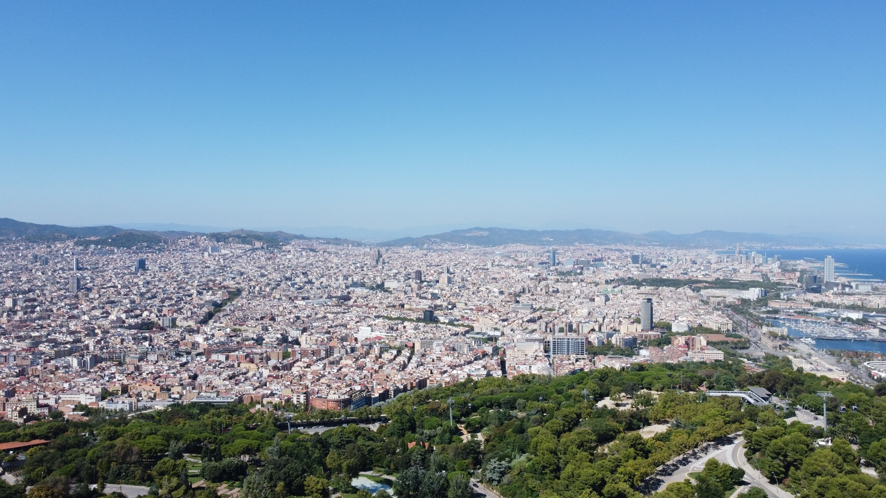
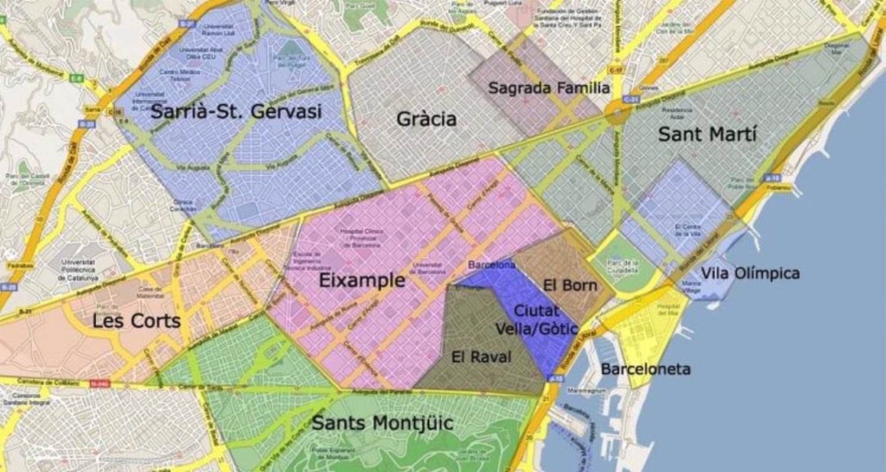

## Contents

## About Barcelona neighbourhoods

Quite often, when you move to a new city, you do not know where the best place to live is. In Barcelona especially, you have many neighbourhoods to decide between, all with their own character and perks. It depends a lot on what your personal circumstances are when it comes to choosing the right place to live.

The city is divided into 10 districts, each with its own distinct personality and attractions. Here is a brief overview of some of the most popular neighbourhoods of Barcelona:

## Main neighbourhoods

1. [Ciutat Vella](#ciutat-vella) (Old City): This is the historic centre of Barcelona which is home to many of the city's landmarks, such as the Gothic Quarter, the Picasso Museum, and the famous Las Ramblas boulevard. You can find the following areas in this neighbourhood.

- [El Raval](#el-raval)
- [El Gótico](#el-gótico)
- [El Born](#el-born)

1. [L’Eixample](#leixample): This is a modernist neighbourhood known for its grid-like street layout and iconic buildings designed by Antoni Gaudí, such as the Sagrada Família.
2. Gràcia: A lively neighbourhood with a bohemian vibe and a strong community spirit, Gràcia is known for its small independent shops, bars, and restaurants.
3. [Sants-Montjuïc](#sants-montjuïc): This is a diverse neighbourhood located on a hill overlooking the city. It is home to the Montjuïc Castle, the Olympic Stadium, and the Poble Espanyol (Spanish Village).
4. [Sant Martí](#sant-martí): This is a residential neighbourhood with a number of parks and green spaces, including the Parc de la Ciutadella and the Barceloneta beach.
5. Sarrià-Sant Gervasi: This upscale neighbourhood known for its mansions and embassies is home to the Tibidabo amusement park and the Collserola Natural Park.
6. Horta-Guinardó: This is a green neighbourhood with several large parks, including the Jardins del Laberint d'Horta and the famous Parc Güell.
7. Nou Barris: This multicultural neighbourhood has a number of public housing estates and is where you’ll find Parc del Guinardó and the Mercat dels Encants (a large flea market).
8. Sant Andreu: This is a residential neighbourhood with plenty of small parks and squares, as well as being home to the Fabra i Coats art and community centre and the Sant Andreu Jazz Band.
9. Sant Adrià de Besòs: An industrial neighbourhood located on the coast north of Barcelona. The Port of Barcelona and the Parc del Fòrum can be found here.

## Where to live in Barcelona?
It depends on what you enjoy and what you are used to, but I will give my view of the locations as places to live. 

If you are visiting the city, you will want to stay in the Ciutat Vella region as it is in the heart of the city and close to most tourist attractions.

Below are the pros and cons of each neighbourhood from the experiences and views of people I know.

---

### Ciutat Vella

#### El Raval

This is the edgy part of the city centre – it’s a mixing pot of all ethnicities and well located for most things.

**Pro’s:** Great location, cheap property for the location, good variety of ethnic stores.

**Con’s:** Higher levels of crime, older buildings, very noisy most of the time, risk of okupas (squatters).

#### El Gótico

Another central neighbourhood inside what was the old city. Being right in the heart of Barcelona, it is a maze of narrow medieval streets.

**Pro’s:** As central location-wise as you will find for the city, lots to see, do and explore and close to all the shops and attractions, close to the marina (Port Vell).

**Con’s:** Lots of active pickpockets, packed with tourists, buildings can be old and lower floors have very limited light, noisy.

#### El Born

The trendy central neighbourhood. More light and space than Gótico and closer to the park and beach, if that’s your thing. Lots of attractions, but with that comes lots of people.

**Pro’s:** Location location location. It’s right in the centre but close to the beach and park. Lots of restaurants and bars.

**Con’s:** Packed most of the time with drunk tourists, some properties on a low level will hardly see any light, problems with petty crime, a couple of dodgy areas in the centre of the barrio. 

---

### L'Eixample

The central residential district of Barcelona, Eixample has an easy-to-navigate grid system and is close enough to the city to feel well connected.

**Pro’s:** A good location for the city centre and a quieter vibe than Ciutat Vella. Lots of good public transport options and close enough to all the attractions if you are visiting. Safe, and offers some quieter streets and blocks with a more community-focused vibe.

**Con’s:** Further away from the beach if you enjoy this, high prices as an in-demand neighbourhood. Can be noisy if you are on one of the main roads that cross the city (Gran Via/Aragon).

---

### Sants Montjuïc
A diverse neighbourhood with some nice areas that’s relatively central and mostly very well connected.

**Pro’s:** Awaiting recommendations.

**Con’s:** Awaiting recommendations.

#### Poble Sec

**Pro’s:** Awaiting recommendations.

**Con’s:** Awaiting recommendations.

---

### Sant Martí

#### Poblenou

**Pro’s:** Awaiting recommendations.

**Con’s:** Awaiting recommendations.

