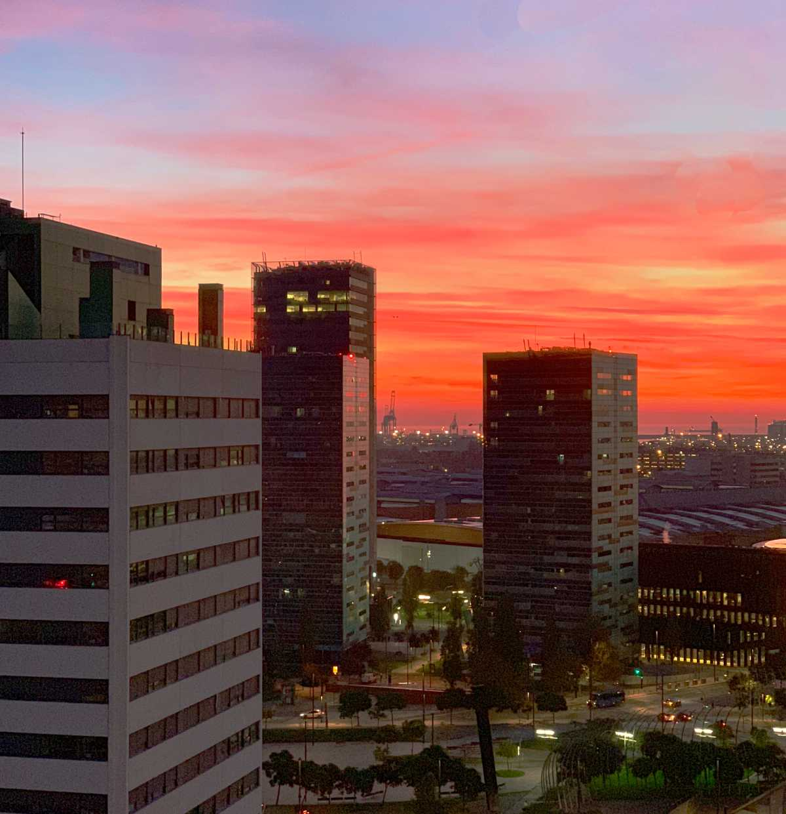

## Contents

**Quite** often when you move to a new city, you do not know where the best place to live is. In Barcelona you have a number of neighbourhoods and each has its own character and perks. It often depends a lot on what your personal circumstances are when it comes to choosing the right place to live.
The city is divided into 10 districts, each with its own distinct character and attractions. Here is a brief overview of some of the neighbourhoods of Barcelona:

1. Ciutat Vella (Old City): This is the historic centre of Barcelona and is home to many of the city's landmarks, such as the Gothic Quarter, the Picasso Museum, and the famous Las Ramblas boulevard. You can find the following areas in this neighbourhood.

- El Raval
- El Gotico
- El Born

2. Eixample: This is a modernist neighbourhood known for its grid-like street layout and iconic buildings designed by Antoni Gaudí, such as the Sagrada Família.

3. Gràcia: This is a lively neighbourhood with a bohemian vibe and a strong community spirit. It is known for its small independent shops, bars, and restaurants.

4. Sants-Montjuïc: This is a diverse neighbourhood located on a hill overlooking the city. It is home to the Montjuïc Castle, the Olympic Stadium, and the Poble Espanyol (Spanish Village).

5. Sant Martí: This is a residential neighbourhood with a number of parks and green spaces, including the Parc de la Ciutadella and the Barceloneta beach.

6. Sarrià-Sant Gervasi: This is an upscale neighbourhood known for its mansions and embassies. It is home to the Tibidabo amusement park and the Collserola Natural Park.

7. Horta-Guinardó: This is a green neighbourhood with a number of parks, including the Jardins del Laberint d'Horta and the Parc Güell.

8. Nou Barris: This is a multicultural neighbourhood with a number of public housing estates. It is home to the Parc del Guinardó and the Mercat dels Encants (flea market).

9. Sant Andreu: This is a residential neighbourhood with a number of small parks and squares. It is home to the Fabra i Coats art centre and the Sant Andreu Jazz Band.

10. Sant Adrià de Besòs: This is an industrial neighbourhood located on the coast north of Barcelona. It is home to the Port of Barcelona and the Parc del Fòrum.

## Where to live in Barcelona?
It depends on what you enjoy and what you are used to, but I will give my view on the locations as places to live. 
If you are visiting the city you will want to stay in the Ciutat Vella region as it is in the heart of the city and close to most of the tourist attractions.
Below are the pro’s and con’s of each neighbourhood from experiences and views of people I know.

### Ciutat Vella

#### El Raval

This is the edgy part of the city centre, it is a mixing pot of all ethnicities and well located for most things.

**Pro’s** - great location, cheap property for the location, good variety of ethnic stores
**Con’s** - higher levels of crime, older buildings, very noisy most of the time, occupas (squatters)

-----

#### El Gotico

Another central neighbourhood inside what was the old city. Right in the heart of the city is is a maze of narrow medieval streets.

**Pro’s** - central location as you will find for the city, lots to see and do and explore and close to all the shops and attractions, close to the marina (port Vell)
**Con’s** - lots of pick pockets active, packed with tourists, buildings can be old and lower floors have very limited light, noisy

-----

#### El Born

The trendy neighbourhood in the centre. More light and space than Gotico and closer to the park and beach if that is your thing. Lots of attractions, but with that lots of people.

**Pros** - location location location, right in the centre, but close to the beach and park. Lots of restaurants and bars.
**Con’s** - packed most of the time with drunk tourists, some properties on a low level will hardly see any light, problems with petty crime, a couple of dodgy areas in the centre of the barrio.

-----

### Eixample
The central residential district of Barcelona, with an easy to navigate grid system and close enough to the city to feel well connected. 

**Pros** - a good location for the city centre and a quieter vibe than Ciutat Vella. Lots of good public transport options and close enough to all of the attractions if you are visiting. Safe and some quieter streets and blocks with a more community focused vibe.
**Cons** - Further away from the beach if you enjoy this, high prices as an in demand neighbourhood. Can be noisy if you are on one of the main roads that cross the city (Gran Via / Aragon).

-----

### Sants Montjuïc
A diverse neighbourhood which contains some nice areas and is relatively central and mostly very well connected.
Poble Sec

**Pros** - well connected to the city centre, and close to the space and quiet of Montjuic. Some quieter neighbourhoods and reasonable prices.
**Cons** - can be noisy on lower floors when on main roads. 
