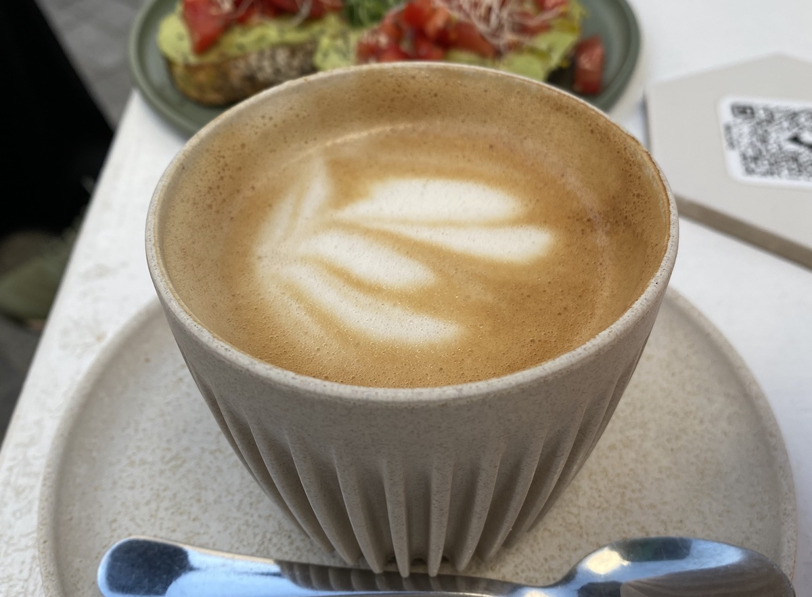

## Contents

## Best coffee in Poblenou

Barcelona has hundreds of coffee shops and places to drink coffee. But if you’re looking for the absolute best, we highly recommend you to check out the El Poblenou neighbourhood, where you will find some of the best coffee in Barcelona!

So where is **Poblenou** and why is it so good for coffee? Also, what’s the **@22 District**?

If you already know the answers to these questions, you can skip straight to <a href="#best-coffees-in-poblenou">the list of coffee places below</a>.

## About Poblenou @22

Poblenou is a quieter and more laid back neighbourhood in Barcelona compared to the city centre, and is well known for its creative industry. It is not short of design and visual FX schools and creative spaces (such as arts, ceramics, music, architecture, clothing and artisanal independent businesses), which together help attract young talent to the area.

The Barcelona Ajuntament (city council) has coined the term “@22” as a designation to emblemise and recognise this special area as the technological and innovation district of the wider Sant Martí neighbourhood. The plan was approved in 2000 and the urban regeneration has been steadily ticking over ever since.

<a id="best-coffees-in-poblenou">Best Coffees in Poblenou 2024</a>
When it comes to coffees in Barcelona, every neighbourhood has several spots worth visiting, but the below are our favourite places for exceptional coffee in Poblenou.

_(In no particular order)_

## Nomad Frutas Selectas
You can’t get any more hipster than Nomad Frutas, which to some could seem more like a coffee shop purporting to be a fruit shop! Nonetheless, the coffee is highly acclaimed and the shop sees its fair share of regulars day-to-day.

**Address:** C/ de Pujades, 95, 08005 Barcelona

## Skye Coffee Corner
Be careful not to confuse this with “SKYE Coffee Co”, which is currently closed. Skye Coffee Corner is a very exclusive coffee spot, almost too well hidden, and you’ll only come across locals who know about this place. Even so, their coffee is top quality and the relaxed courtyard is inviting.

**Address:** C/ d'Àvila, 32, 08005 Barcelona

## CASA TAOS
You can find CASA TAOS at the front entrance of Apocapoc BCN, which offers coworking and office spaces in a rather unique leafy setting. The coffee here is pretty sought after and there’s often a queue.

**Address:** C/ d'Àlaba, 100, 08018 Barcelona

## Itnig Café
Itnig Café ticks all the boxes and then some more. The coffees are great, the atmosphere is relaxing, and the place is really popular, especially with students and people at the coworking space next door.

**Address:** C/ de Pujades, 100, 08005 Barcelona

## Syra Coffee - Poblenou
Situated just off the Rambla Poblenou, you’ll come across Syra Coffee. Barcelona has seen the rise of several other Syra Coffee shops lately, and it seems like this local brand is doing well –– probably due to their excellent coffee. They also have an app where you can collect points, which works out well if you’re a regular of theirs!

**Address:** C/ del Dr. Trueta, 232, 08005 Barcelona

## Federal Cafe
Following the success of the other Federal Cafes, Poblenou is lucky enough to have its own, quietly tucked away at the bottom of C/ Marià Aguiló. They serve up a decent brunch, too, so we recommend you pay a visit when you’re next over that way.

**Address:** C/ del Taulat, 109, 08005 Barcelona

## Odara Café

Odara opened in 2023 and immediately became a huge success with the Llacuna neighbours. It was also a much needed coworking/coffee shop in Llacuna and will hopefully be here to stay. You’ll be able to enjoy a decent coffee from a laid back, hip coffee shop –– we also recommend popping by at lunchtime for their healthy dishes.

**Address:** C/ de la Ciutat de Granada, 68, 08005 Barcelona

## Gabby's Brunch

Gabby’s Brunch has mastered coffees and brunches and everything they do is super photogenic, Instagrammable and delicious! That being said, you’ll need to make the effort to get there as it’s slightly off the main path, but well worth the trip. On the weekends, you’ll be competing with a mix of locals and tourists, but it’s usually possible to get a table.

**Address:** C/ de Ramon Turró, 93, 08005 Barcelona

## Ombú Cafè
Ombú’s a general good all-rounder for coffee as well as light breakfasts and lunches. They make a great coffee and they also have a terrace at the back. It’s slightly off the beaten path, but the quality cannot be overlooked. Well worth a visit if you’re in the area.

**Address:** C/ d'Àvila, 51, 08005 Barcelona

## Julius Poblenou
Julius opened in 2022 and has since confirmed itself as a major contender for casual terrace drinks, beers and their menu del día, which is sometimes even available on Sundays –– something quite rare in Barcelona‌! Their coffee won’t win awards, but the setting and terrace more than make up for the experience. 

**Address:** C/ de Ramon Turró, 160, 08005 Barcelona

## Can Dende
Can Dende is a heavy-hitter on the brunch scene and you’ll struggle to even get a table at the weekends, unless you arrive before 10am. Aside from their Instagrammable brunches, their coffee is pretty good, if you don’t mind waiting in line.

**Address:** C/ de la Ciutat de Granada, 44, 08005 Barcelona

## Little Fern
Little Fern is quite a unique place in that it’s the only place in the area offering New Zealand-inspired brunches (at least as far as we know!). It’s worth a trip just for the food, but if you’re popping by just for coffee, then you’ll still find well-crafted specialty blends. It can get busy, so don’t leave it too late if you want a table, especially at lunch and weekends.

**Address:** C/ de Pere IV, 168, 08005 Barcelona

## Cata by Catacroquet
The main offering of Cata is their somewhat high-end dining experience in a casual setting –– not forgetting the huge terrace and outdoor seating space. Of course they sell the best croquetas around, so it’s worth a trip just for some of the best croquetas in Poblenou, but you can also enjoy a nice coffee in the mornings or at lunchtime in the sun.

**Address:** C/ dels Almogàvers, 211, 08018 Barcelona

## Klevito's Restaurant
Klevito’s gets a mention since it seems to be the last decent cup you’ll find before Glories, if you’re walking up that way! In the daytime, the restaurant has a nice semi-open terrace where you’ll be able to enjoy a good cup of coffee in a relaxed environment.

**Address:** C/ de Badajoz, 115, 08018 Barcelona

## Cafè Menssana
Situated on the fringe of @22 District is Cafè Menssana, which can often get busy most days. It is fortunate to have a terrace which gets the sun the whole year around and draws people in from the nearby Pompeu Fabra University Campus. Their breakfast/brunch/lunch offering is solid and is a no-brainer if you’re staying in that area.

**Address:** C/ de Sardenya, 48, 08005 Barcelona

## Sensorial Coffee
Fairly new on the scene, Sensorial Coffee opened its doors in 2022 and mainly focuses on coffees and cakes. The prices are very reasonable and it could well be the best coffee on C/ Marià Aguiló (even though technically it’s on C/ de Llull!). They also sell coffee to take home and other coffee-related paraphernalia (such as filters, AeroPresses, etc.)

**Address:** C/ de Llull, 199, 08005 Barcelona

## The Cake Man Bakery
The Cake Man is more of a bakery that also sells coffees, but they leave no room for error when it comes to quality and presentation. While slightly hard to find, those who do must sample their wide selection of cakes and desserts –– as well as the coffee, of course!

**Address:** C/ de l'Amistat, 18, 08005 Barcelona

## BRKLYN Torrefaction

BRKLYN opened around when Covid hit, but that hasn’t stopped it being successful –– probably due to it doing excellent brunches, cakes and food. In summer, they make full use of their terrace and it’s a great option if you’re in that area. Their coffee is always good, as far as we’re concerned!

**Address:** C/ de Bac de Roda, 79, 08005 Barcelona

## Tras-paso

Tras-paso has been operating for years and is a huge hit with the locals. In fact, it might even do some of the best food in that area and is a hot spot for people working at Palo Alto. Their cocktails are top-notch, but they do make a good brew, too. We strongly recommend passing by for lunch or dinner –– you will be pleasantly surprised.

**Address:** C/ de Ramon Turró, 314, 08019 Barcelona

## Tarannà Cafè
Tarannà usually caters for the weekday crowd, especially as it’s close to Selva de Mar and the nearby office blocks. They also do good quality, healthy food and the environment inside is nice and inviting. The coffee is more than adequate.

**Address:** C/ de Fluvià, 47, 08019 Barcelona

## El Fornet
El Fornet is a straightforward coffee and pastry shop and there are no secrets about it. The morning and lunchtime trade can make it fairly busy at peak times, but the rest of the time, you can enjoy a good cup of coffee and one of their many pastries in a nice space. It’s often quite popular with the coworkers at nearby Spaces, WeWork, LOOM, or Glovo & GE, which are all in the local area. They have many more locations all around Barcelona, so you’ll probably recognise the name already.

**Address:** C/ de Pallars, 193, 08005 Barcelona

## Forastera
The regulars usually go here for lunch or dinner, since their burgers and salad bowls are a huge hit, but they do a fair coffee too. Popular mainly with students and climbers from the close-by Bloc District bouldering centre, the clientele can be a mixed bag. We gave it a mention as it’s the last stop on the way out of the neighbourhood.

**Address:** C/ de Sancho de Ávila, 22, 08018 Barcelona

Did we miss a place? **Tell us and we’ll add it in!**

