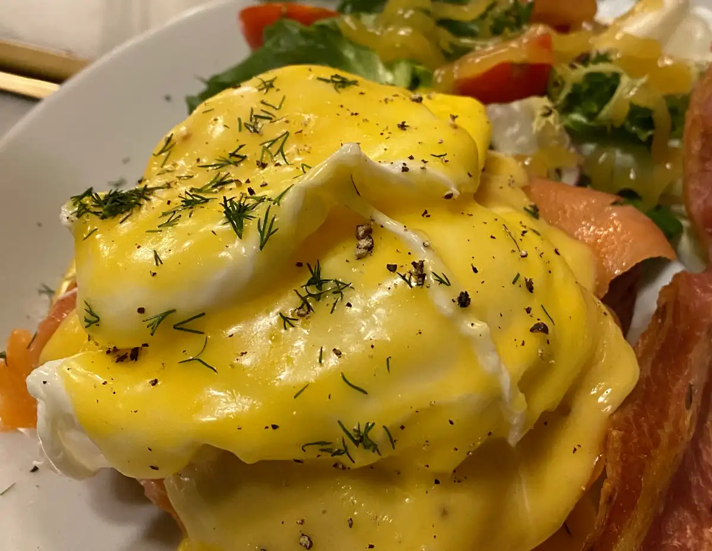

## Contents

## Gabby's Brunch
Address: C/ de Ramon Turró, 93, 08005 Barcelona

Website: http://gabbys.es/

Map: https://maps.app.goo.gl/L7vYZh8Rna3KMRaM6

## Can Dende
Address: C/ de la Ciutat de Granada, 44, 08005 Barcelona

Website: http://www.candendebcn.com/

Map: https://maps.app.goo.gl/rbqUeWiPCGhLQ8hWA

## Little Fern
Address: C/ de Pere IV, 168, 08005 Barcelona

Website: http://www.littleferncafe.com/

Map: https://maps.app.goo.gl/XqR8TJwoPEBUxgVy8

## CACHO
Address: C/ de Llull, 27, 08005 Barcelona

Website: https://wearecacho.com/

Map: https://maps.app.goo.gl/9j8f9rxd28wbbTeo6

## Cafè Menssana
Address: C/ de Sardenya, 48, 08005 Barcelona

Website: http://cafemenssana.com/

Map: https://maps.app.goo.gl/3WVWWa8hMs6bxPtTA

## Federal Cafe Poblenou
Address: C/ del Taulat, 109, 08005 Barcelona

Website: https://federalcafe.es/barcelona-poblenou/

Map: https://maps.app.goo.gl/3msuGvvccdTD7Xpa6

## Súper Coffee & Food Store
Address: C/ de Roc Boronat, 102, 08018 Barcelona

Website: http://www.supercoffeefood.com/

Map: https://maps.app.goo.gl/aPk5mEh4Wo7EA6gH7

## Blu Bar (vegan)
Address: Rambla del Poblenou, 11, 08005 Barcelona

Website: https://maps.app.goo.gl/4n6q8h3QEfzewuZY6

Map: https://www.blubar.es/es/menu

## Enlagloria Salad House - Pallars
Address: C/ de Pallars, 154, 08005 Barcelona

Website: http://www.enlagloriasaladhouse.com/

Map: https://maps.app.goo.gl/B775GZgFFA2QCKe8A

## Odara Café
Address: C/ de la Ciutat de Granada, 68, 08005 Barcelona

Website: https://instagram.com/odaracafebcn

Map: https://maps.app.goo.gl/Hj8tbSASUZrqi6AX8

## BRKLYN Torrefaction
Address: C/ de Bac de Roda, 79, 08005 Barcelona

Website: None

Map: https://maps.app.goo.gl/L7wKaXhEVWroLnUy6

## Ombú Cafè
Address: C/ d'Àvila, 51, 08005 Barcelona

Website: https://ombubcncafe.com/

Map: https://maps.app.goo.gl/b26kjQqfEffhWTXH6

## Forastera
Address: C/ de Sancho de Ávila, 22, 08018 Barcelona

Website: https://www.instagram.com/forasterabcn/

Map: https://maps.app.goo.gl/UeR1YkWFxfFvA6tb7

## Tarannà Cafè
Address: C/ de Fluvià, 47, 08019 Barcelona

Website: https://www.tarannatakeaway.com/

Map: https://maps.app.goo.gl/AXYAhX4zh8ybXvZi7
