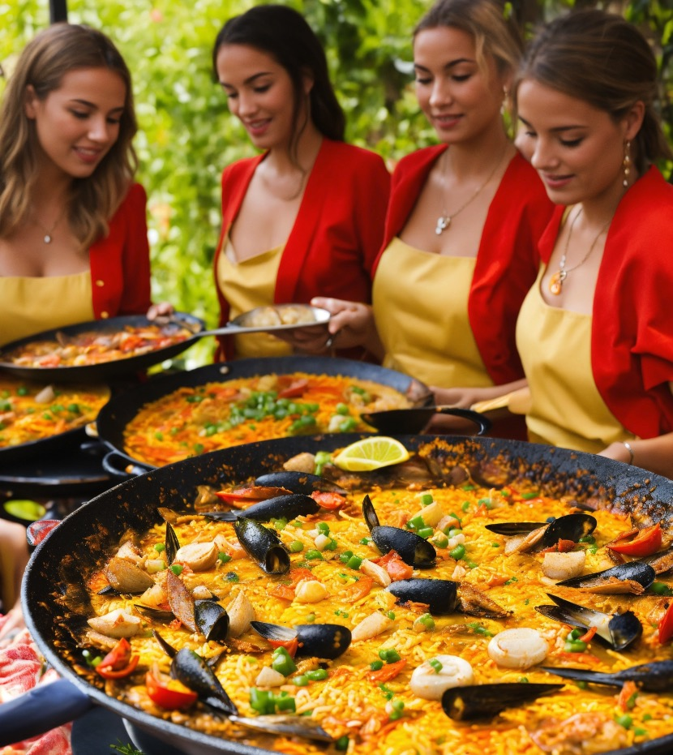

import ListingBlock from '../../components/elements/listing-block.astro';

## Contents

## Paella restaurants in Barceloneta
A lot of the restaurants below have outdoor seating, but it can depend on the time of day and time of year as to whether their terrace is in operation.

## Restaurant Barceloneta

<ListingBlock
  address="Moll dels Pescador, Port Vell, Carrer de l'Escar, 22, Ciutat Vella, 08039 Barcelona"
  map='https://maps.app.goo.gl/FWcsSxD9xRMowLjm9'
  website='http://www.restaurantbarceloneta.com/'
  seating='Mainly inside with an open terrace view'
>

This somewhat straightforwardly named restaurant by the water is a great place to take guests, friends and family and has space for hundreds of people.

</ListingBlock>

## Maná 75

<ListingBlock
  address="Pg. de Joan de Borbó, 101, Ciutat Vella, 08039 Barcelona"
  map='https://maps.app.goo.gl/jA6qyphYUTLrqwLS7'
  website='https://mana75.es/'
  seating='Inside + Terrace'
>

If you're looking for a glamorous and luxurious place to eat paella in Barceloneta, you should definitely consider Maná 75 restaurant. Certainly handy if you're staying in the nearby W Barcelona -- an iconic 5-star hotel a stone's throw away.

</ListingBlock>

## Merendero de la Mari

<ListingBlock
  address="Plaça de Pau Vila, 1, Ciutat Vella, 08039 Barcelona"
  map='https://maps.app.goo.gl/23xypbbGtH2GoDPJA'
  website='https://www.merenderodelamari.com/es/'
  seating='Inside + Terrace'
>

</ListingBlock>

## Restaurant Salamanca

<ListingBlock
  address="Address: C/ de Pepe Rubianes, 34, Ciutat Vella, 08003 Barcelona"
  map='https://maps.app.goo.gl/QzhAxUFGVwz4BF7X8'
  website='https://restaurantesalamanca.es/menus/'
  seating='Inside + Terrace'
>

</ListingBlock>

## Can Ramonet

<ListingBlock
  address="Carrer de la Maquinista, 17, Ciutat Vella, 08003 Barcelona"
  map='https://maps.app.goo.gl/wfsCwVbqQEQ69X1x9'
  website='http://www.canramonet.es/'
  seating='Inside + Terrace'
>

</ListingBlock>

## Restaurant Ca La Montse

<ListingBlock
  address="C/ de Balboa, 14, Ciutat Vella, 08003 Barcelona"
  map='https://maps.app.goo.gl/oA1d6ziSPiVkkdWf7'
  website='https://restaurantcalamontse.com/carta-restaurante-barceloneta/'
  seating='Inside + Terrace'
>

</ListingBlock>

## Restaurant Cheriff

<ListingBlock
  address="C/ de Ginebra, 15, Ciutat Vella, 08003 Barcelona"
  map='https://maps.app.goo.gl/DjfmDkbf5Ex7uqgQ8'
  website='http://cheriffrestaurant.es/'
  seating='Inside Only'
>

</ListingBlock>

## Camping Mar

<ListingBlock
  address="Marina Vela, Pg. de Joan de Borbó, 103, Ciutat Vella, 08039 Barcelona"
  map='https://maps.app.goo.gl/99NZEVasAUPq4Xpk9'
  website='https://grupotragaluz.com/restaurantes/camping-mar/'
  seating='Inside + Terrace'
>

</ListingBlock>

## Peix Vela

<ListingBlock
  address="Passeig del Mare Nostrum, 19, 21, Ciutat Vella, 08039 Barcelona"
  map='https://maps.app.goo.gl/9BZSnm6ak6Fmboaa7'
  website='https://grupotragaluz.com/restaurantes/pez-vela/'
  seating='Inside + Terrace'
>

</ListingBlock>

## Gallito

<ListingBlock
  address="Passeig del Mare Nostrum, 19, 21, Ciutat Vella, 08039 Barcelona"
  map='https://maps.app.goo.gl/JzThQqZSseK3h7Sp9'
  website='https://grupotragaluz.com/restaurantes/gallito/'
  seating='Inside + Terrace'
>

</ListingBlock>
