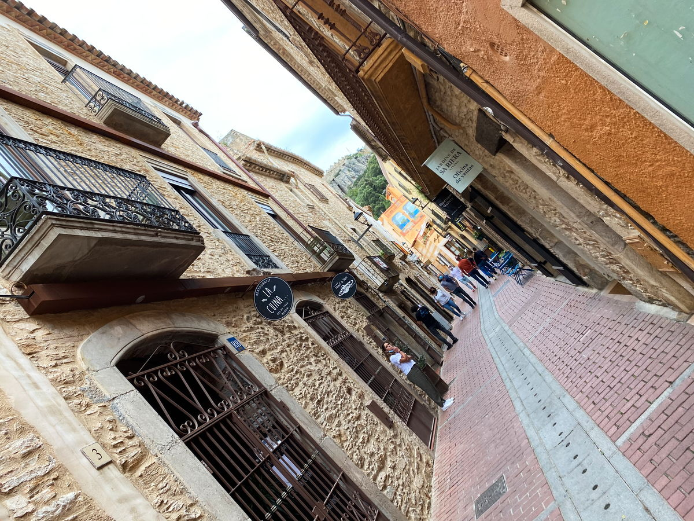

import Gallery from '../../components/elements/gallery.astro';

## Contents

## Visiting Begur

Technically not on the coast, but I included it because it's a great little village to visit as a tourist. Arriving by car will be your best option and the village itself is set on a hill so be prepared to walk a bit. Keep in mind that parking can be difficult also.

The view out over Begur from [Mirador Monumento Carmen Amaya](https://maps.app.goo.gl/RA21ZyfEygBjoQd68) (over [El Jardí de Can Marc](https://www.canmarc.cat/)) is spectacular and a good place to see Begur from up high.

<Gallery maxCols={2} images={[
  { url: "/src/assets/blog/costa-brava/begur-sa-tuna-aiguafreda-sa-riera/begur-castle-from-mirador.jpg", alt: "Begur Castle From Viewpoint" },
  { url: "/src/assets/blog/costa-brava/begur-sa-tuna-aiguafreda-sa-riera/begur-castle-night.jpg", alt: "Begur At Night" }
]}></Gallery>

## Walking around Begur

If you head to this street - [Concepció Pi i Tató](https://maps.app.goo.gl/gc8FH2SdLVT1m7H16) - you will find the bulk of the town's shops, which are mainly artisan and boutiques unique to the area.

## Restaurants in Begur

There's also a few restaurants in this area, too, and our community recommends the up-market [Diferent Restaurant Begur](https://maps.app.goo.gl/qVdDj1GaNKdGNMPy6) for lunch or dinner. Failing that, you still have some great options, depending on your taste:
- [Restaurant la Motxa](https://maps.app.goo.gl/R3bY7jZj4PtZkkmb8) (excellent local cuisine)
- [Clara Begur](https://maps.app.goo.gl/ce2ghUtAjb4yX72W8)
- Anything on: Carrer Pi i Ralló, such as [Casa Juanita](https://maps.app.goo.gl/hwN3Cnn4v5Ehf6uT7).

If you're after tapas, drinks and cocktails, be sure to check:
- [C-Roack](https://maps.app.goo.gl/LxBQVMiD3vkWqyp27)
- [Sa Barra Begur](https://maps.app.goo.gl/6BJxVHvXMhKpvXcB9)

**_(Some of which are open until late, in the peak season)_**

## Staying in Begur

Keep in mind that Begur is set on a hill and so you might find yourself doing a bit of cardio as you go up and down the streets! It's also incredibly popular and it's not uncommon to book over 6 months in advance to guarantee a particular hotel, presumably due to weddings taking place in the area.

Anywhere near the centre should be fine for a base, such as close to the Church of Sant Pere - but in general, one can walk around the whole town fairly easily.

## Begur Castle

The view from the castle is great and gives you a magnificent 360 degree panoramic view. Arriving isn't as taxing as it looks, so be sure to go. Simply follow map directions on foot and there's some great viewpoints on the way, such as the one below.

<Gallery maxCols={3} images={[
  { url: "/src/assets/blog/costa-brava/begur-sa-tuna-aiguafreda-sa-riera/view-from-begur-castle-town.jpg", alt: "View of Begur from the Castle" },
  { url: "/src/assets/blog/costa-brava/begur-sa-tuna-aiguafreda-sa-riera/view-from-begur-castle.jpg", alt: "Begur Castle Sea View" },
  { url: "/src/assets/blog/costa-brava/begur-sa-tuna-aiguafreda-sa-riera/begur-castle-top.jpg", alt: "Begur Castle - The Top" }
]}></Gallery>

## Church of Sant Pere

Finally, you could visit [Parc de l'Arbreda](https://maps.app.goo.gl/DzKAwYgJZAWqnKth9), which sometimes plays host to outdoor events, depending on the time of year.

**Note**: If you're in the area only for the day, I highly recommend visiting Cala Sa Tuna, a short drive away, mentioned below.

---

## Visiting Cala Sa Tuna / Aiguafreda

Even though it's close to Begur, [Cala Sa Tuna](https://maps.app.goo.gl/YKN9vnGo3uHCSik49) at [Aiguafreda](https://maps.app.goo.gl/YKN9vnGo3uHCSik49) is still a 10 minute drive away. Cala Sa Tuna is a quaint little beach cove in Aiguafreda (the latter meaning “cold water” in Catalan).

One good option might be to [park here](https://maps.app.goo.gl/MBE8gydjBpFQmVV57) and head towards the [Cap Sa Sal Restaurant](https://maps.app.goo.gl/2bCYAQATfrgtdKn46). Make sure to book well in advance if you are planning to eat at the restaurant here, it probably won't accept walk-ins. There's also a cool little forest path which gives you an exclusive cliff view and takes you down to Cala Sa Tuna.

In the area you'll see boats and houses and there's not much to do, but it's very idyllic. There's a place called [Hostal Restaurant Sa Rascassa](https://maps.app.goo.gl/ieUHpiCBV79Uf2qm7) which serves food you could check out and they have a very nice garden terrace, but again, book in advance. There is also a [car park here](https://maps.app.goo.gl/AKveQphxCTpvQ5pb6), if you're just visiting the cove.

### Staying in Aiguafreda & Sa Tuna

In terms of accommodation, the hotels and restaurants in this area are fairly pricey and exclusive, so keep this in mind before booking. As aforementioned, they are likely to book up very quickly and are popular with locals and weddings.

---

## Visiting Sa Riera

**Awaiting recommendations**

