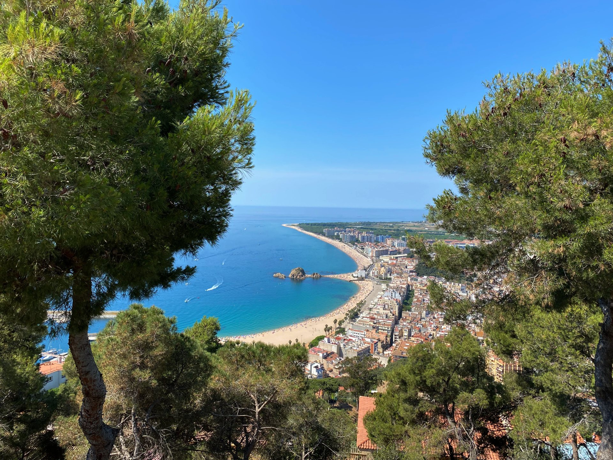
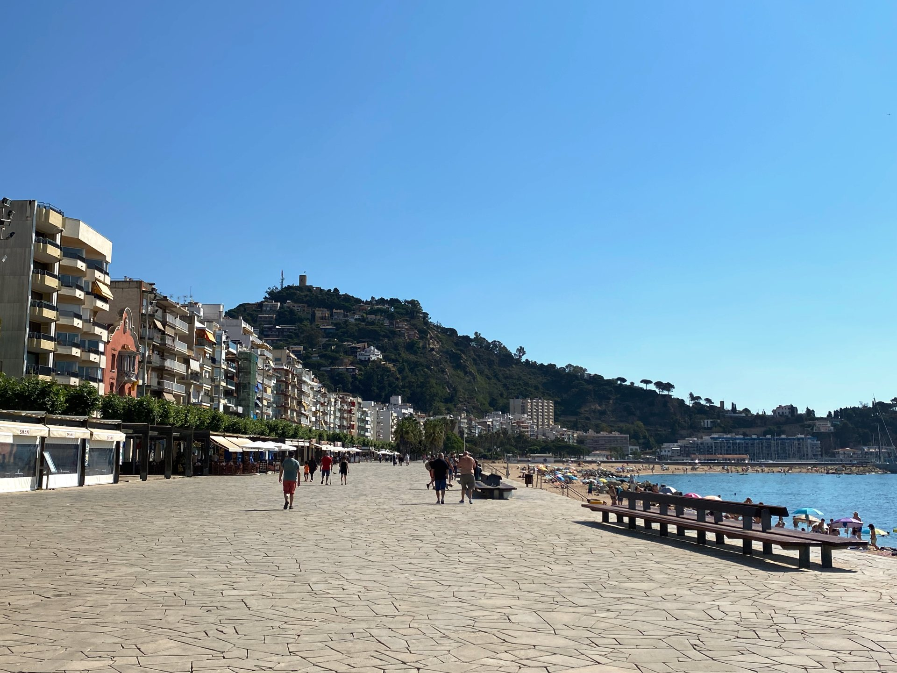
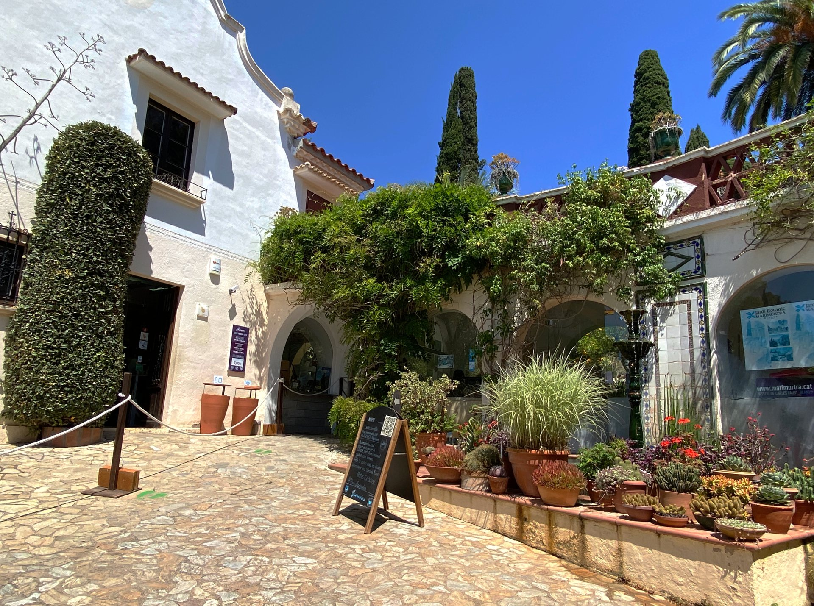
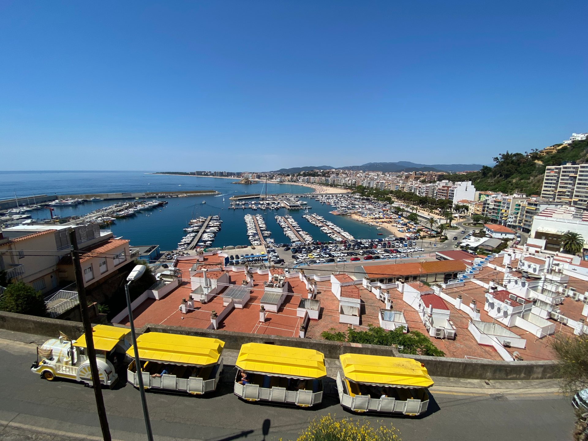

import Gallery from '../../components/elements/gallery.astro';

## Contents

## What to do in Blanes

Our community really likes Blanes as it is an easy place to visit and there is a lot to see and do. One recommendation would be to head to the Passatge del Bellaire and take a nice stroll up the coast, where you will eventually meet the Port of Blanes.

## Blanes Seafront
During the warmer months, there are restaurant after restaurant next to the Blanes beach, where you can find many different types of cuisine on one of the terraces - you are literally spoiled for choice! Our favourite is [El Racó Blau](https://elracoblau.com/) for its seafood and [Vadecatas](http://www.vadecatas.com/) for its premium take on cooking.

## Blanes Castle
During the day, be sure to take a trip to the Castle where you will be rewarded with amazing views over Blanes and more places up the coast. Starting at [Plaça d'Espanya](https://maps.app.goo.gl/sApeGuprLsYdXd4g6), walk up to [Santa Maria Church](https://maps.app.goo.gl/2yFNeX28QMzSbxT49), then follow the route up - [full route on the map here](https://maps.app.goo.gl/Ew3VpmeaRUnzg8pj6).

<Gallery images={[
  { url: "/src/assets/blog/costa-brava/blanes/blanes-santa-maria-church.jpg", alt: "Santa Maria Church" },
  { url: "/src/assets/blog/costa-brava/blanes/walk-up-to-castle.jpg", alt: "Walk up to Blanes Castle" },
  { url: "/src/assets/blog/costa-brava/blanes/blanes-castle.jpg", alt: "Blanes Castle" },
  { url: "/src/assets/blog/costa-brava/blanes/view-from-blanes-castle.jpg", alt: "View from Blanes Castle" },
  { url: "/src/assets/blog/costa-brava/blanes/blanes-castle-arch.jpg", alt: "Blanes Castle - Archway" }
]} maxCols={3}></Gallery>

## Botanical Gardens
We also highly recommend the Botanical Gardens which can be reached on foot if necessary, either from the Castle or the Port, but easier by car or taxi. The walk is quite a lot of uphill and follows the road up.

<strong>Pro tip</strong>: The Botanical gardens also has a connecting tourist train which takes you from the promenade to the gardens front door.

## Blanes Nightlife

Going out in Blanes is fairly good and there's lots to see and do. Most activity is focussed around the town near to Blanes beach, but there's also life further down the coast around [Platja de S'Abanell](https://maps.app.goo.gl/oH9LKjfXToVGqF6G9), where you'll also find lots more hotels and areas for camping. From here it's a steady 30 mins walk to Blanes Port.

Awaiting nightlife recommendations

## Places Nearby

For the intrepid adventurer, be sure to walk up to [Jardí Botànic Tropical Paratge Pinya de Rosa](https://maps.app.goo.gl/WstrM5k8jpY9yYjV8) (what a mouthful!). This place is an idyllic garden paradise and well worth a visit!

Also, a cool thing to do is to walk some of the [Camí de Ronda](https://maps.app.goo.gl/4yqba5wXeWjgZhFt5) as it will expose the hidden beaches in that area and it's more off the beaten path.

Finally, just up the coast from Blanes you'll come to [Lloret de Mar](/blog/costa-brava-lloret-de-mar) - the next stop in our Costa Brava guide!