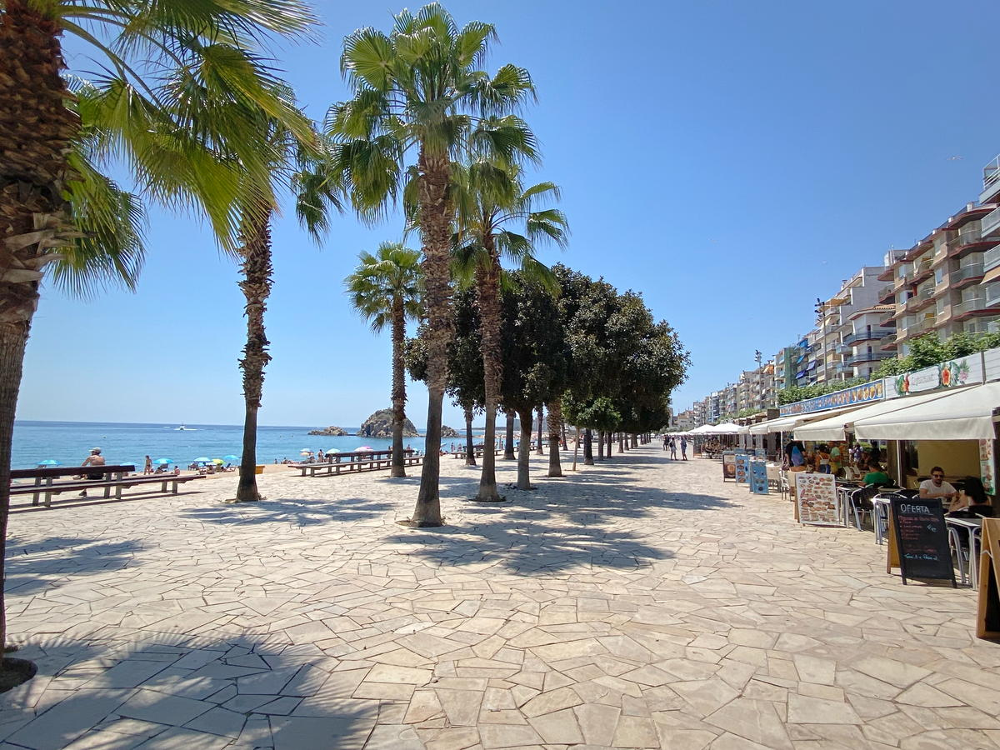

import Gallery from '../../components/elements/gallery.astro';

## Contents

## What to do in Blanes

Nearly all the people I have spoken to have said they really like Blanes, as it's an easy place to visit and there's a lot to see and do there. One recommendation would be to head to the [beach front](https://maps.app.goo.gl/z7q5UA4WVV8zzCx39) and take a nice stroll up the coast, where you will eventually meet the [Port of Blanes](https://maps.app.goo.gl/phzrV991K5SA7Hko7).

## Blanes Restaurants & Nightlife

Going out in Blanes is fairly good and there's lots to see and do. Most activity is focussed around the town near to [Blanes beach](https://maps.app.goo.gl/QdkmQjnxCmTkBfwa7), but there's also life further down the coast around [Platja de S'Abanell](https://maps.app.goo.gl/oH9LKjfXToVGqF6G9), where you'll also find lots more hotels and areas for camping. From here it's a steady 30 mins walk to [Blanes Port](https://maps.app.goo.gl/phzrV991K5SA7Hko7).

During the warmer months, there is restaurant after restaurant next to the Blanes beach, where you can find many different types of cuisine and lots of open-air terraces - you will be literally spoilt for choice! My favourite is [El Racó Blau](https://elracoblau.com/) for its seafood and [Vadecatas](http://www.vadecatas.com/) for its premium take on cooking.

It's also just great in general to sit and enjoy a drink by the sea in one of the many bars and restaurants, which are generally open all day long.

During the day time there's also loads of restaurants to choose from and [Carrer de la Muralla](https://maps.app.goo.gl/t4APgrSmoiyMah977) has some more bohemian, back-street options, if you want to get off the main strip.

Similarly, [Plaça d'Espanya](https://maps.app.goo.gl/zCWkh4uWNvacdjPEA) is always lively, with its mix of shops and restaurants and even a good place to take a beer, wine or coffee.

## Blanes Castle
During the day, be sure to take a trip to the Castle where you will be rewarded with amazing views over Blanes and more places up the coast.

Starting at [Plaça d'Espanya](https://maps.app.goo.gl/sApeGuprLsYdXd4g6), walk up to [Santa Maria Church](https://maps.app.goo.gl/2yFNeX28QMzSbxT49), then follow the route up - suggested [full walking route here](https://maps.app.goo.gl/Ew3VpmeaRUnzg8pj6).

<Gallery images={[
  { url: "/src/assets/blog/costa-brava/blanes/blanes-santa-maria-church.jpg", alt: "Santa Maria Church" },
  { url: "/src/assets/blog/costa-brava/blanes/walk-up-to-castle.jpg", alt: "Walk up to Blanes Castle" },
  { url: "/src/assets/blog/costa-brava/blanes/blanes-castle.jpg", alt: "Blanes Castle" },
  { url: "/src/assets/blog/costa-brava/blanes/view-from-blanes-castle.jpg", alt: "View from Blanes Castle" },
  { url: "/src/assets/blog/costa-brava/blanes/blanes-castle-arch.jpg", alt: "Blanes Castle - Archway" }
]} maxCols={3}></Gallery>

## Botanical Gardens
I would also highly recommend the Botanical Gardens, which can be reached on foot from the Port, if you don't mind walking up the hill. Or you can descend to it from the Castle. It's easier by car or taxi, though.

<strong>Pro tip</strong>: The Botanical gardens also has a connecting tourist train which takes you from the Port/promenade to the garden's front door.

## Where to stay in Blanes

There's hundreds of accommodation options from low/mid/high-end hotels to private villas and even hostels in Blanes - simply check out short-stay and booking websites. Even at full capacity, you'll still be able to find somewhere and there are even hostals where you can just walk in, which isn't so common for the Costa Brava.

## Places Nearby

For the intrepid adventurer, be sure to walk up to [Jardí Botànic Tropical Paratge Pinya de Rosa](https://maps.app.goo.gl/WstrM5k8jpY9yYjV8) (what a mouthful!). This place is an idyllic garden paradise and well worth a visit!

Also, a cool thing to do is to walk some of the [Camí de Ronda](https://maps.app.goo.gl/4yqba5wXeWjgZhFt5) as it will expose the hidden beaches in that area and it's more off the beaten track.

Finally, just up the coast from Blanes you'll come to [Lloret de Mar](/blog/costa-brava-lloret-de-mar) - the next stop in our Costa Brava guide!