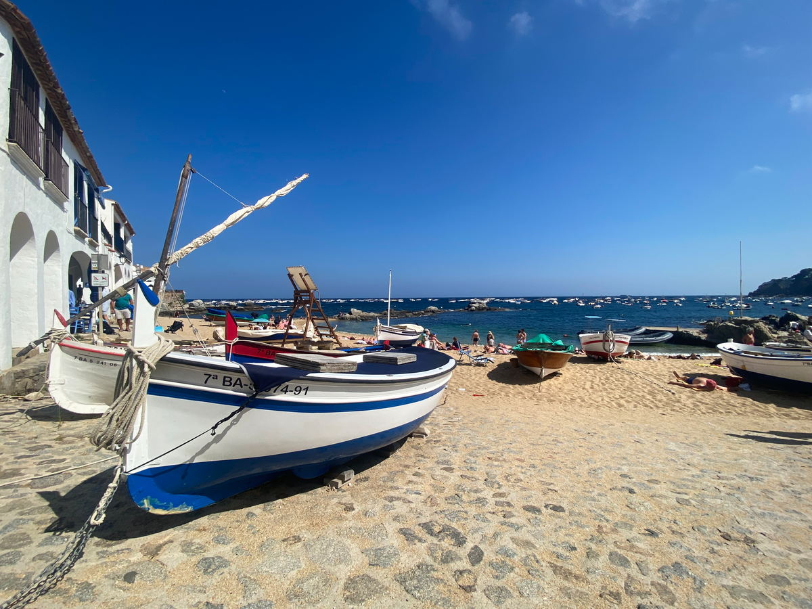
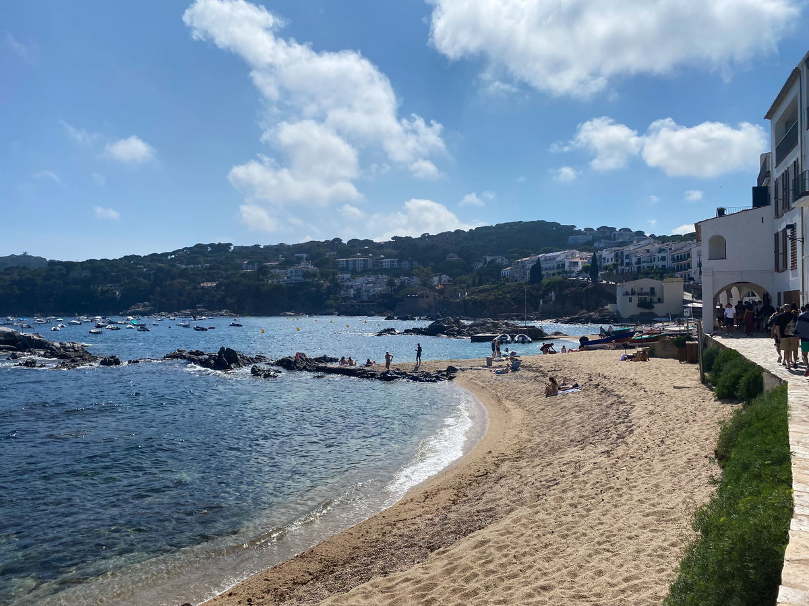

import Gallery from '../../components/elements/gallery.astro';

## Contents

## Visiting Calella de Palafrugell

Calella de Palafrugell is a romantic little fishing village right by the sea, which offers several small, idyllic beaches. It has a sheltered bay and the beaches/sea can get quite crowded in summer so try to visit before and after the kids’ school holidays if you can.

Most of it can be done casually on foot from end-to-end so just park up and walk the beachfront.

If coming by car, parking is usually in high demand, but you could try [parking near to here](https://maps.app.goo.gl/VbRZaE3G8Aq7HjzY6), if you want to be close to the north beach.

Calella de Palafrugell is a beautiful place and has everything that you’d expect from an idyllic Costa Brava destination, right down to romantic and secluded beach coves, classy beach-side restaurants and a nice small town, with cobbled streets.

The main beach areas of interest are [Platja Port Pelegrí](https://maps.app.goo.gl/DmvZsGGofg3aDi5x9), [Platja de les Barques](https://maps.app.goo.gl/a4na7KHd5qUdyHfk6) and [Platja del Canadell](https://maps.app.goo.gl/uzfEZvBEv25BF6AHA). If you’re just looking to sunbathe, Canadell is probably your best bet, but all are great. Getting into the sea is also possible and due to having some rocky formations there’s even some great snorkelling to be had.

### Platja del Canadell Beach

A great, but small beach for sunbathing and going in the sea.

<Gallery maxCols={2} images={[
  { url: "/src/assets/blog/costa-brava/calella-de-palafrugell-llafranc/platja-del-canadell-trees.jpg", alt: "Canadell Beach" },
  { url: "/src/assets/blog/costa-brava/calella-de-palafrugell-llafranc/platja-del-canadell.jpg", alt: "Canadell Beach" },
  { url: "/src/assets/blog/costa-brava/calella-de-palafrugell-llafranc/platja-del-canadell-closeup.jpg", alt: "Canadell Beach" },
  { url: "/src/assets/blog/costa-brava/calella-de-palafrugell-llafranc/platja-del-canadell-from-south.jpg", alt: "Canadell Beach - From South" }
]}></Gallery>

### Platja de les Barques Beach

The _Barques_ beach has a bit more activity and, as the name would suggest, has little boats on it. It also feels more connected to the main town and there's a few more restaurant options literally 2 metres away from the beach.

### Restaurants in Calella de Palafrugell

For restaurants, you have a good selection. The ones with the best terraces and views are easy to find and you’ll probably walk by them anyway, for instance:
- [La Blava](https://maps.app.goo.gl/R339PnQdpwvfKA7s8)
- [Sol Ixent Calella. Slow food](https://maps.app.goo.gl/yFaTwiakRJyqBuZx9)
- [Restaurant Fiego](https://maps.app.goo.gl/oWUsGMGr9LAgswog8)
- [Margarita](https://maps.app.goo.gl/U3PWA5dBn1fQkaNu6)
- [Gelpifish](https://maps.app.goo.gl/zPzkhN2FVhDMK6Na7)
- [Hotel La Torre](https://maps.app.goo.gl/posmUw7LkPHAJ6Wj7) _(also offers drinks and a staggering view from their terrace!)_

**Note**: Most restaurants will be closed outside of the main season, so plan ahead.

### Palafrugell Town 

If you’re here for a while, you could also pay a visit to the inland town of [Palafrugell](https://maps.app.goo.gl/fgJpgWBS5RfZem6X6), where you will find more accommodation, urbanisation and shops - you should be able to cover it in a day easily.

---

## Visiting Llafranc

Llafranc is only a short walk up the coast from Calella de Palafrugell and has a similar feel. The small beach cove makes it feel like an exclusive Costa Brava retreat-type destination and it's very photogenic. Like with a lot of these coastal destinations, you can pick up the Camí de Ronda coastal path, which you can take to reach [Calella de Palafrugell](/blog/costa-brava-calella-de-palafrugell-llafranc#visiting-calella-de-palafrugell), or explore the viewpoints to the north of Llafranc.

### Restaurants in Llafranc

**Awaiting recommendations**

