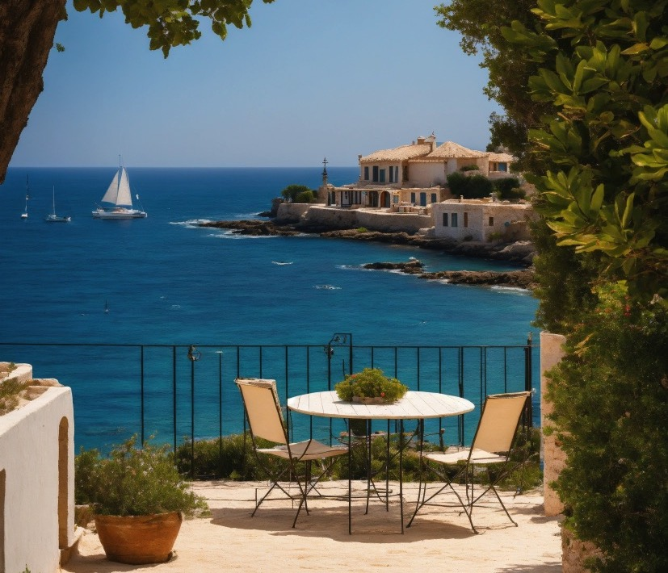

import ListingBlock from '../../components/elements/listing-block.astro';

## Free Costa Brava Guide ⛱

This guide contains a run-down of **all the major sites** on the Costa Brava coast, starting at [Blanes](/blog/costa-brava-blanes) and going all the way up to [Portbou](costa-brava-grifeu-colera-portbou), near to France!

First of all, where and what is the **Costa Brava**?
The Costa Brava is the name given to the coast of Spain from Blanes all the way to the French border. Therefore, it includes all the coastal points in the province of Girona. In contrast, the area between Barcelona and Blanes is called the Costa del Maresme and should not be confused with the Costa Brava - in fact, we have a separate post about that - coming soon!

## Where is the Costa Brava?

<iframe defer src="https://www.google.com/maps/d/embed?mid=1dhJrgST4tRZ_njoFWlbMvNFEi1-_UtU&ehbc=2E312F" width="1280" height="560" title="Costa Brava map with markers" style={{maxWidth: '100%'}}></iframe>

### How to get to the Costa Brava from Barcelona
While the Costa Brava isn't that far from Barcelona, some parts are more accessible than others, depending on how you plan to arrive. If you have a car, you can reach any place within about 2-3 hours from central Barcelona, depending on traffic.

Travelling to the Costa Brava by public transport from Barcelona is a different story and you will only be able to take the train as far as [Blanes](/blog/costa-brava-blanes), Girona or Figueres, followed by an onward local bus to your destination. Alternatively, you could take a coach from Barcelona to reach some of the key places and they depart from [Estación de Autobuses Barcelona Nord](https://barcelonanord.barcelona/es). The route is the number 1, operated by [Moventis Sarfa](https://compras.moventis.es/online/).

In general, transport links can be a bit limited so having a car will be your best option most of the time.

## Costa Brava Index

<strong>Note</strong>: This guide is a work in progress!

1. [Blanes](/blog/costa-brava-blanes)
2. Lloret de Mar (coming soon)
3. Canyelles (coming soon)
4. [Cala Llorell (+ Camping Llevadó)](/blog/costa-brava-cala-llorell)
5. [Tossa de Mar](/blog/costa-brava-tossa-de-mar)
6. La Pola i Giverola, Salionç & Canyet de Mar (coming soon)
7. [Sant Feliu de Guíxols](/blog/costa-brava-sant-feliu-de-guixols)
8. [S'Agaró](/blog/costa-brava-s-agaro)
9. [Platja d'Aro](/blog/costa-brava-platja-d-aro)
10. [Sant Antoni de Calonge, Palamós and Cap Roig](/blog/costa-brava-sant-antoni-de-calonge-palamos-cap-roig)
11. [Calella de Palafrugell and Llafranc](/blog/costa-brava-calella-de-palafrugell-llafranc)
12. Tamariu, Aigua Blava and Fornells (coming soon)
13. [Begur, Sa Tuna & Aiguafreda and Sa Riera](/blog/costa-brava-begur-sa-tuna-aiguafreda-sa-riera)
14. Pals & L'Estartit (coming soon)
15. [L'Escala and Sant Martí d'Empúries](/blog/costa-brava-l-escala-sant-marti-d-empuries)
16. [Sant Pere Pescador, Empuriabrava and Roses](/blog/costa-brava-sant-pere-pescador-empuriabrava-roses)
17. [Cadaqués & Cap de Creus](/blog/costa-brava-cadaques-cap-de-creus)
18. [Port de la Selva & Port de Llançà](/blog/costa-brava-port-de-la-selva-port-de-llanca)
19. Grifeu Colera and Portbou (coming soon)
