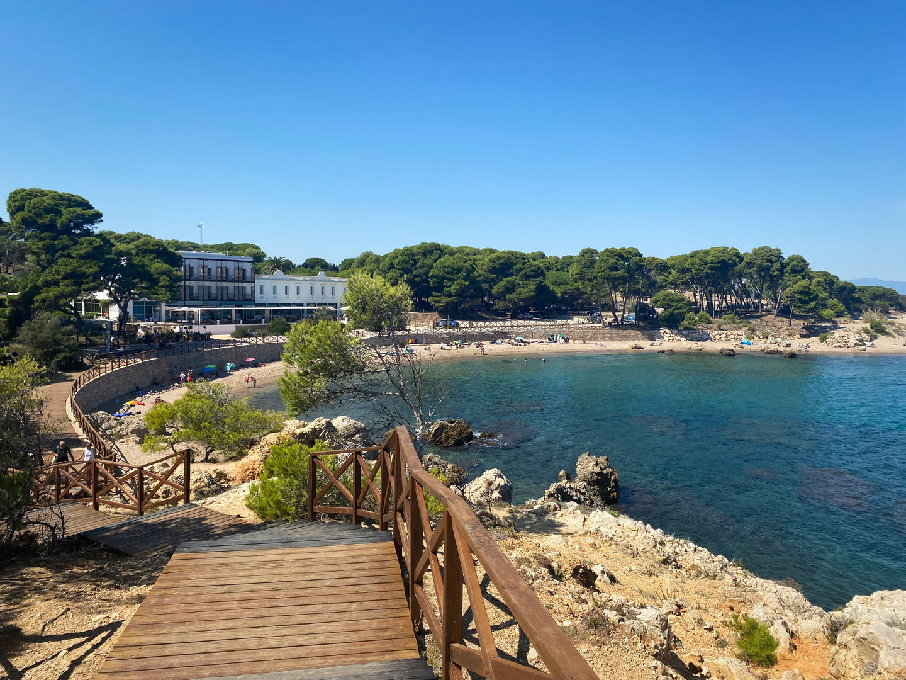
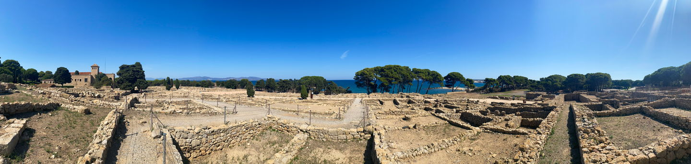

import Gallery from '../../components/elements/gallery.astro';

## Contents

## Visiting L'Escala

**Awaiting recommendations**

---

## Visiting Sant Martí d'Empúries
Sant Martí d'Empúries is the most southerly town which starts the long stretch of beach in the Gulf of Roses. It's steeped in history and plays host to the old [Roman city of Empúries](https://maps.app.goo.gl/88Vkr9y43sjxDQph7), which is now the site of ancient ruins.

### The Ruins

Start by [parking here](https://maps.app.goo.gl/aUGuuQRBNB68St4JA) - it's not free, but cheap. From here you can choose to enter the ruins (also paid, but worthwhile) or head to the waterfront. You can even see into the ruins from the beach, if you don't have time for the full tour. Make sure to reserve a couple of hours to explore the ruins, keeping in mind there's not much shade. I visited at midday in the summer, which I wouldn't recommend! The ruins extend for quite a long way to the West - it's worth a walk up as you really get an idea of the old settlement and how it was constructed, including imagining the Roman thermal baths, which apparently used to be there.

<Gallery maxCols={2} images={[
  { url: "/src/assets/blog/costa-brava/l-escala-sant-marti-d-empuries/ruins/ruins-up.jpg", alt: "" },
  { url: "/src/assets/blog/costa-brava/l-escala-sant-marti-d-empuries/ruins/ruins-sea.jpg", alt: "" },
  { url: "/src/assets/blog/costa-brava/l-escala-sant-marti-d-empuries/ruins/ruins-house.jpg", alt: "" },
  { url: "/src/assets/blog/costa-brava/l-escala-sant-marti-d-empuries/ruins/ruins-gardens.jpg", alt: "" }
]}></Gallery>

### The Beaches near Sant Martí d'Empúries

Definitely worth visiting is [El Portitxol beach](https://maps.app.goo.gl/5JPAUjLWFS4CCmY79), which is a small, but nice beach and from [this coastal path](https://maps.app.goo.gl/XAV2ntBMD6qvcP8S9) just a few minutes walk to the south you'll get a great view looking back to L'escala town and Platja del Rec. It's very quiet and the area is surrounded by nature.

<Gallery maxCols={2} images={[
  { url: "/src/assets/blog/costa-brava/l-escala-sant-marti-d-empuries/portitxol/portitxol-beach.jpg", alt: "Portitxol Beach" },
  { url: "/src/assets/blog/costa-brava/l-escala-sant-marti-d-empuries/portitxol/rocky-outcrop.jpg", alt: "Portitxol Rocks" },
  { url: "/src/assets/blog/costa-brava/l-escala-sant-marti-d-empuries/portitxol/portitxol-north.jpg", alt: "Portitxol Beach" },
  { url: "/src/assets/blog/costa-brava/l-escala-sant-marti-d-empuries/portitxol/platja-del-rec.jpg", alt: "Platja del Rec" }
]}></Gallery>

For food, there's not a huge choice but the [Hostal Empuries](https://maps.app.goo.gl/AMY5j477bQ7f9ZN98) usually gets quite busy and seems to be popular with cyclists, for some reason.

### Staying in Sant Martí d'Empúries

Personally I'd recommend staying in L'Escala, just down the coast as you will find much more accommodation and life, treating Sant Martí as a half day trip, mainly for the ruins and the coastal walking.
