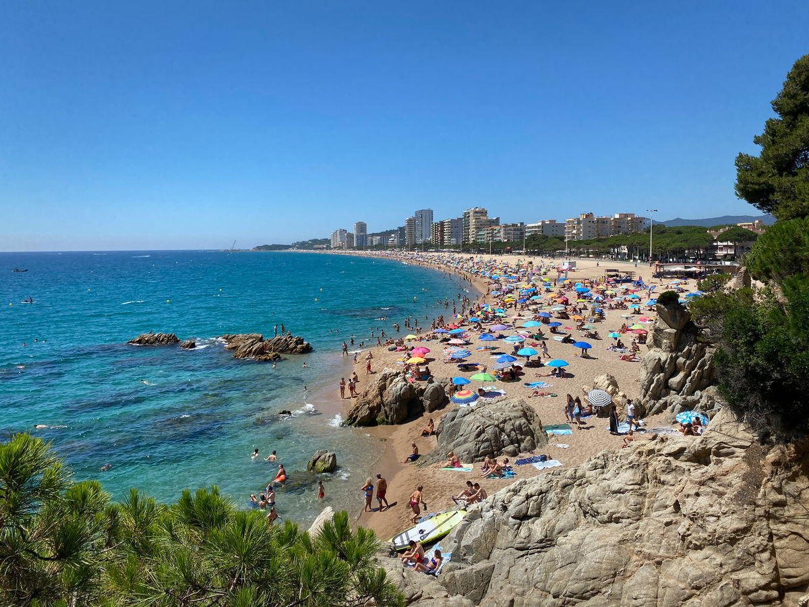
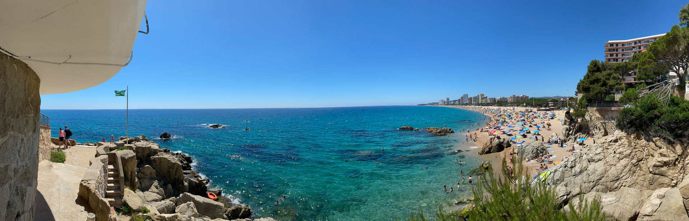
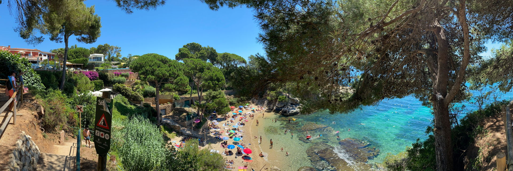
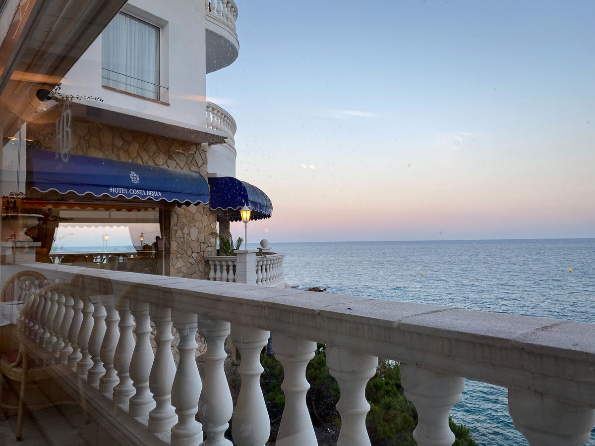
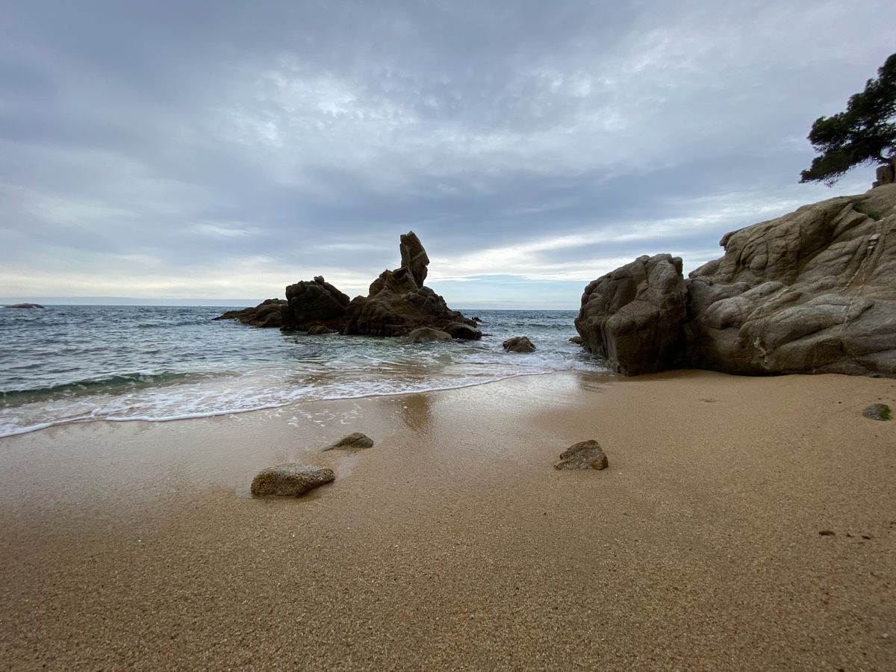

import Gallery from '../../components/elements/gallery.astro';

## Contents

## Visiting Platja d'Aro

Right next door to [S'Agaró](costa-brava-s-agaro) sits Platja d'Aro. Platja d'Aro is very popular with tourists most of the year and it has a long beachfront of about 30 minutes walking end-to-end.

Running nearly parallel to the beach you'll find the main highstreet about 4 or 5 blocks in and also the coach station - [Estació d'autobusos Platja d'Aro](https://maps.app.goo.gl/xigzW68dsUudfYd98); handy if you're arriving from Barcelona by coach. You'll be dropped-off more or less a 15 minute walk away from the centre, but a short walk down Avinguda de s'Agaró takes you right into the action.

Read more about [Platja d'Aro by coach from Barcelona](https://www.moventis.es/es/Marcas/moventis-sarfa).

## Platja d'Aro Beach

As for the beach, it tends to get busy in summer and similarly do the many bars and restaurants right next to the beach, where you will find extensive tapas menus, classic Catalan dishes, fish & seafood, burger bars and cocktails. There's also high-rise hotels and apartments right on the front, for the more up-market stays.

The bars right on the beachfront can be a bit touristy and crowded, and the food isn't the absolute best quality, but for some small tapas plates with a few drinks you could do a lot worse!

## Eating out in Platja d'Aro

For dinner in the warmer months, you'll want to head toward [Av. del Cavall Bernat](https://maps.app.goo.gl/zUdybeUriECSnzDV6) street, which is a few blocks in from the end of the beach, where you will find many Mediterranean, Catalan and fish restaurants with terraces, most of which will be in full swing by 10pm. Failing that, anywhere along the same street back towards town and you will again find many many restaurants, from sushi all-you-can-eat to fast food and burger bars.

Towards the town, some of the bars and [restaurants around here](https://maps.app.goo.gl/Av5QvJm8uvUKm3C79) can be a bit touristy and certainly not authentic, so plan accordingly.

## Platja d'Aro and the coves

For those visiting the _calas_ (coves), the best route is to walk the Camí de Ronda from the north part of Platja d'Aro beach all the way to [Sant Antoni de Calonge](costa-brava-sant-antoni-de-calonge-palamos-cap-roig). The best option is to [start your walk here](https://maps.app.goo.gl/YvBWDCJ6c8WYLT8Y8), taking in the beautiful hidden beaches, such as Cala Rovira, Cala Sa Cova, Cala del Pi and Platja de Belladona. It's a 2-3 hour round trip if you do the whole thing, depending on your pace - just follow the coast from beach-to-beach.

<Gallery maxCols={2} images={[
  { url: "/src/assets/blog/costa-brava/platja-d-aro/cala-rovira.jpg", alt: "Cala Rovira" },
  { url: "/src/assets/blog/costa-brava/platja-d-aro/cala-sa-cova.jpg", alt: "Cala Sa Cova" },
  { url: "/src/assets/blog/costa-brava/platja-d-aro/cala-del-pi.jpg", alt: "Cala del Pi" },
  { url: "/src/assets/blog/costa-brava/platja-d-aro/platja-de-belladonna.jpg", alt: "Platja de Belladonna" }
]}></Gallery>

### Cala Cap Roig

One recommendation is to stop at the beach bar [Xiringuito Cala Cap Roig](https://maps.app.goo.gl/zLBSBNfv7tE3ipqX9), although it can be impossible to get a table in peak times, but they might do takeaway beers! Cap Roig also has a beautiful beach in general and rockpool formations, while being incredibly photogenic.

<Gallery maxCols={3} images={[
  { url: "/src/assets/blog/costa-brava/platja-d-aro/cala-cap-roig-island.jpg", alt: "Cala Cap Roig - Island" },
  { url: "/src/assets/blog/costa-brava/platja-d-aro/cala-cap-roig-from-hotel.jpg", alt: "Cala Cap Roig - from Park Hotel San Jorge" },
  { url: "/src/assets/blog/costa-brava/platja-d-aro/cala-cap-roig.jpg", alt: "Cala Cap Roig" }
]}></Gallery>

You'll also want to venture up to [Park Hotel San Jorge](https://goo.gl/maps/1ZJYa6otwzE4A4KNA) for a wine/beer/coffee, or just simply to enjoy the spectacular view.

### Other points of interest en-route

Right when you set out to do the route, you'll immediately notice the beautiful [Hotel Costa Brava](https://goo.gl/maps/SSxzovs4ztsggq6QA), which offers meals if you pop in and book beforehand - you don't need to be a hotel guest it seems.

The Camí de Ronda itself is quite cool and the path winds through the cliff-face under old stone tunnels and up and down stairs carved into the hillside.

<Gallery maxCols={4} images={[
  { url: "/src/assets/blog/costa-brava/platja-d-aro/cami-de-ronda-1.jpg", alt: "Camí de Ronda" },
  { url: "/src/assets/blog/costa-brava/platja-d-aro/cami-de-ronda-2.jpg", alt: "Camí de Ronda" },
  { url: "/src/assets/blog/costa-brava/platja-d-aro/cami-de-ronda-3.jpg", alt: "Camí de Ronda" },
  { url: "/src/assets/blog/costa-brava/platja-d-aro/cami-de-ronda-north-1.jpg", alt: "Camí de Ronda - North" }
]}></Gallery>

### Cala de la Roca del Paller

Further up the coast still, you will find cove after cove, the below being taken from [Roca del Paller](https://maps.app.goo.gl/p6xDzoscxpJWJqXE6).

If you continue to head up the coast you will eventually reach [Sant Antoni de Calonge](/blog/costa-brava/sant-antoni-de-calonge-palamos-cap-roig), which is our next stop on the list. There's also more information about the coves on this page.