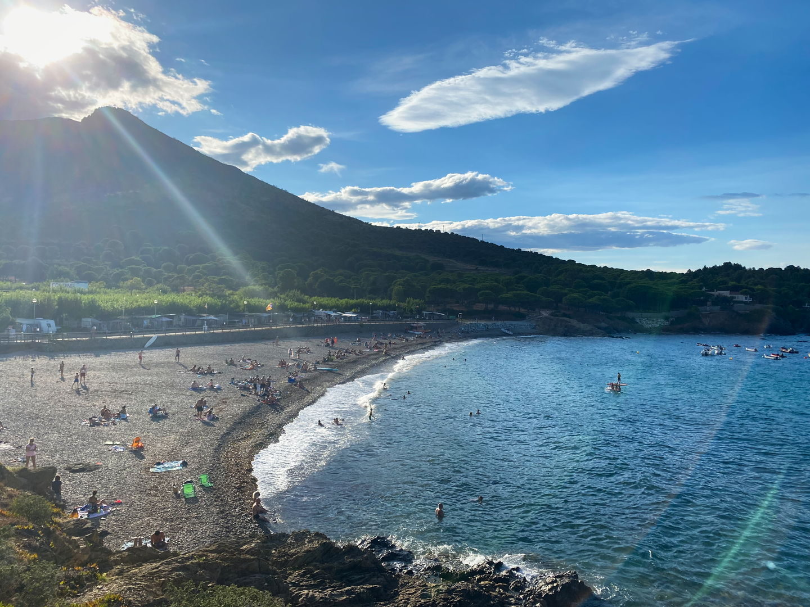
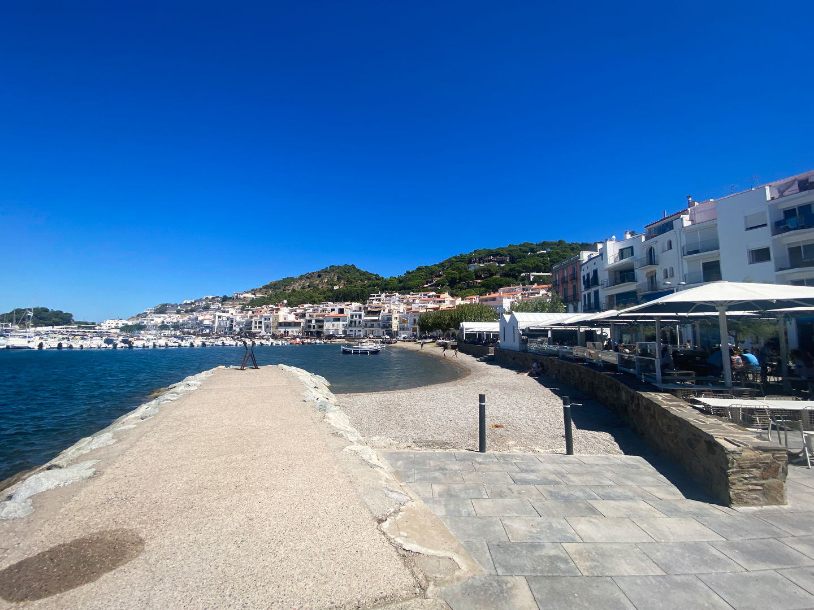
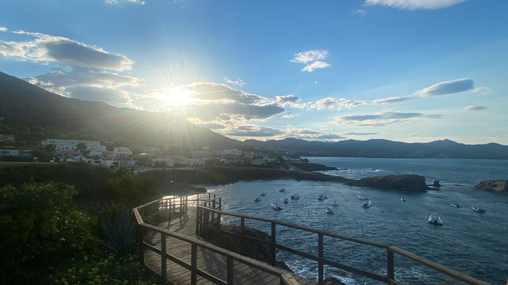
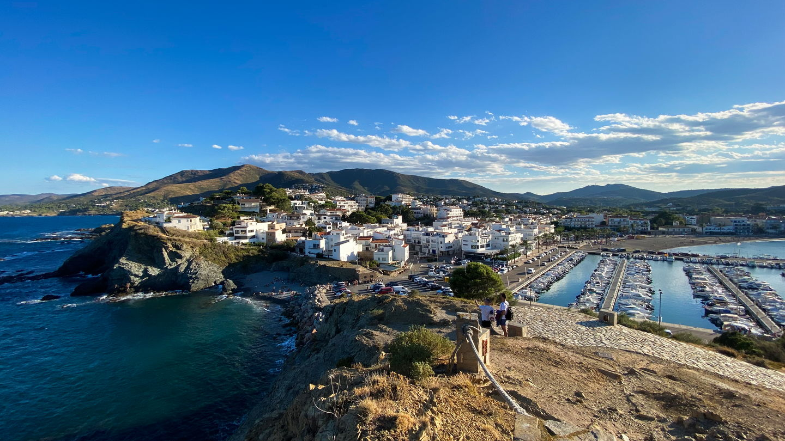
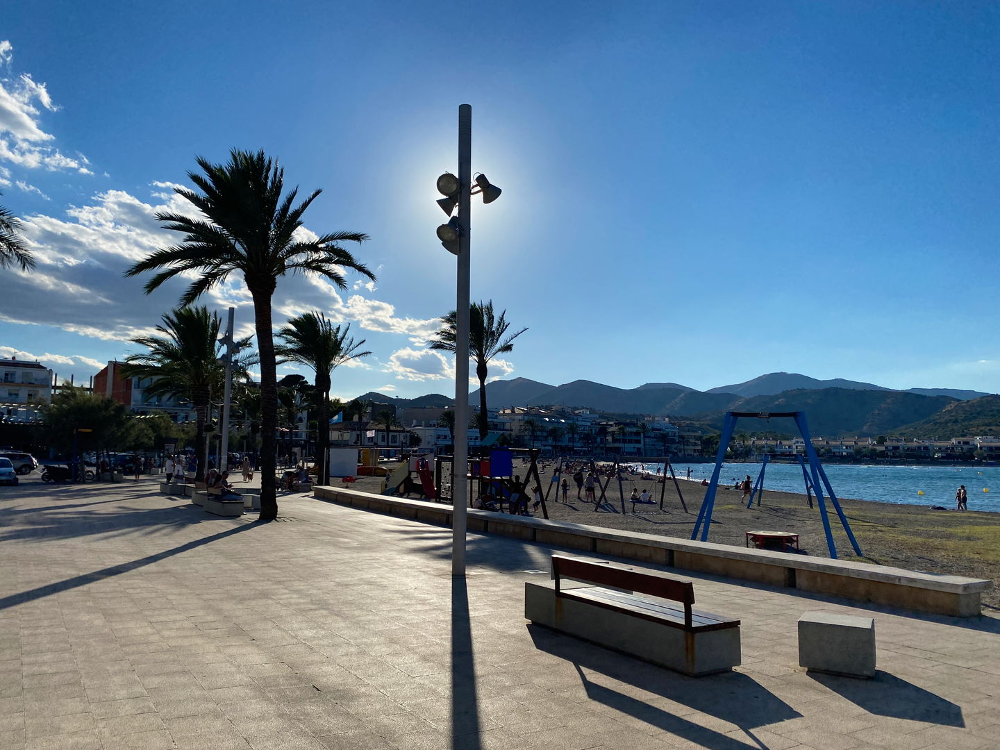
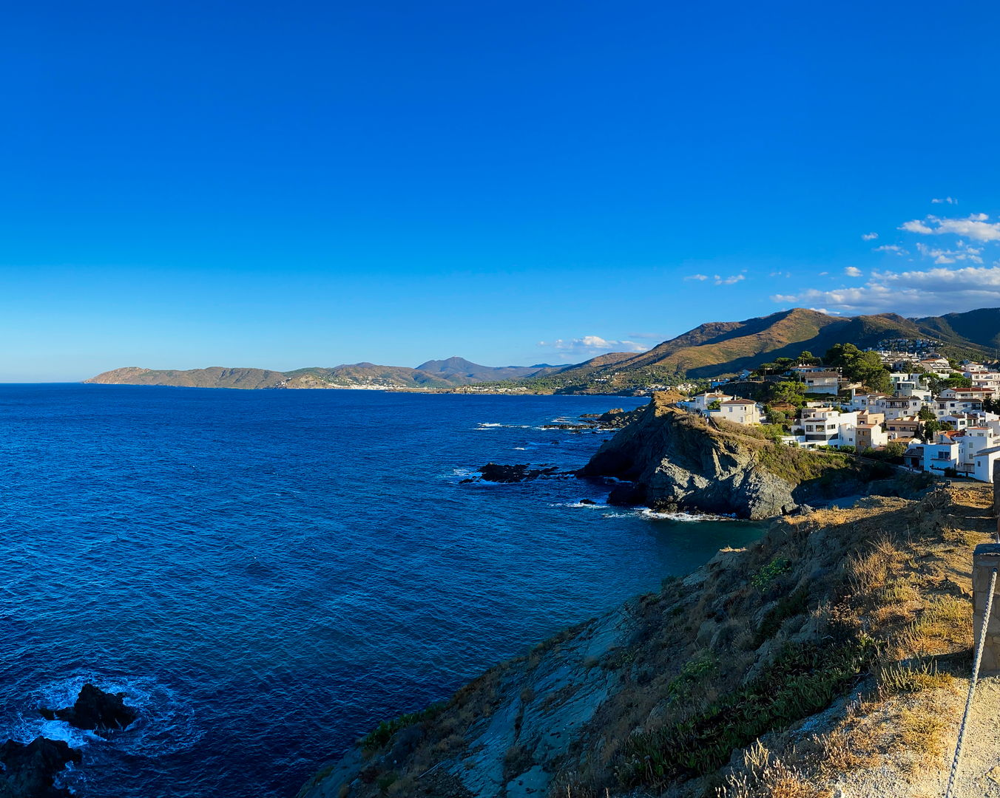
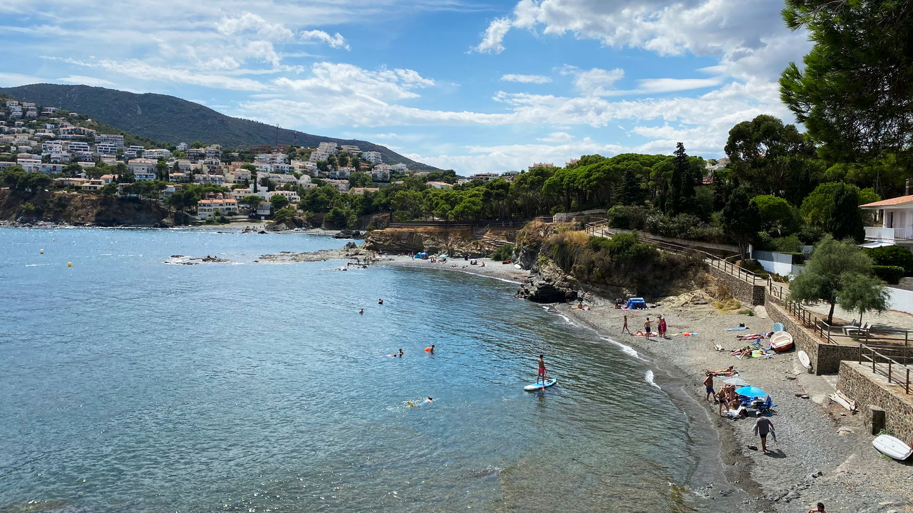

import Gallery from '../../components/elements/gallery.astro';

## Contents

## Visiting Port de la Selva

Port de la Selva is a quiet, laid-back fishing town with a local Catalan vibe. In summer it can get extremely busy and is also slightly cooler than some of the other spots in the Costa Brava and even has windy nights.

### Restaurants in Port de la Selva

In terms of eating out, check out [Ca l'Herminda](https://maps.app.goo.gl/ny8kj3orCYAjpN2k9) (_Mediterranean_), [Can Pepitu](https://maps.app.goo.gl/kS6ubX2d8cSxb7k4A) (_Tapas_) or [Restaurant L'Àncora](https://maps.app.goo.gl/KSrkZzjrJb4ztQDu6) (_Mediterranean_), which are all right on the front next to the Port de la Selva and you'll most likely be eating the local seafood at these tapas and Mediterranean restaurants.

A bit further up you'll find [Restaurant Club Nàutic Port de la Selva](https://maps.app.goo.gl/MptyQxKq5u8QNXUj7), which also offers a reasonable dining experience. Beyond here, to the north, there's only a small beach and eventually [Cala Tamariua](/blog/costa-brava-port-de-la-selva-port-de-llanca#cala-tamariua) (mentioned below).

In summer you'll also find nice bar terraces near to the Port for a cocktail, wine or beer, such as [El Xiri Blanc](https://maps.app.goo.gl/275o16bxEWg9NqeQ6), where you can practically drink and touch the water!

- As a word of warning, the service and food in Port de la Selva can be a bit hit or miss (in my opinion), which you could say is in line with Port de la Selva's laid-back attitude to dining...maybe?
- Also, in summer, due to it being overcrowded, it can be tricky to find a spot for dinner if you don't reserve in advance and some restaurants close well before midnight.
- Outside of season you will surely find it very quiet and not much activity

### Port de la Selva beach

While Port de la Selva [does have a beach](https://maps.app.goo.gl/azfMCw1eYLvW4Wfo8), it's not really the main attraction of the area. I would say that the beach, while being scenic, isn't the absolute best in the world and there are better beaches to be found in the Costa Brava.

### Cala Tamariua

Cala Tamariua to the north-east is a short drive away from the main port (_it's walkable, just!_) and is a popular spot for beachgoers looking for something more peaceful, since it's off the beaten track. It offers great snorkelling and swimming and even though the beach is pebbled rather than sandy, it still gets quite busy in the summer and parking is first come, first served. It also appears to be a nudist-friendly beach!

<Gallery maxCols={2} images={[
  { url: "/src/assets/blog/costa-brava/port-de-la-selva-port-de-llanca/cala-tamariua-rocks.jpg", alt: "Cala Tamariua - From Hillside" },
  { url: "/src/assets/blog/costa-brava/port-de-la-selva-port-de-llanca/cala-tamariua.jpg", alt: "Cala Tamariua - Beach" }
]}></Gallery>

### Camí de Ronda near Port de la Selva
If you go the other way, up the coast towards France, there's some great walking to be done along the Camí de Ronda from Port de la Selva town. For example near to [Restaurant L'Encesa](https://maps.app.goo.gl/fbKdrLgHsymvtKFA8) and the [Mirador d'El Port de la Selva](https://maps.app.goo.gl/suuHNNeNZ9338QxWA) you'll find some cool volcanic rock formations and rock pools as well as a great view back towards Port de la Selva itself.

Around these parts, there's also small, little beaches, which the locals, who have beach houses in this area, tend to use and you'll see paddle boarders and families enjoying these private beaches. The beaches are mainly pebbled so be sure to take flip-flops!

As you keep walking, you pass by more little beach coves and the Camí de Ronda just keeps going. The below photo is taken from [Platja de Vaquers](https://maps.app.goo.gl/mEPY4hsxZ1UMgrKA9).

In fact, from Port de la Selva it's possible to walk to the [lighthouse](https://maps.app.goo.gl/FnJj9YRyt6HyLmM36), passing by a big camp site along the way. It's a fairly easy walk and follows the coast.

Just past the lighthouse, there's some amazing volcanic rock formations and rock pools which are pretty cool at [Cap de Bol beach](https://maps.app.goo.gl/U7JBcoqka4q9PCVe6), which I'd recommend.

From here on, the Camí de Ronda path continues all the way to Port de Llança, below.

---

## Visiting Port de Llança

## Port de Llança Town

Awaiting recommendations.

## Mirador del Castellar

If you've just arrived in Port de la Llança, be sure to have a short walk up to the [viewpoint](https://maps.app.goo.gl/3UotYM22MdFSv7Uz7), where you'll get a great view of everything (👆 photo above).

Also, closeby to here is [Gola Beach](#platja-de-la-gola), neatly tucked away and almost a secret beach.

## Platja del Port

The [beach at Port de Llança](https://maps.app.goo.gl/tkKPTDB42yDMJJNw6) is fairly basic and busy, and for me is nothing more than a nice backdrop to some of the close-by restaurant terraces.

## Platja de la Gola

For some reason you have to walk through a random carpark and scale a wall to get to [this beach](https://maps.app.goo.gl/6ixv2iE1vC5ptfmL8) (it almost seems as if the locals are trying to hide it!). It's a pebbled beach, like a few in this part of the Costa Brava, but the sea is quite interesting here and good for some snorkelling -- it can get a bit wavey, though!

## Camí de Ronda

If you follow the Camí de Ronda path to the south, you will come across some nice little beach coves. Some of the beaches can be awkward to access, but they get easier when you get to [Platja el Morer](#platja-el-morer).

## Platja El Morer

Once again, snorkelling here is quite interesting as there's a lot of rocky formations under the sea, but the sea is a bit calmer than some other parts in the area.

Location: **[El Morer Beach](https://maps.app.goo.gl/dVawPGUZ5Tpzgjqv8)**

## Platja del Cau del Llop

Another 15 minutes walking and you arrive to [Platja del Cau del Llop](https://maps.app.goo.gl/VixZ1Dr8JKncqZRZA) -- It's also a sandy beach!

<Gallery maxCols={2} images={[
  { url: "/src/assets/blog/costa-brava/port-de-la-selva-port-de-llanca/platja-del-cau-del-llop.jpg", alt: "Platja del Cau del Llop" },
  { url: "/src/assets/blog/costa-brava/port-de-la-selva-port-de-llanca/platja-del-cau-del-llop-beach.jpg", alt: "Platja del Cau del Llop" }
]}></Gallery>

If you're looking for food along the way, you should really check out [Mangata Restaurant Llançà](https://maps.app.goo.gl/wxohg88DPfMcDzkh7). The seafood Paella and Fideua were probably some of the best I've had in Catalunya in the last 10 years, considering the abundance and variety of local seafood served-up.
