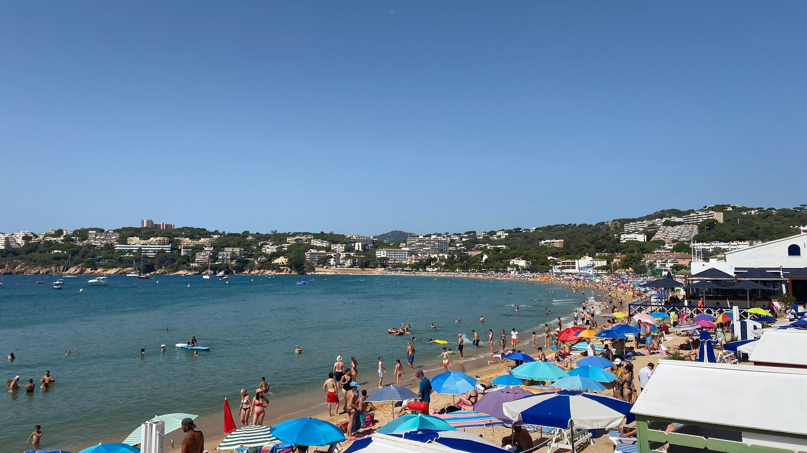
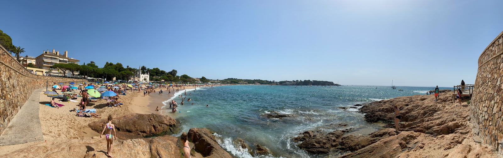
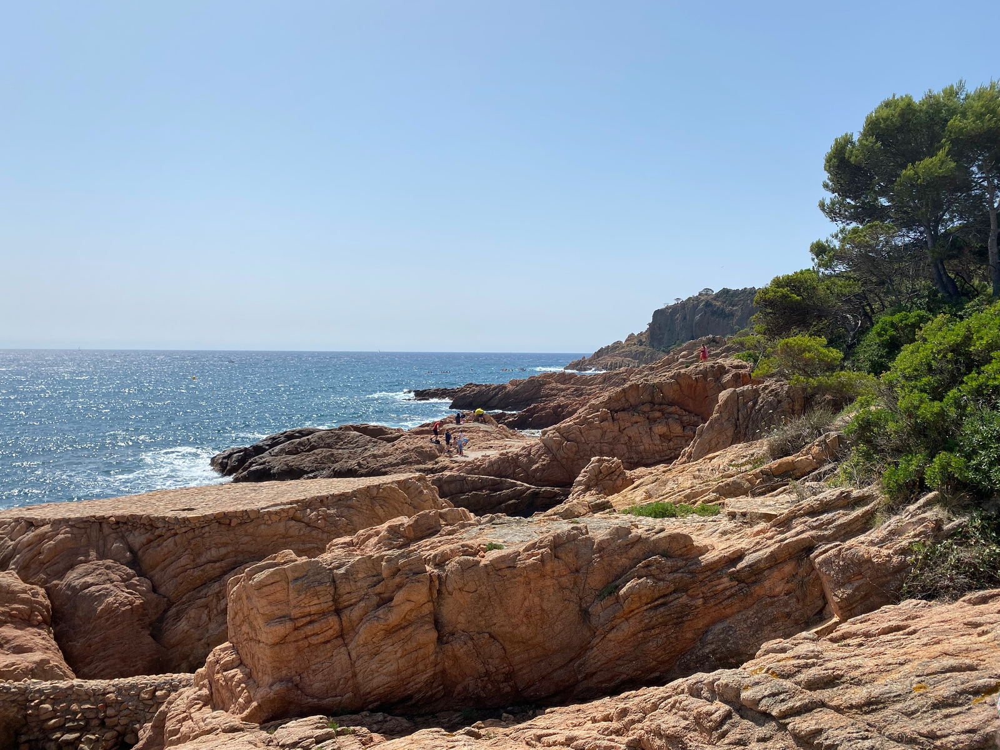
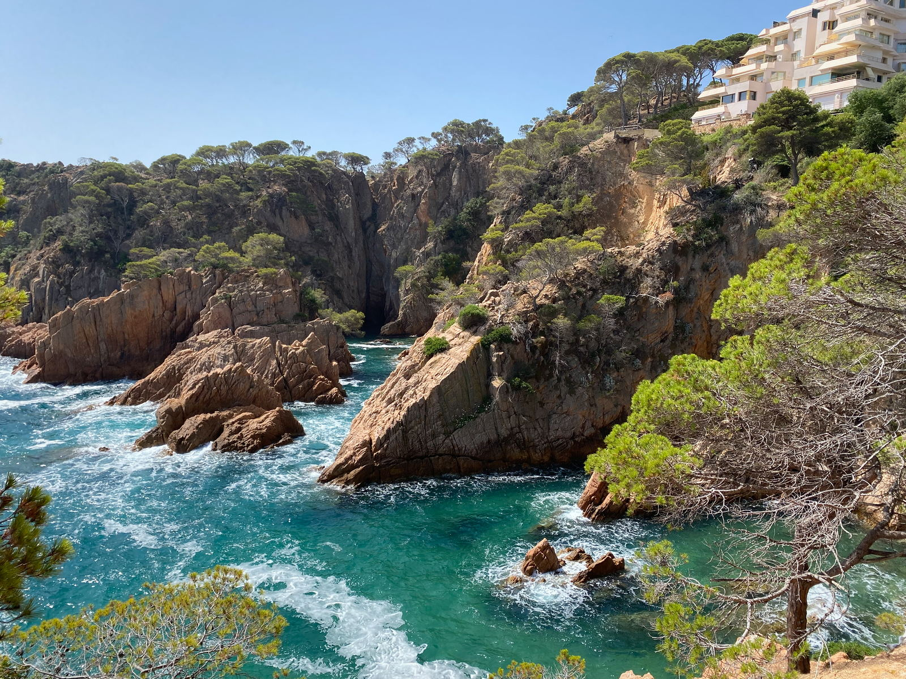
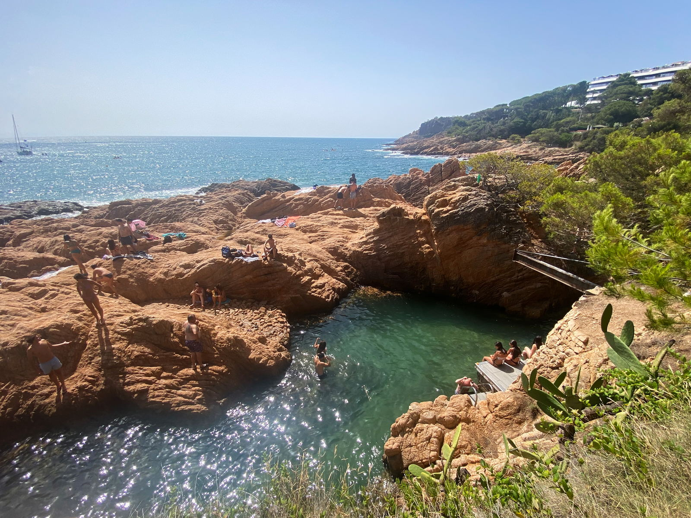
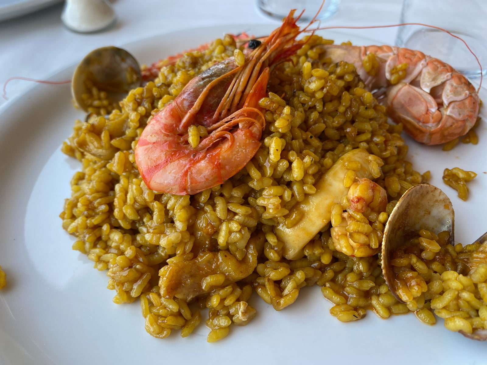

import Gallery from '../../components/elements/gallery.astro';

## Contents

## Visiting S'Agaró

Just up from [Sant Feliu de Guíxols](/blog/costa-brava-sant-feliu-de-guixols) you will find S'Agaró, which is a small beach town usually with a busy, but fairly chilled-out beach vibe -- even in the peak times.

Right from the beach you will see various watersports going on, including kayaks, jet skis, boating and SUP (stand-up paddleboarding).

### S'Agaró Beach

The beachfront itself is less than a 5 minute walk end-to-end, but over to the right (as you're facing the sea) there's some cool little rocky _calas_ to explore and places to have a swim. You may even see cliff jumpers around here, too!

### S'Agaró _Calas_
To access the calas, you can walk on the _Camí de Ronda_ coastal path (which is a bit _up-y and down-y_) or take the road. A couple of recommendations would be [Sa Caleta](https://maps.app.goo.gl/m2bBhKGn3SJz8aECA), which is the first one south of the beach (can be busy) and the harder to reach [Salt del boig](https://maps.app.goo.gl/q649dxPJnd2Yxoxh7), which has easier access to get into the sea but can have some good swimming and waves.

## Eating in S'Agaró

To eat in S'Agaró, there's several places on the seafront, but you might like to try [El Racó de Sant Pol](https://maps.app.goo.gl/pH9NorKGyMwSPXea6), a Mediterranean restaurant with a nice terrace or indeed any of the restaurants in the middle of the beachfront.

Arriving at S'Agaró by car will be your best bet, but parking can get incredibly difficult, especially at the weekends, so you'll want to arrive as early as 10am to find a spot.

## S'Agaró & the Camí de Ronda

From S'Agaró walking north up the coast, you'll find the continuation of the Camí de Ronda and it first offers a fantastic view from up over the whole beach before taking you along the dedicated path through more coves and past idyllic sea houses perched on the coast.

<Gallery maxCols={3} images={[
  { url: "/src/assets/blog/costa-brava/s-agaro/s-agaro-east-side.jpg", alt: "S'Agaró from the East" },
  { url: "/src/assets/blog/costa-brava/s-agaro/s-agaro-cami-de-ronda.jpg", alt: "S'Agaró Camí de Ronda" },
  { url: "/src/assets/blog/costa-brava/s-agaro/s-agaro-cami-de-ronda-sea.jpg", alt: "S'Agaró Camí de Ronda - sea" }
]}></Gallery>

If you keep going you'll eventually reach [Cala Sa Conca](https://maps.app.goo.gl/rpjcf4tsvCcfTC6A7), a small secluded beach. Further still and you'll get to [Platja d'Aro](/blog/costa-brava-platja-d-aro) beach, but you'll have to track inland first to cross the sea inlet.

