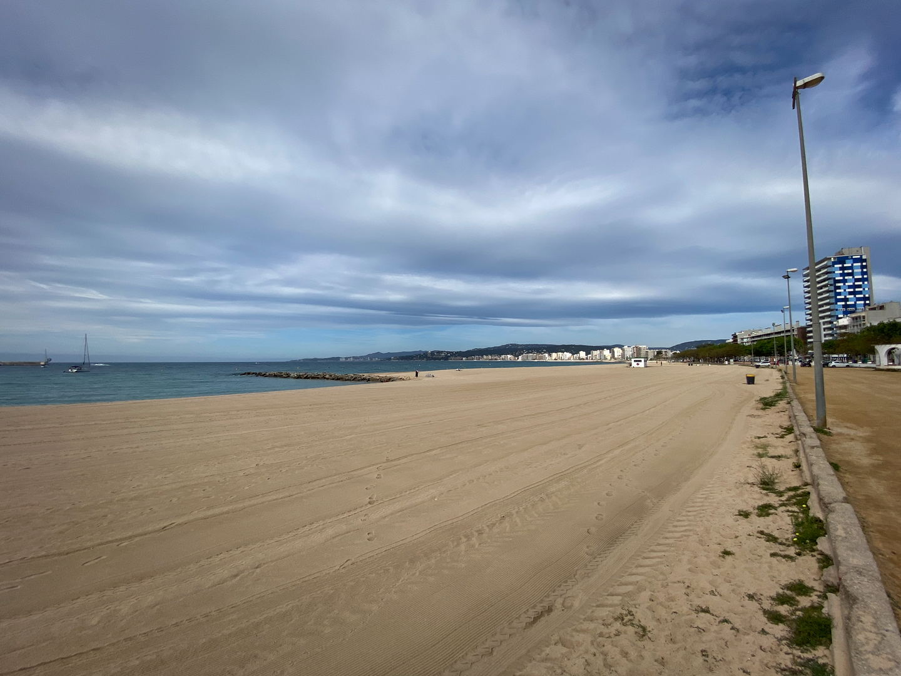
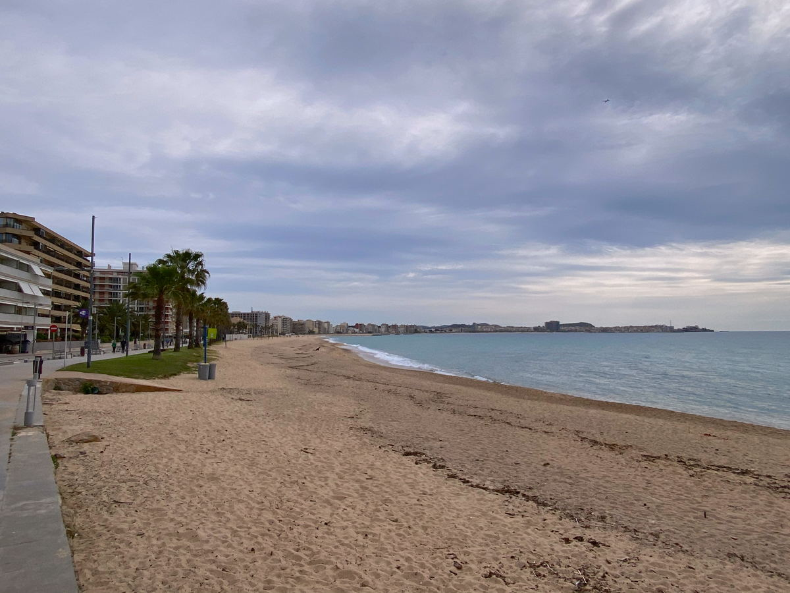

import Gallery from '../../components/elements/gallery.astro';

## Contents

## Sant Antoni de Calonge

Sant Antoni de Calonge is relatively small and mainly comprises the beach front and the surrounding urbanisation, which extends just a few blocks from the beach. In historical times it served as a summer retreat for the Romans, but these days it is a relaxed beach town attracting vacationers and watersport enthusiasts. 

It's still worth a mention on our list however, in part because of its proximity to the picturesque [coves](/blog/costa-brava-platja-d-aro#platja-daro-and-the-coves) (_calas_) between [Platja d'Aro](/blog/costa-brava-platja-d-aro) and Sant Antoni de Calonge, but also to [Palamós](#palamós) (see below), a short walk up the coast. For those visiting the area, you might find competitively priced budget accommodation (compared to Platja d'Aro and Palamós), which could make it a lucrative spot and also a bit quieter, too.

Sant Antoni de Calonge has a large-ish beach front, but in my opinion it is not nearly as good as some of the other beaches in the Costa Brava. There is also a huge campsite, called [Eurocamping](https://maps.app.goo.gl/vL6MAP85pvnJpqUH8), which is a good budget camping spot to stay at for those on a budget.

If you're staying at Sant Antoni de Calonge, I'd recommend a walk around the seafront, which is where most of the life is happening - but also you shouldn't miss a day trip to Palamós, which can be done on foot. Then there's the aforementioned _[calas](/blog/costa-brava-platja-d-aro#platja-daro-and-the-coves)_, which shouldn't be missed. Simply head South down the coast and follow the official Camí de Ronda public footpath, which (eventually) takes you all the way to Platja d'Aro (although it's not necessary to go all the way to discover some of the more exclusive hidden beaches en-route). If you do choose to do the full round trip to Platja d'Aro, allow up to 3 hours walking to do it comfortably and it goes without saying that in the summer months it can be an uncomfortable choice, given the high temperatures.

<Gallery maxCols={4} images={[
  { url: "/src/assets/blog/costa-brava/sant-antoni-de-calonge-palamos-cap-roig/sant-antoni/sant-antoni-de-calonge-south.jpg", alt: "Sant Antoni de Calonge - South" },
  { url: "/src/assets/blog/costa-brava/sant-antoni-de-calonge-palamos-cap-roig/sant-antoni/cami-de-ronda-path-start.jpg", alt: "Camí de Ronda - Path Start" },
  { url: "/src/assets/blog/costa-brava/sant-antoni-de-calonge-palamos-cap-roig/sant-antoni/cami-de-ronda-map.jpg", alt: "Camí de Ronda - Map" },
  { url: "/src/assets/blog/costa-brava/sant-antoni-de-calonge-palamos-cap-roig/sant-antoni/cami-de-ronda-coastal-path.jpg", alt: "Camí de Ronda - Coastal Path" }
]}></Gallery>

**Note**: I have covered [the coves in detail here](/blog/costa-brava-platja-d-aro#platja-daro-and-the-coves).

---

## Palamós

Palamós is a great little seaside town deep in the Costa Brava. It's famous for its [Palamós Prawns](https://en.wikipedia.org/wiki/Aristeus_antennatus) -- one of the star products of the Costa Brava, and has a chilled-out, laid back vibe, complete with cobbled streets and the old town. The old town is filled with trendy wine bars, excellent restaurants and cocktail bars, which, in my view make it great if you're there for the nightlife or a short weekend getaway.

There is a beach, which is shared with [Sant Antoni de Calonge](#sant-antoni-de-calonge), a 30 minute walk down the coast. Most activity is around [Port de Palamós](https://maps.app.goo.gl/egQpJdNakbbhGPLy5) and you'll probably want to focus yourself around there, especially for dinner and an evening stroll. Speaking of dinner, if you're a lover of Mediterranean cuisine and the local food then you may want to head to [Restaurant L' Arcada](https://maps.app.goo.gl/ckFBMuiHBUfdmxdv8), or simply take a look around that area as there are multiple options to choose from. You'll most likely stumble across the terrace restaurants, with the sea view, such as [L'Encís Taverna](https://maps.app.goo.gl/XukqqGStGVRuT4R26) or [Pirata Tapas Bar](https://maps.app.goo.gl/UuZ95yFE4X4xYgLJ6), and while they offer more nightlife they'll be a tiny bit more pricey.

If you're coming for a day trip by car, parking can be a bit difficult, but this is the case with most towns in the Costa Brava, especially in the summer holiday season.

It's also worth visiting the parts to the east of Palamós, such as [Cala Margarida](https://maps.app.goo.gl/hCjdhnbkuau2QPeX7) and [Platja de La Fosca](https://maps.app.goo.gl/u9xoh74tbzgV7qZM9), which might be a bit off the beaten track for some, but still accessible by car, or even on foot. If you continue up the coast on the Camí de Ronda, you'll also find a nice continuation of beaches and hidden coves, so pay a visit if you have the time.

---

## Cap Roig

Cap Roig is not much more than a rocky outcrop and some secluded coves, but it does have the beautiful gardens ([Jardíns de Cap Roig](https://maps.app.goo.gl/NdaJF9gbU7oREU8Q8)), which are worth a visit. Also, the Cap Roig castle is worth a visit with its idyllic gardens and sea view.

Cap Roig also hosts an [annual music festival](https://caproigfestival.com/en/) in the summer, which could be something to consider if you're planning a trip around that time.