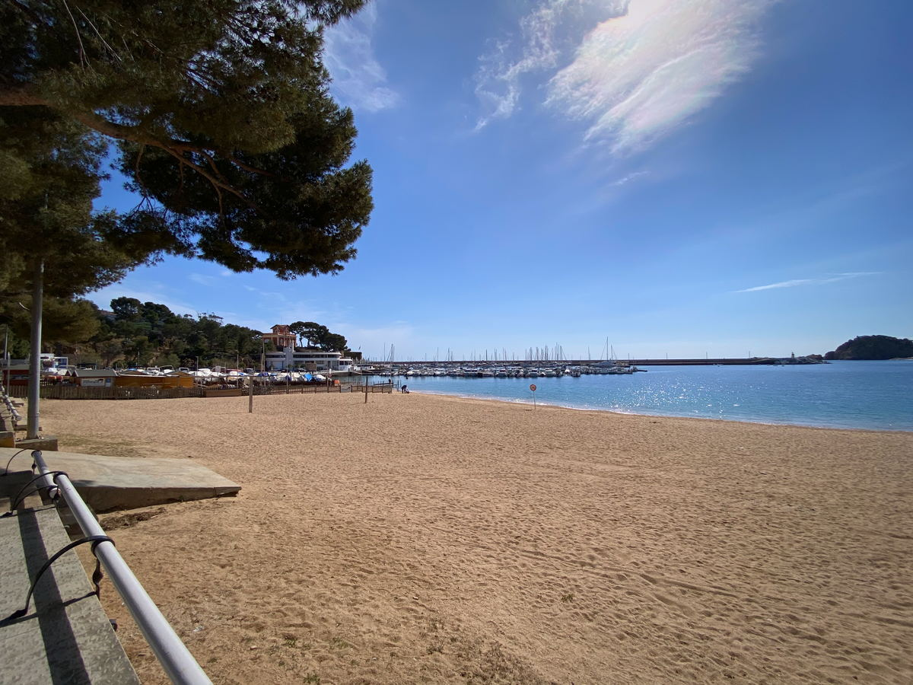

## Contents

## Visiting Sant Feliu de Guíxols

A little further down the road, you will come to Sant Feliu de Guíxols, which is a small fishing village. The beach is nice but small and there's only a few restaurants - speaking of which, check out [Casa Teva Restaurant](https://maps.app.goo.gl/yYggrJxeY2rnXpuG7), which has a decent Catalan menu with good service. Apart from that, the area can be covered in half a day or less and you might like to pair it up with [S'Agaró](/blog/costa-brava-s-agaro) and Platja de Sant Pol just up the coast (a short car ride away).

## Walking in Sant Feliu de Guíxols

From the main [Beach of Sant Feliu](https://maps.app.goo.gl/X72qshoGkyDoeEPK6), if you're looking for a short walk (< 1hr), you can walk from the beach to the southern cape via a [viewpoint here](https://maps.app.goo.gl/vcxWtth3vY1VcVnTA) and eventually you'll get a good near 360-degree view from [the cape of Sant Feliu de Guíxols](https://maps.app.goo.gl/fZ5uKrabniMB81Vc7), once you've scaled the rocky outcrop. The area around there isn't particularly interesting (except the view) and is mainly just residential.

Alternatively, I recommend hiking between Sant Feliu and [S'Agaro](costa-brava-s-agaro) and you'll get to enjoy the secluded beach coves en-route, where you'll probably see cliff jumping, kayaks and people in the water, as well as the beautiful surrounding nature. It's a bit up and down again in this area, but unfortunately the price of hidden coves!

There's also some hiking to be had to the south, towards Punta Brava, but these routes are best checked on Wikilok or Komoot apps.

## Sant Feliu Monastery

Finally, a short walk up to the [Monastery](https://maps.app.goo.gl/SXYLP8A4WrZm6UQF8) is quite nice and be sure to check out the port to the east of the beach, where there's more restaurants and people activity. Sant Feliu can be more or less done in a day.