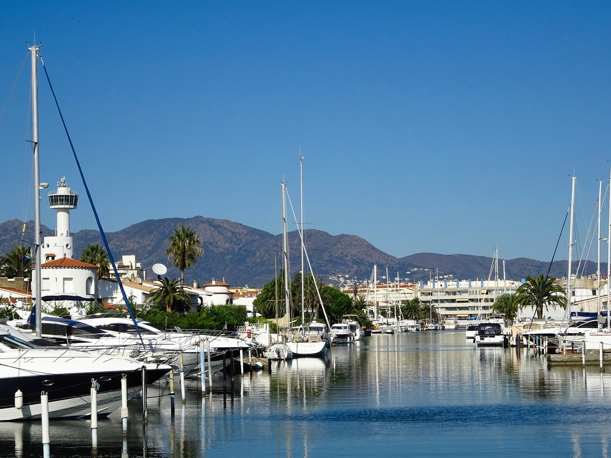
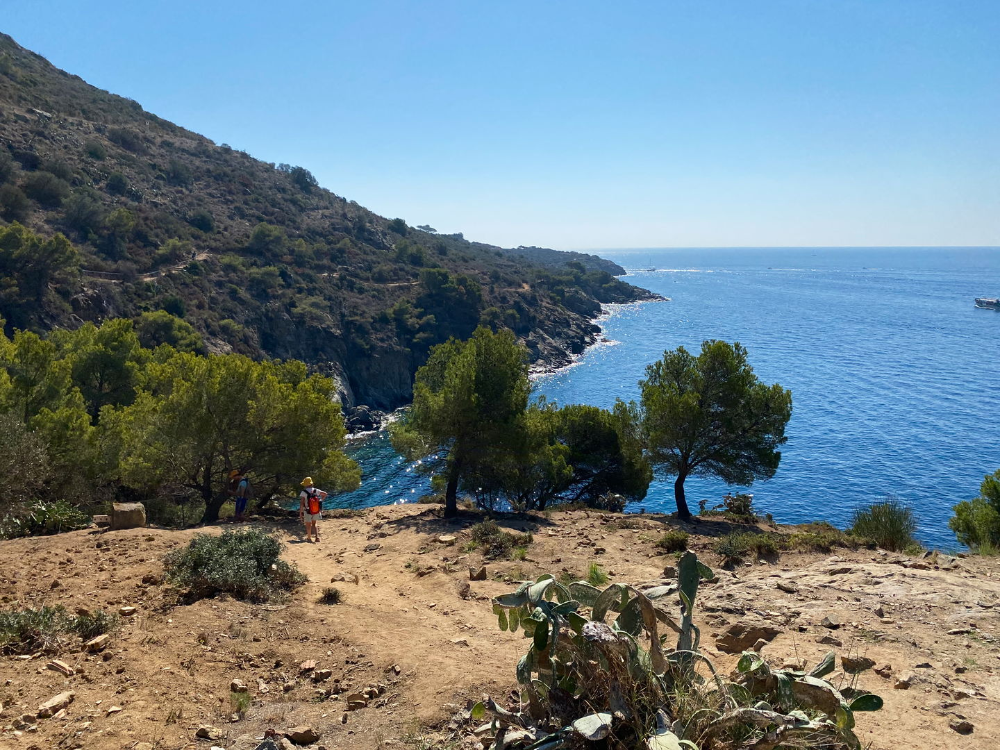
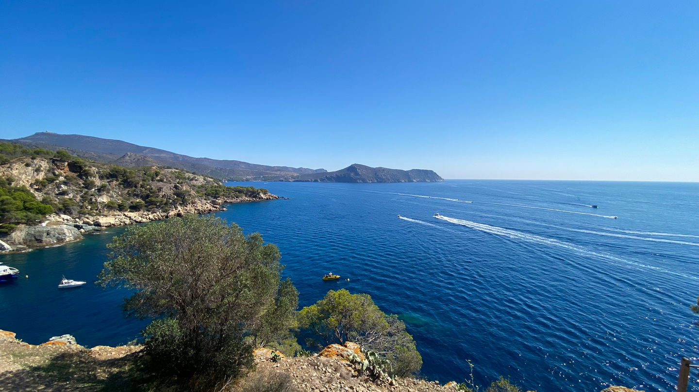

import Gallery from '../../components/elements/gallery.astro';

## Contents

## Visiting Sant Pere Pescador

**Awaiting recommendations**

---

## Visiting Empuriabrava

Located in the _Alt Empordà_ region of the Costa Brava, Empuriabrava is unique in that it has over 40 km of inland canals and waterways, which are navigable if you happen to have a boat. The seaside town has developed a lot and it's only in the last 50 years that it has been considered a tourist spot, at least by the locals.

Coming from Barcelona, the journey can be done in under 2 hours by car and is fairly direct.

In terms of things to see and do, you may want to consider hiring a boat to get around, although it is possible to walk. There's also lots of water and adventure activities on offer - just seek out any tourist information and trip agent when you are visiting. Also, accommodation is aplenty, although also a popular tourist destination, so book ahead. There is a beach but you might enjoy more Roses (just up the coast) or indeed Sant Pere Pescador, since the latter has a long beach stretch.

### Close-by to Empuriabrava

Apart from that, people like to pay a visit to the nearby town of Figueres closeby, made famous by the likes of [Salvador Dalí](https://en.wikipedia.org/wiki/Salvador_Dal%C3%AD), the Spanish artist - we'll probably do a future post about Figueres!

### Restaurants in Empuriabrava

**Awaiting recommendations**

---

## Visiting Roses

Roses is another cool little seaside destination to visit on the Costa Brava. It can be a cool place to spend a couple of nights and perhaps can be paired with Figueres (for visiting the Salvadro Dalí museum for instance), or for visiting [Cadaqués](/blog/costa-brava-cadaques-cap-de-creus). If the latter, you'll want to consider a speed boat trip, which will ferry you from Roses to Cadaqués directly, since it's remote.

Roses as a destination also complements well with a day trip to Empuriabrava just down the coast (mentioned above).

<Gallery maxCols={2} images={[
  { url: "/src/assets/blog/costa-brava/sant-pere-pescador-empuriabrava-roses/roses.jpg", alt: "Roses Beach" },
  { url: "/src/assets/blog/costa-brava/sant-pere-pescador-empuriabrava-roses/roses-beach-morning.jpg", alt: "Roses Beach" },
  { url: "/src/assets/blog/costa-brava/sant-pere-pescador-empuriabrava-roses/roses-from-espigo.jpg", alt: "Roses From The Breakwater" },
  { url: "/src/assets/blog/costa-brava/sant-pere-pescador-empuriabrava-roses/roses-sunset.jpg", alt: "Roses Beach - Sunset" }
]}></Gallery>

## Roses Beach

Roses has a nice seafront with bars and restaurants right next to the beach and in general is just nice to walk up and down. Also, the sea seems fairly clean and the beach is a sandy one, as opposed to rocky like you might find at some other parts of the Costa Brava. There's also a fair amount of reasonably priced hotels scattered around and since it's relatively small it doesn't really matter where you stay.

## Bars & Restaurants in Roses

For food & drink options, there's plenty to choose from. In fact, Roses receives a lot of French tourists (probably due to the proximity to France and/or Figueres?) so you might be greeted in French at shops and restaurants and probably the menu will be in French by default, if you look like a tourist!

For dining, if you're after something off the main strip, you could try the street [Carrer de Sant Sebastià](https://maps.app.goo.gl/zQGEXh1uJUTy54nVA) and bars/restaurants near to [Hotel-Restaurant La Cala](https://maps.app.goo.gl/3WTGJnZ3Wei6fP6g7). Usually it's pretty lively with street musicians and there's lots of options on that street. Failing that, any of the hidden restaurants in the surrounding streets of that area. Or -- of course, the seafront, where you will find the typical seafront restaurants with terraces.

## Hiking near Roses

### Montjoi
If you're looking for some hiking in the area, you might want to consider a day trip to [Montjoi](https://maps.app.goo.gl/SfK5ETHdSSWV3HcL7).
The public transport around here is very limited and so preferrably accessed by car. Start at [Platja de Canyelles Grosses](https://maps.app.goo.gl/ASJGGnWRcLehtTAfA), taking any parking spot you can find, even if it's high up on the main road away from the Canyelles Grosses beach. It's possible to walk from the beach to the Camí de Ronda (or park even closer - there's an entry point to the [Camí de Ronda here](https://maps.app.goo.gl/386w3Z72A3maM1ut5)).

**Start of the route**

Once on the route, just follow the natural path and you'll go past some coves and abandoned bunkers, which are cool to see. Wikilok or Komoot (apps) will be your friends here, so just pick up a route that someone else has done.

<Gallery maxCols={2} images={[
  { url: "/src/assets/blog/costa-brava/sant-pere-pescador-empuriabrava-roses/cami-de-ronda-cala.jpg", alt: "Camí de Ronda - Cove" },
  { url: "/src/assets/blog/costa-brava/sant-pere-pescador-empuriabrava-roses/cami-de-ronda-path.jpg", alt: "Camí de Ronda - Pathway" },
  { url: "/src/assets/blog/costa-brava/sant-pere-pescador-empuriabrava-roses/cami-de-ronda-cala-view.jpg", alt: "Camí de Ronda - View" },
  { url: "/src/assets/blog/costa-brava/sant-pere-pescador-empuriabrava-roses/bunker.jpg", alt: "Abandoned Bunker" }
]}></Gallery>

**Things to keep in mind:**
- The route is quite exposed, so avoid the direct sun
- The distance is quite far, so only attempt it if you are confident, as there's not much around there!
- It's possible to get in the sea at a few of the coves en-route, but they are very small and quite difficult to climb down to - not to mention could be dangerous since no-one else will be there. Also, with the speedboats going past en-route to Cadaqués, you will probably have to deal with a lot of waves!

### Canyelles Big Beach
If you're just up for some beach action, [Platja de Canyelles Grosses](https://maps.app.goo.gl/94imQ1dnxpJ5hmDfA) has you covered. The side near to [Almadrava Chiringuito beach bar](https://maps.app.goo.gl/y1LzTX1sRzuCK2ec6) is a bit quieter and the sea & beach are both very nice here.

<Gallery maxCols={2} images={[
  { url: "/src/assets/blog/costa-brava/sant-pere-pescador-empuriabrava-roses/canyelles-panorama.jpg", alt: "Canyelles Beach" },
  { url: "/src/assets/blog/costa-brava/sant-pere-pescador-empuriabrava-roses/canyelles-water.jpg", alt: "Canyelles Beach" },
  { url: "/src/assets/blog/costa-brava/sant-pere-pescador-empuriabrava-roses/canyelles-sea.jpg", alt: "Canyelles Beach" },
  { url: "/src/assets/blog/costa-brava/sant-pere-pescador-empuriabrava-roses/canyelles-sand.jpg", alt: "Canyelles Beach" }
]}></Gallery>

## Roses → Cadaqués by Boat

If you want to visit Cadaqués, but without the hassle of driving there, you could consider a boat transfer or daytrip from Roses. It seems a lot of people do it and it's quite quick to arrive. It also means you can tick-off Cadaqués, if you're in the area but limited on time.

