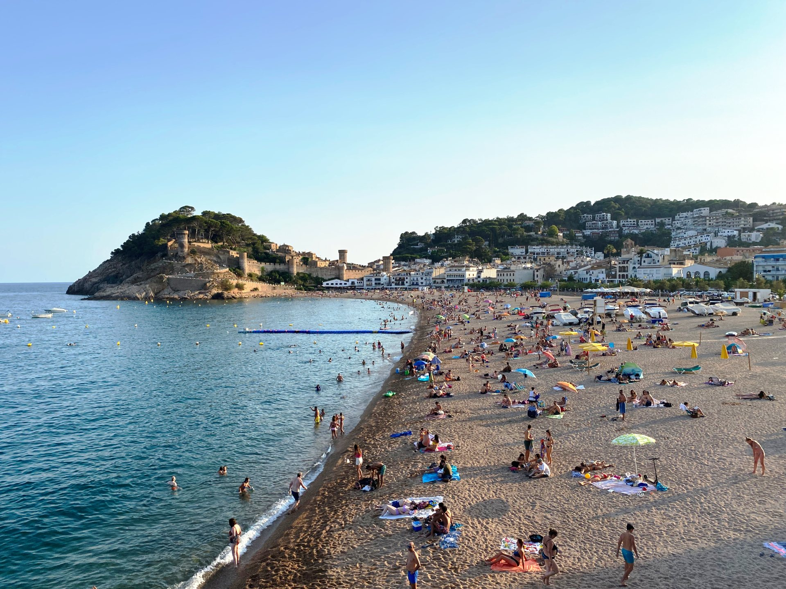
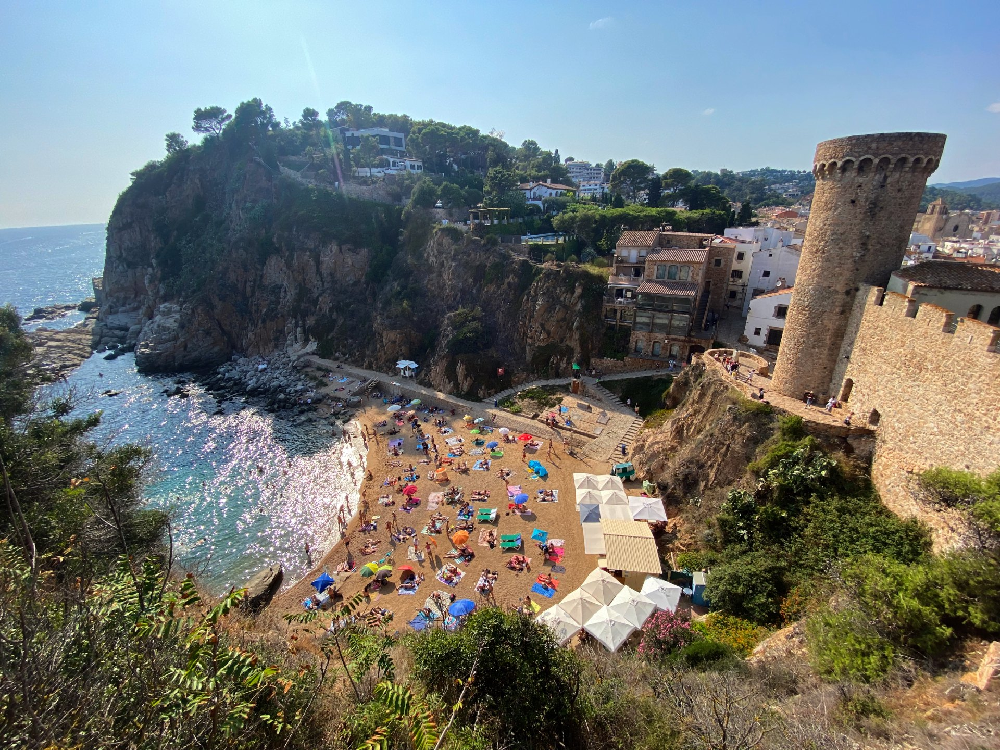
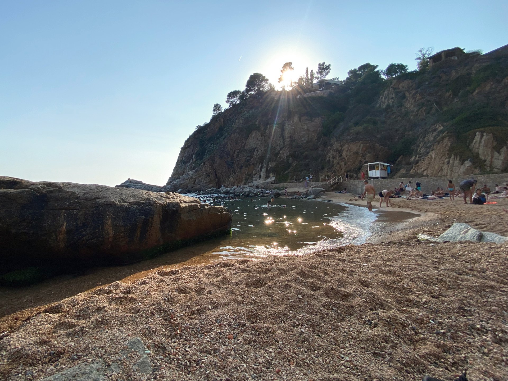
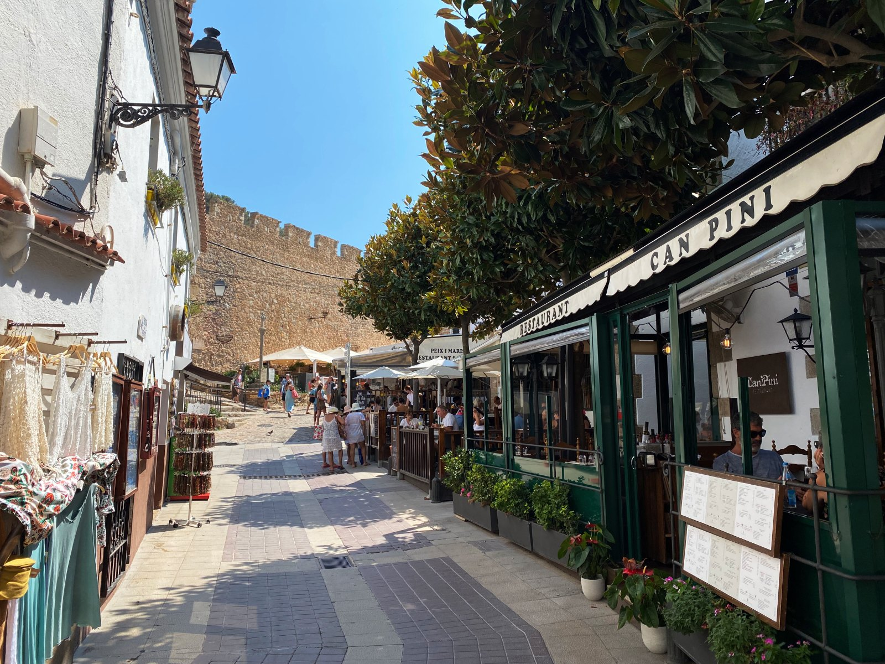
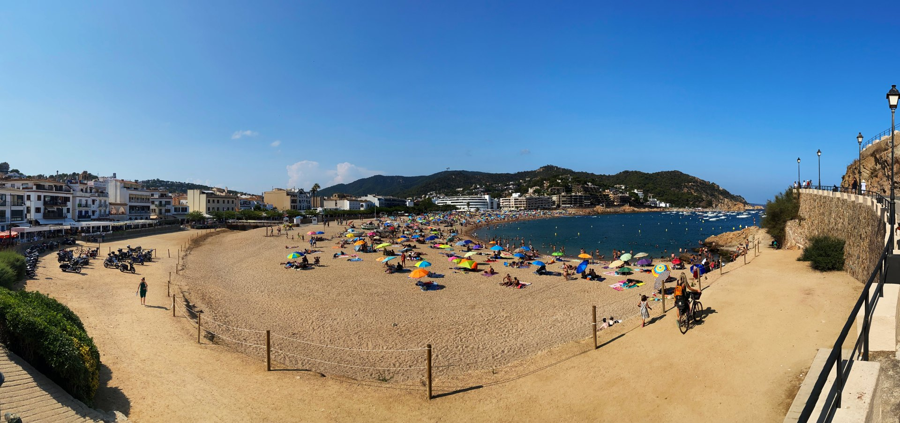

import Gallery from '../../components/elements/gallery.astro';

## Contents

## What to do in Tossa de Mar

Tossa de Mar has a lot to offer. First off, the town and area around [Plaça Espanya](https://maps.app.goo.gl/sXXyhrtN7ZWxqYdM6) and the Passeig del Mar has a nice seaside vibe and you will find back-to-back restaurants and bars in this area as well as souvenir shops, ice creams and other independent artisanal shops.

### Tossa de Mar lighthouse and seaview

A small hike up to the [lighthouse](https://maps.app.goo.gl/urUqDtrGJYWsekmo6) is well worth it and the view of the bay from the top is staggering.

The route starts at the beach and you will pass by the [Muralles](https://maps.app.goo.gl/2DxH1zgPcnDbFdGg8) and various ancient [gothic ruins](https://maps.app.goo.gl/cSAM87gKi41D8y1h6) before reaching the top, walking through the woodland.

<Gallery images={[
  { url: "/src/assets/blog/costa-brava/tossa-de-mar/view-from-lighthouse-ruins.jpg", alt: "View from lighthouse ancient ruins" },
  { url: "/src/assets/blog/costa-brava/tossa-de-mar/view-from-lighthouse.jpg", alt: "View from lighthouse" }
]} maxCols={2}></Gallery>

From here you can descend and explore the [castle](#tossa-castle) (see below).

### Tossa castle

A trip to the [castle](https://maps.app.goo.gl/MEuUPFwiRvCuUtpVA) should be high on your list and is a personal favourite, since the views are excellent and you can stop by one of the bars for a drink on your way. Once you head south off the main seafront just follow the path up. In addition, be sure to head up to the top and the [lighthouse](https://maps.app.goo.gl/ayxZaSrkcaHFVGgC8), which also offers amazing views out over the bay.

### Secret calas near Tossa de Mar
If you make it to the top you'll probably notice the hidden beach of '[Cala es Codolar](https://maps.app.goo.gl/3UhJqizf5cXFTEwW9)' which usually gets busy, but if you can find a spot to sunbathe it's worth a visit. The beach is chilled and is also a topless sunbathing spot! Make sure to take goggles and a snorkel for when you go in the sea as there's rock pools and fish to see. 

From Cala es Codolar, it's possible to walk all the way through the forest and coastal path to [Cala Llorell]((/blog/costa-brava-cala-llorell)), but it's a good 1h 30m and there's some uphill walking to be done, but you can also go up to the [viewpoint](https://maps.app.goo.gl/yrQnjAP78WtKXoto7) if you're looking to walk a shorter distance.

Another excellent feature of Tossa is the cobbled streets below the castle, [here](https://maps.app.goo.gl/AVjdDqbbKiJwKhsT8). There's some quirky pirate themed bars and a few restaurants in these streets, albeit quite busy with tourists, too.

### Tossa de Mar lunch options
For lunch, you will also find some very cool little restaurants and tapas bars around here, for example [Bar La Lluna](https://maps.app.goo.gl/Z7Av5md6rXrSeZA16), [Restaurant Castell Vell](https://maps.app.goo.gl/D7w5xgsfiWZ1nRUUA) and [Restaurant Santa Marta](https://maps.app.goo.gl/7AuHDz1B5KnRJkt29), as well as many more on [Carrer del Portal](https://maps.app.goo.gl/if8yQSTmM3oYMufe7).

In addition, there's plenty of restaurants on the beach front, so head to [Passeig del Mar](https://maps.app.goo.gl/QBb1KcAbdVTsHJm98), where there's quite a few more traditional Mediterranean restaurants.

### Tossa de Mar beaches
From Tossa de Mar up the coast you'll find the main beach [Platja Gran](https://maps.app.goo.gl/st9QBFbDqgFWswrf7) and another small beach further up ([Platja Mar Menuda](https://goo.gl/maps/NjJoqByKtqCdmgp47)). The latter has all the geographical hallmarks of this area (secret beach, rocky coves, aquamarine sea...etc.) Past here it's very much off-the-beaten-path and I would recommend taking a car along the coastal road, where you'll come across some small coastal villages and more exclusive spots.

### Tossa viewpoint

Finally, if you are feeling adventurous, head up to the [Mirador de Tossa de Mar](https://maps.app.goo.gl/qLQmp2rVBbNh9rnA8) for an astounding view back over Tossa de Mar.

[Back to Top 👆](#main)