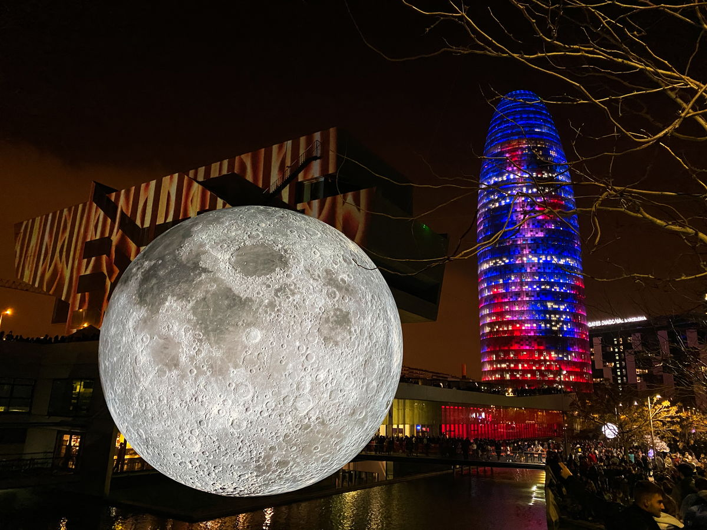
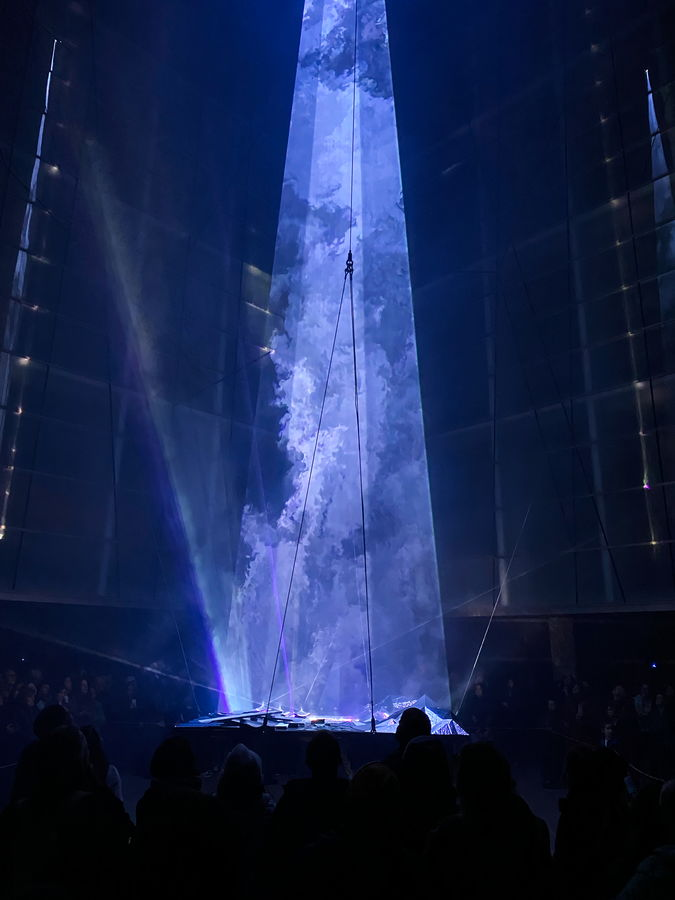
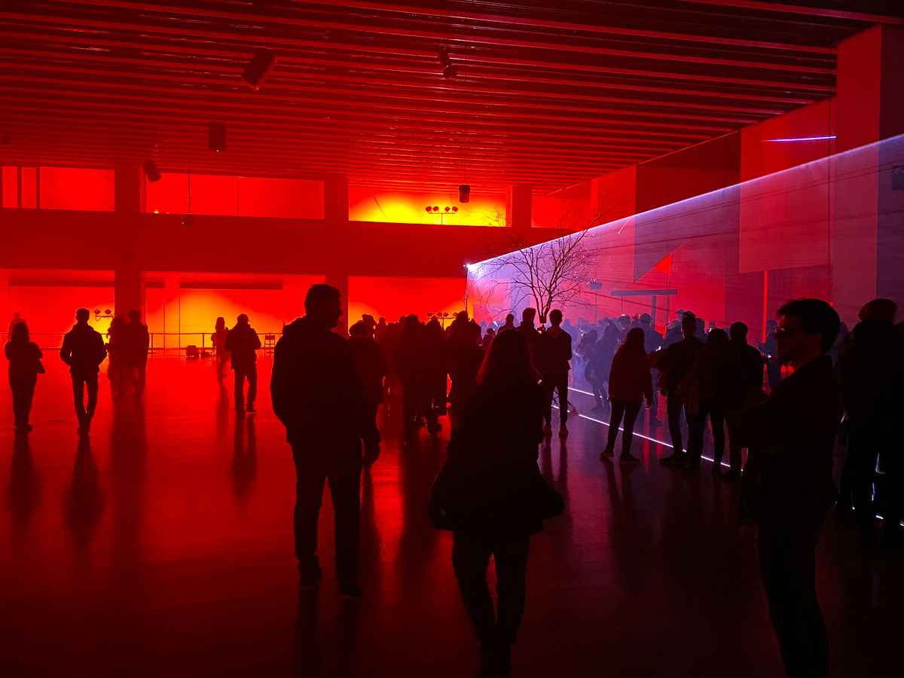
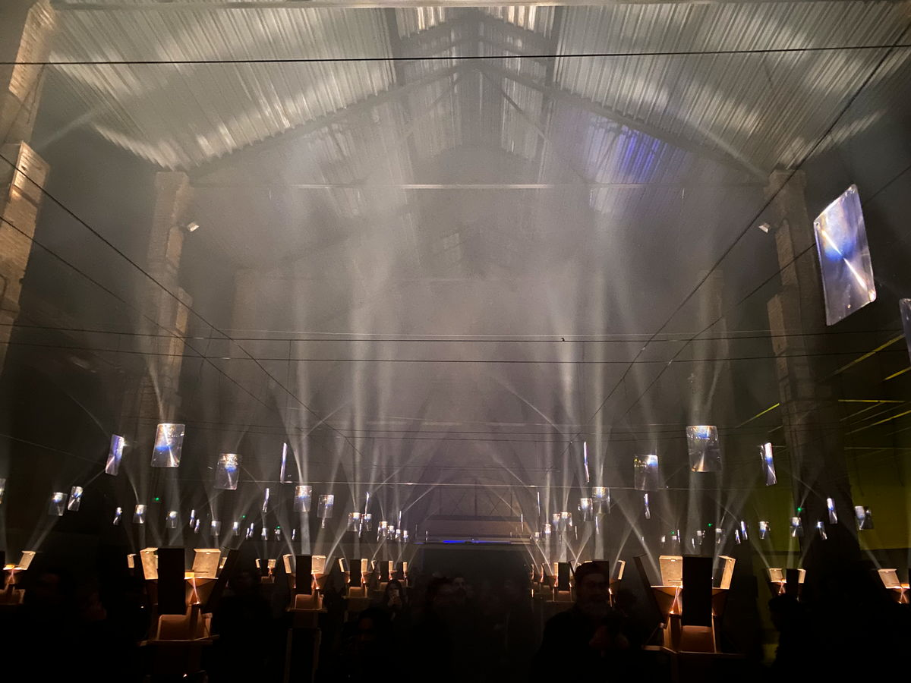
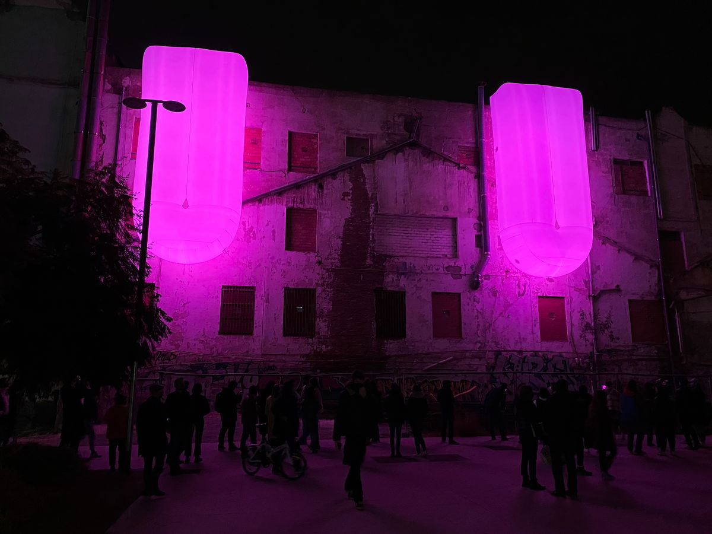
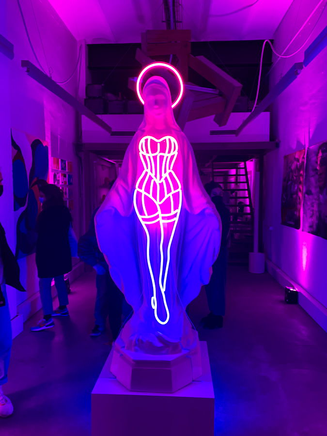

import Gallery from '../../components/elements/gallery.astro';

## Contents

## The BCN Llum Festival 2025

**If you're just looking for the map, then the [Llum BCN 2025 map](https://www.barcelona.cat/llumbcn/en) is here. They also have [a native app here](https://ajuntament.barcelona.cat/apps/ca/llum-bcn).**

## What is Llum BCN?
The Barcelona Llum Festival (locally known as Llum BCN) is an internationally recognised light arts festival held each year in one of Barcelona's most acclaimed neighbourhoods, Poblenou. It is usually a 3-day festival in February over a Friday, Saturday and Sunday. This year, the festival runs from the 7th - 9th February 2025. The official website is here: https://www.barcelona.cat/llumbcn/en

Since 2012, local residents and tourists alike have been descending on the otherwise chilled-out neighbourhood of Poblenou to enjoy light and sound spectacles in the participating sites and locations and the festival even persisted through the COVID times without a year-off.

<iframe style={{ maxWidth: "100%", marginLeft: 'auto', marginRight: 'auto'}} width="560" height="315" src="https://www.youtube.com/embed/NQgzG2PHT8Q?si=4CZ8vynBKjdffV41" title="YouTube video player" frameborder="0" allow="accelerometer; autoplay; clipboard-write; encrypted-media; gyroscope; picture-in-picture; web-share" referrerpolicy="strict-origin-when-cross-origin" allowfullscreen></iframe>

<small>
**Video courtesy of our very own community member, Brata from 2023.**
</small>

## Visiting Llum BCN

Even when the residents of Barcelona are donning winter clothes to pass the (relatively) cold month of February and avoid the single digit temperatures, Barcelona's creativity never stops. The festival is always a big hit and attracts almost a quarter of a million visitors over the 3 day period, according to the [Barcelona City Council](https://www.barcelona.cat/llumbcn/en).

Visitors to this year's Llum Festival will once again enjoy a unique and, above all, free self-guided walk around multiple sites and installations -- almost all of which are situated in the Poblenou neighbourhood and others just a stones' throw away.

<small>**Taken @ The Auditorium, 2024**</small>

Every location featured gives rise to a different space and lighting experience, plus no two years are the same, meaning that if you don't catch an artists' work one year, you might not see the same installation again the following year.

<small>**Taken @ The Barcelona Design Hub, 2020**</small>

This year, there will be **30 installations** featuring the works of **15 light artists** from 17 universities and schools of design & architecture. They also have a lot of outdoor scenes this year and are focussing not only on lighting but also on scenography, photography, visual art and even dance. In a lot of cases, the installations have been created especially for the Llum 2025 Festival.

<small>**Taken @ The MUHBA Art Museum, 2024**</small>

## Llum BCN Installations & Locations

It's not just the installations that change -- regulars to the Llum Festival will note that some locations host an installation and then the next year they don't, which keeps the punter keen to find out what will be on offer this year!

<Gallery maxCols={4} minCols={2} images={[
  { url: "/src/assets/blog/llum-bcn/parc-del-poblenou-plants.jpg", alt: "Llum BCN - Poblenou Park" },
  { url: "/src/assets/blog/llum-bcn/parc-del-poblenou-poles.jpg", alt: "Llum BCN - Poblenou Park" },
  { url: "/src/assets/blog/llum-bcn/parc-del-poblenou-glass.jpg", alt: "Llum BCN - Poblenou Park" },
  { url: "/src/assets/blog/llum-bcn/parc-del-poblenou-walls.jpg", alt: "Llum BCN - Poblenou Park" }
]}></Gallery>

Having said that, the regular locations, which tend to let their spaces to the public are the creative institutions in the heart of Poblenou and other publicly recognised buildings, parks & open spaces, such as:

- Glòries
  - [The Barcelona Design Hub](https://www.dissenyhub.barcelona/en)
  - [Plaça Josep Antoni Coderch](https://maps.app.goo.gl/YSo1DRYCxmHXovGW8)
  - [Torre Glòries (Agbar Tower)](https://maps.app.goo.gl/wsbBdgNkZR9rkSUH6)
- [Teatre Nacional de Catalunya](https://maps.app.goo.gl/E41sCaNnkCyJAV4BA) & The Auditorium ([L'Auditori](https://maps.app.goo.gl/EbZtnzw9CqmhVbFFA))
- [Parc del Centre del Poblenou](https://maps.app.goo.gl/rAbTBJRUGaRP3MVh8) / Diagonal
- Educational institutions: [IAAC](https://iaac.net/), [UIC](https://www.uic.es/en), [BAU](https://www.baued.es/), [Pompeu Fabra University](https://www.upf.edu/), [LCI Barcelona](https://maps.app.goo.gl/TDXhv2mabMfobJFAA), [FX Barcelona Film School](https://maps.app.goo.gl/4dk91bb17tcgar9X6)
- [The Can Framis Museum](https://maps.app.goo.gl/SmeRNwZYXGd1e4MD9)
- [Razzmatazz](https://maps.app.goo.gl/uhXw2AwaaC63k6Z9A)

**Note**: Due to the manual nature of some locations, people with reduced mobility might find some installations have limited access. Check the official website before heading out.

On top of the above, you'll surely happen upon random light shows projected onto the sides of buildings, street performances or simply just unique outdoor spaces, utilizing what would otherwise be random bits of disused wasteland scattered around the Poblenou neighborhood.

<small>**Taken @ Pl. Isabel Vila, Poblenou, 2022**</small>

<small>**Taken @ Plataforma Art Gallery, Poblenou, 2022**</small>

Then, there's the general festival street vibe going on around the more low-key and independent businesses, shops and bars, which (often) unofficially participate in the festivities, particularly the ones near to Metro Llacuna (such as Moryarty Posters & Marcs).

## Getting to Llum BCN

If you're looking for an alternative starting point, which isn't the busier Glòries Metro, then Llacuna will be your best bet and will undoubtedly be the meeting point for many people. Apart from that, Marina or Glòries metro are safe bets. The Tramvia also serves the sites near to Diagonal and Glòries and so those are great options, plus Poblenou metro or Bogatell will put you close to the action, too. The city usually bumps-up the metro and bus frequency during the festival to help.

This year, the 3-day Llum Festival falls on the 7, 8 & 9th of February 2025 and is from 7pm until 1am (finishing at 11pm on the Sunday night). 

| Day        | Opening   |
| :--------- | :-------- |
| Friday     | 19h - 01h |
| Saturday   | 19h - 01h |
| Sunday     | 19h - 23h |

## Recommendations for BCN Llum 2025

Having visited the festival for the last 8 years, I would recommend going on the Friday night from 7pm and try to tick-off the main locations (such as Glòries, The Barcelona Design Hub and Teatre Nacional), since these sites can get very busy on the Saturday and Sunday nights (although by Sunday most people have been and gone). The Design Hub even has queues so be there at 6.30pm if you want to beat the queue! This should then free you up to explore the installations on the streets around Almogàvers, Pallars, Pujades and Llull the following day. Having said this, in recent years the festival has managed to cross Diagonal at Parc del Centre del Poblenou, which has had some great installations in the last few years and the queues here can also be quite long if you leave it too late.

Be sure to check [the map](https://www.barcelona.cat/llumbcn/en) as there are certainly more installations than you'll have time to visit, so shortlist the ones which you want to see the most as you simply won't get around all the places, unless you go for the full 3 days!

Food & drink can be sourced en-route, so just walk around the streets and you'll find street vendors and pop-up bars at some of the sites offering the usual “Barcelona swag”, with the likes of local beers and takeaway food from well-known local restaurants, especially to a resident Poblenou person.

## Llum BCN - previous years

Here's some highlights from previous years.

<Gallery maxCols={4} minCols={2} images={[
  { url: "/src/assets/blog/llum-bcn/jardins-miquel-marti-i-pol.jpg", alt: "Jardins de Miquel, Martí i Pol" },
  { url: "/src/assets/blog/llum-bcn/can-framis-gardens.jpg", alt: "Can Framis - Gardens" },
  { url: "/src/assets/blog/llum-bcn/campus-del-poblenou.jpg", alt: "Campus del Poblenou" },
  { url: "/src/assets/blog/llum-bcn/behind-we-work-office.jpg", alt: "Behind the WeWork Office, Pallars" },
  { url: "/src/assets/blog/llum-bcn/lazer-in-sky.jpg", alt: "Lazer" },
  { url: "/src/assets/blog/llum-bcn/sancho-avila-badajoz-lamps.jpg", alt: "Lamps, Sancho D'Avila with Badajoz" },
  { url: "/src/assets/blog/llum-bcn/sancho-avila-badajoz-lamp.jpg", alt: "Lamps, Sancho D'Avila with Badajoz" },
  { url: "/src/assets/blog/llum-bcn/pl-isabel-vila.jpg", alt: "Pl. Isabel Vila" },
  { url: "/src/assets/blog/llum-bcn/light-installation-on-vehicle.jpg", alt: "Light Installation on Vehicle" }
]}></Gallery>
