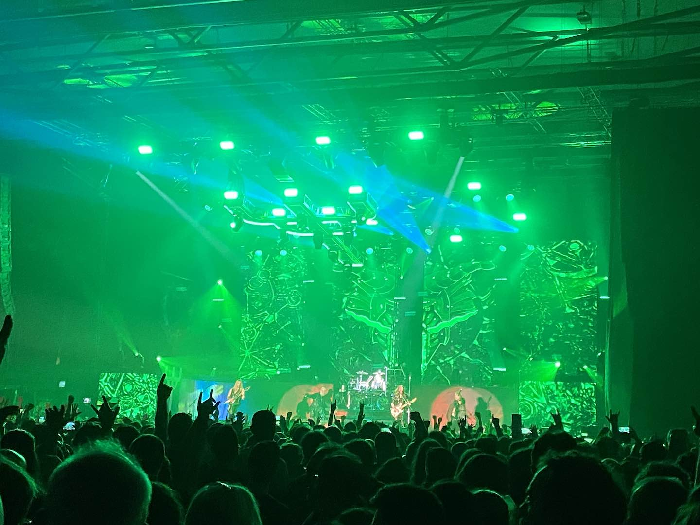

import ListingBlock from '../../components/elements/listing-block.astro';

## Contents

## Rock & Metal in Barcelona

Here’s a list of all the places in Barcelona where you can find rock and metal music. Some are dedicated to rock, heavy rock, classic rock, metal, heavy metal and death metal, while others are more random.

## Old Town (Ciutat Vella)
The old town is where you will find most rock & metal music in Barcelona.

### Hell Awaits, El Raval
Hell Awaits deserves accreditation for its dedication and focus on heavy music, and this is reinforced by the sheer number of CDs and records behind the bar. The bar staff are also big music fans. This no-frills bar is usually frequented by serious rockers, but they do have a surprisingly good selection of bottled beers, considering it’s a relatively small place. There’s also a pool table, but that’s just a bonus!

<ListingBlock
  address={'Carrer de les Tàpies, 21, Ciutat Vella, 08001 Barcelona'}
  map='https://maps.app.goo.gl/EBcfX6n74ZKfGaCh6'
>
</ListingBlock>

### Nevermind, El Gótico & El Raval
The clue’s in the name with Nevermind and they have two bars -- one in El Gótico tucked away just behind Plaça Reial and the second in El Raval, near the university.

<ListingBlock
  placeName='Nevermind Raval'
  address={'C/ dels Tallers, 68, 08001 Barcelona'}
  map='https://maps.app.goo.gl/xdmSmt28AjbbiTLk8'
>
</ListingBlock>

<ListingBlock
  placeName='Nevermind Gótico'
  address={'C/ dels Escudellers Blancs, 3, 08002 Barcelona'}
  map='https://maps.app.goo.gl/WAA8yFsbBV91YdX48'
>
</ListingBlock>

### Magic Barcelona, El Born
Magic plays rock and punk classics, mainly from the 90s and 00s, but be sure to check the flyer before you go. It’s a nightclub, so you will want to visit the club during the weekend where it can go on until late. The drinks are fairly priced, with beers going for €5 apiece (as of 2024), plus the clientele is usually nice. The dance floor in the back room usually gets going well after midnight.

<ListingBlock
  address={'Passeig de Picasso, 40, Ciutat Vella, 08003 Barcelona'}
  map='https://maps.app.goo.gl/uoxU2pd4zaNJcYva9'
  website='http://www.magic-club.net/'
>
</ListingBlock>

### Bar Sincopa, El Gótico

Sincopa is in the heart of El Gótico is on Carrer d'Avinyó, which is a busy, happening street in the heart of the neighbourhood. The bar is fairly small, but the place is music-themed with instruments hanging from the ceiling (also check out the saxophone beer font!). They usually play some good rock and it generally caters to many tastes. It can be a good place to start your night, especially with Bar Manchester just around the corner (see below). Beers in here will set you back a mere €3,50 (as of 2024). If you go on a Friday or Saturday night after 10pm, you may even have difficulty finding space.

<ListingBlock
  address={'Carrer d\'Avinyó, 35, Ciutat Vella, 08002 Barcelona'}
  map='https://maps.app.goo.gl/mBrWoJv3QyTi7aTN8'
>
</ListingBlock>

### Bar Manchester, El Gótico

Bar Manchester in the Gothic neighbourhood is one of the two bars of the same name, the other being in El Raval, although this closed in 2024. The interior has a dark, cave-type atmosphere, but it’s actually pretty chilled. However, it can get busy on weekends and it’s sometimes hard to find a place to sit, especially if you arrive later in the evening. They play a mix of music and do a good job of covering the more popular rock and indie classics, as the name suggests.

<ListingBlock
  address={'Carrer de Milans, 5, Ciutat Vella, 08002 Barcelona'}
  map='https://maps.app.goo.gl/1Df2ncVvrfrpuaYs9'
>
</ListingBlock>

### Motor Oil (f.k.a. The Bollocks), El Gótico

Formerly known as The Bollocks, Motor Oil seems to be continuing the theme of rock music, but within a cocktail bar-type theme. It’s not 100% clear yet how it compares to the previous dive bar and so I’ll leave this one here for you to decide!

<ListingBlock
  address={'Carrer Ample, 46, Ciutat Vella, 08002 Barcelona'}
  map='https://maps.app.goo.gl/GZrznwQXib3ich487'
>
</ListingBlock>

### Bar Makinavaja, El Raval

This little bar often plays more old-school rock from way back and its clientele are usually serious locals. The common parlance is mainly Spanish and Catalan in this bar. They also have some jazz nights and live music, so it could be a potluck, depending on when you visit.

<ListingBlock
  address={'Carrer de les Carretes, 51, Ciutat Vella, 08001 Barcelona'}
  map='https://maps.app.goo.gl/rBhDfL1kDMJZLeQ39'
>
</ListingBlock>

### Macabra bar del Raval Barcelona, El Raval

This bar is somewhat of a hidden gem tucked away inside El Raval. It doesn’t always play metal or rock music but it has been known to put on a few tracks in the past, so you might not catch them on a rock night if you just drop by. The interior space is bigger than it appears from the outside (which is the case for most of the bars in the Old Town and in the back they have been known to have live music and bands. Take a peek at their Instagram before you go to see what’s on.

<ListingBlock
  address={'C/ de Ferlandina, 55, Ciutat Vella, 08001 Barcelona'}
  map='https://maps.app.goo.gl/szMLPYZEnyawwoK38'
>
</ListingBlock>

### Sidecar, El Gótico

Note: this bar is now closed

Since 1982, Sidecar has been providing some solid late nights for the residents of Barcelona and has been known to play rock in their dive-like basement room. However, as of the start of 2024 it has taken a pivot and changed into a DJ/concert bar. We left this listing here because Sidecar has been a great dive club up until now and most expats who come to Barcelona know about the place!

<ListingBlock
  address={'Pl. Reial, 7, Ciutat Vella, 08002 Barcelona'}
  map='https://maps.app.goo.gl/QiE5AzGjtcTuu3G3A'
  website='https://www.sidecar.es/'
>
</ListingBlock>

## El Poble Sec, Sants & Montjuïc

### Psycho, El Poble Sec
Psycho is a small bar that’s dedicated to playing classic rock. It can get busy on the weekends, but that’s when it is also best. If you’re looking to brush shoulders with fellow rockers then this is the place - and brush shoulders you will, since the bar is narrow and small. Nonetheless, the ambience is what makes it and its pure dedication to rock!

<ListingBlock
  address={'Carrer de Piquer, 27, Sants-Montjuïc, 08004 Barcelona'}
  map='https://maps.app.goo.gl/n9zwWunS5mUZGoFV7'
>
</ListingBlock>

### Restaurante Burning Rock&Food, Sants
Awaiting recommendations

<ListingBlock
  address={'C. del Cobalt, 123, 08907 L\'Hospitalet de Llobregat, Barcelona'}
  map='https://maps.app.goo.gl/1kCQtyEHLUYorkyR8'
>
</ListingBlock>

---

## Poblenou

### Sala Bóveda
Sala Boveda is a very popular rock/metal nightclub in Poblenou. It is mainly frequented by locals and you probably won’t find so many tourists here, compared to some of the other mainstream places. They usually cover the likes of System of a Down, Papa Roach, Linkin Park, Nirvana, Foo Fighters and other artists like that. The dance floors get busy and it can go on until past 5 am. They also put bands on, so be sure to check out the Sala Boveda website for information in advance.

<ListingBlock
  address={'Carrer de Roc Boronat, 33, Sant Martí, 08005 Barcelona'}
  map='https://maps.app.goo.gl/LKCMmiqrXPRLySA29'
  website='http://www.salaboveda.com/'
>
</ListingBlock>

### Razzmatazz
Depending on the night, Razzmatazz plays host to a good selection of metal and rock artists. The rest of the time, it holds its regular club nights -- check their website for more info. Razz is a huge hit with locals but attracts people from all over Barcelona, so you will always find a unique night here. It also has several rooms and is an excellent venue for gigs. Be sure to check the Razzmatazz website before you go and to buy tickets.

<ListingBlock
  address={'C/ dels Almogàvers, 122, Sant Martí, 08018 Barcelona'}
  map='https://maps.app.goo.gl/SvLRCE1ESn55qgqq6'
  website='http://www.salarazzmatazz.com/'
>
</ListingBlock>

Note: Razzmatazz 2 also does live music so don’t confuse it with the main Razzmatazz. The venue is just behind - here’s the address: Carrer de Pamplona, 88, Sant Martí, 08018 Barcelona 

### bb+

BB+ offers a great selection of heavy metal classics on Saturday nights, running way into the early hours. A lot of people use it as a pre-bar for close-by Razz or Sala Boveda. When there’s a heavy band on at Razzmatazz (above) this place is usually full of metalheads and can be in full swing even at midnight. Watch out for their generous cubatas which can pack a punch!

<ListingBlock
  address={'C/ de Pere IV, 65, Sant Martí, 08018 Barcelona'}
  map='https://maps.app.goo.gl/8HTF95AkizpwYH746'
>
</ListingBlock>

### Fills de Caín
Awaiting recommendations - Focused mainly on Spanish classic rock.

<ListingBlock
  address={'C. de Pallars, 122, Sant Martí, 08018 Barcelona'}
  map='https://maps.app.goo.gl/hPEWkPweAV35EpMT9'
>
</ListingBlock>

### La Nau

La Nau is a great venue for live music and also has rehearsal rooms. Check their website for gigs and line-ups.

<ListingBlock
  address={'C. d\'Àlaba, 30, Sant Martí, 08005 Barcelona'}
  map=''
  website='https://lanaubcn.es'
>
</ListingBlock>

### Ceferino

Ceferino is a super small, but intimate underground rock venue. It's usually frequented by serious rock and metal types, so don't turn up in a suit after work!

<ListingBlock
  address={'C. de Pamplona, 88, Sant Martí, 08018 Barcelona'}
  map=''
>
</ListingBlock>
---

## Gràcia 

### Ballbreaker, Gràcia
Awaiting recommendations

<ListingBlock
  address={'Carrer de Matilde, 7, Gràcia, 08012 Barcelona'}
  map='https://maps.app.goo.gl/gQeAYFEiojkCC77n7'
>
</ListingBlock>

### Continental Bar, Gràcia
Awaiting recommendations

<ListingBlock
  address={'C. de la Providència, 30, Gràcia, 08024 Barcelona'}
  map='https://maps.app.goo.gl/fZoT7GjQzbQ39DYU8'
>
</ListingBlock>

## Sant Andreu

### Jokers House

Being a bit outside of the centre of Barcelona, Jokers House is for the true rock fans who can make the pilgrimage to get there. Opening times are sporadic and it’s more of a night-time joint, so check out their social profiles for events and times. They also do live music and host bands.

<ListingBlock
  address={'Carrer de l\'Avançada, 17, Sant Andreu, 08030 Barcelona'}
  map='https://maps.app.goo.gl/RCSQiNmvVXWsmzWe8'
>
</ListingBlock>

---

**Other non-Rock bars where you may find rock music**

- Michael Collins
- L'Ovella Negra | Marina
- L'Ovella Negra | Ramblas
- Hangar 05 - sometimes do shows and live rock music

