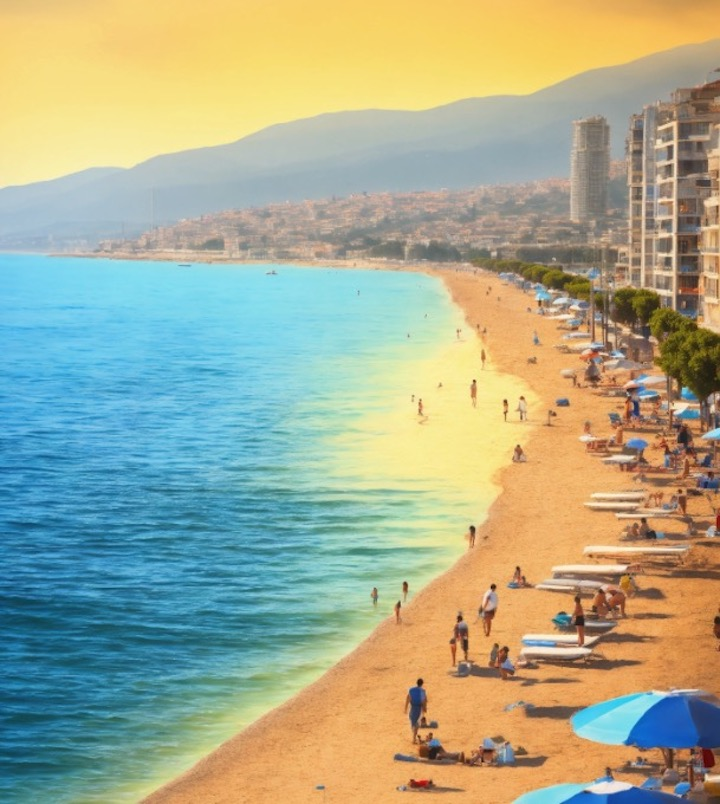
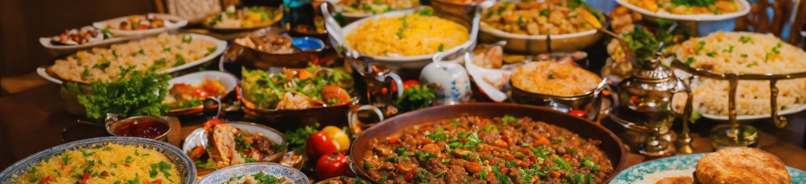

import ListingBlock from '../../components/elements/listing-block.astro';

## Contents

## Where to host a birthday party in Barcelona

Finding a cool activity or place for your birthday party in Barcelona can be tricky and it's hard to be original. Having had the same problem many times, I decided to write down all the things that I brainstormed when planning previous parties in Barcelona!

Some things below are in general quite good and you won't need an excuse to do them!

### Ideas for Food & Drinks parties in Barcelona

| Idea              | Example |
| :---------------- | :--------- |
| Buffet libre       | Hiro Sushi, Shoku Eixample |

- Buffet libres, eg: Hiro Sushi, Shoku Eixample
- Brazilian Buffet, Guanabara etc
- Hot pots, eg Badalona
- Craft beer tasting, eg Garage etc
- Wine tasting
- Bodega tour, eg: Cava Jaume Giró i Giró or Caves Codorniu
- Belgian Beers
- Pintxos, C/Blai
- Catalan Dinner, Los Caracoles, Can Culleretes, Els 4 Gats
- Fancy Tapas, Can Paixano, La Barra del 7 Portes | Pla de Palau, Jai Ca
- Saturday Morning Market Food: Bar Joan
- Esmorzar de Forquilla: Place in Gracia
- Steaks, eg Madurada, La Selva, El Gotico place, Buenos Aires grill, Carnal
- Galician Food: Porvenir, etc
- Beer Hall: Moritz Brewery, CocoVail
- Mexican Tacos on a terrace

### Ideas for Dance & Music parties in Barcelona

- Salsa, eg El Bombó, Machete, La Paloma
- Live music: Eg Craft BCN, La Belter
- Comedy Club
- Sala Plataforma
- Rock Night, Magic Bar
- Razzmatazz
- Apolo Club
- Marula Café (club night)
- DJ: Mad Radio
- Guzzo
- Bus Terrassa / El Forum
- BCN Beach Party (near Forum?)

### Ideas for Activities in Barcelona

- Laser tag, eg Play Point
- Cooking class
- Painting & wine
- Cocktail making class
- Bingo
- Snooker/ billiards
- Board Games Bar
- Karaoke, eg see post
- Boat Trip, eg Las Galondrinas
- Montjuic, Cable Car
- Museum of senses
- Guitar museum
- Santa Maria del Mar - Rooftop visit (needs booking)
- Escape room
- Axe Throwing, Born place
- Jumping Place trampolines
- Drag Show, Eixample
- Calçotada (seasonal, see post)
- BBQ yourself: Europa, Les Planes
- Beach & Picnic
- Volleyball Game
- Snorkelling trip Costa brava
- SUP Barceloneta
- Kayak tour CB

### Ideas for Fancy Locations to host a party in Barcelona

- Rooftop & DJ, such as Hoxton Hotel Rooftop (see post)
- Enchanted Drinks: Alice Secret Garden, Bosque de les Fades etc
- Cocktails, Farola, Paradiso, etc
- Speak Easy Hidden Cocktail Bar, eg Paradiso, Monk…
- Fancy Brunch, eg
- Mirador Drinks, Terrassa Martinez
- Harbour View: Above design museum
- New port espigo near Mapfre
- Summer drinks: Antic Teatre
- Mediterranean - El Cercle

### Related Private Hire companies in Barcelona

- Blackline cabs (for getting around and cheaufeuring/private taxis...)