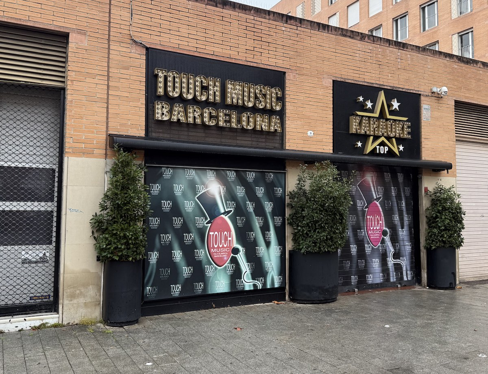
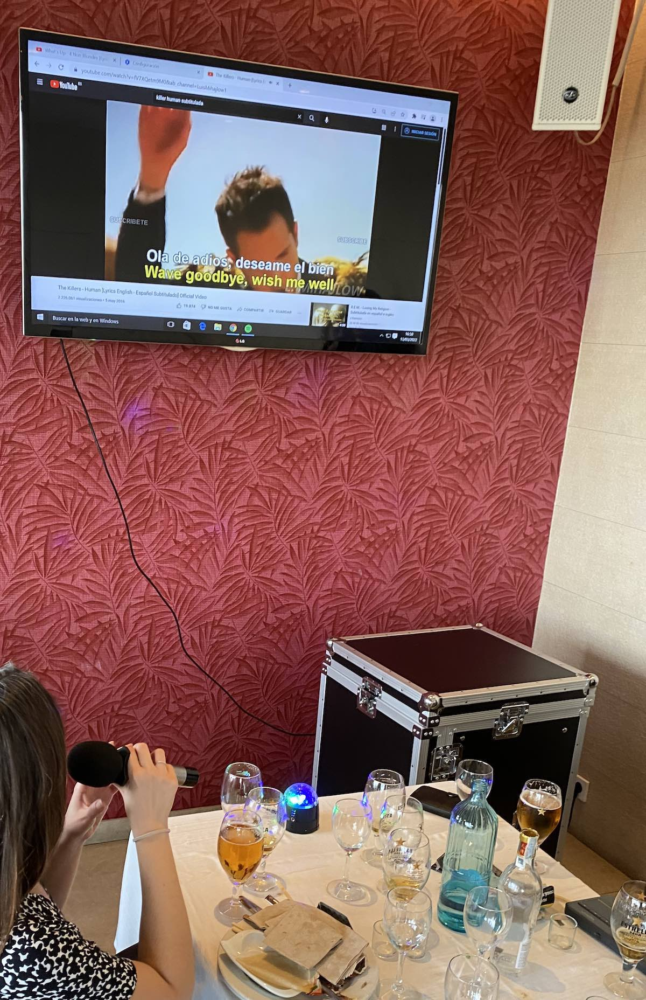
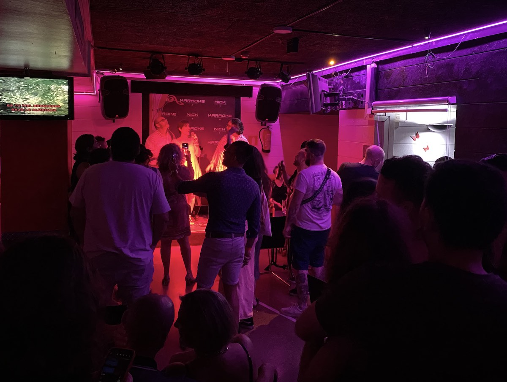

import ListingBlock from '../../components/elements/listing-block.astro';

## Contents

## Where to do Karaoke in barcelona

### Touch Music Karaoke

Touch Music is a late night karaoke bar near to Icària beach. If you don’t know the area too well you’ll need a map to find it as it's tucked away on a quiet street.

The place itself is quite big inside and on a Friday or Saturday night you’ll mainly find a mix of merry tourists and some locals slaughtering classic songs on stage with the occasional wannabe X-factor contestant! Still, it’s a great place to go for a laugh and usually goes on until late. The entrance is paid, but comes with a drink and there’s plenty of space inside for just watching or sitting at the bar.

They have a good repertoire so you’ll be sure to find your favourite song.

<ListingBlock
  address={'Carrer de Joan Miró, 8, Sant Martí, 08005 Barcelona'}
  map='https://maps.app.goo.gl/DRmJDByz69FrLtMY7'
>
</ListingBlock>

### A Viva Voz

[IMAGE]

Keep in mind that there’s two karaoke bars both called A Viva Voz so make sure to get the right one! The one on Muntaner in Eixample Dreta (CHECK) is the best and is a relatively big place. Drinks are a bit pricey but it’s never a boring moment here. It can also be quite busy before 22h and they have a good repertoire of music.

<ListingBlock
  placeName='Main one'
  address={'Carrer d\'Aribau, 103, L\'Eixample, 08036 Barcelona'}
  map='https://maps.app.goo.gl/m63LQUCbjRUSrW7G7'
>
</ListingBlock>

<ListingBlock
  placeName='Other one (note, this was closed when I went, but it exists apparently!)'
  address={'C/ de Rocafort, 187, L\'Eixample, 08029 Barcelona'}
  map='https://maps.app.goo.gl/n3dR3uwVPzihAYWd9'
>
</ListingBlock>

### Pato Pekín (Restaurant)

This place needs booking in advance and is a restaurant in general. They have a really cool karaoke dinner room which you can book (directly to the left when you enter the restaurant). It can fit about 12-15 people dining and you get a couple of microphones and essentially a computer, so you can put whatever you want on. One handy thing is that the door is more or less soundproofed, so you won’t interrupt the other diners! Also, the Chinese food is pretty good!

<ListingBlock
  address={'Torre Mapfre, Carrer de la Marina, 16, Sant Martí, 08005 Barcelona'}
  map='https://maps.app.goo.gl/Sn78M7sf4NAMFFSj8'
>
</ListingBlock>

### Wino (Restaurant)

[IMAGE]

Wino restaurant has 3 karaoke rooms, which can be privately hired. The good thing here is that you get Chinese food and drinks, plus the karaoke system, which is on a big TV on the wall (so no stage as such) and you can practice your singing skills from the dinner table if you want!

As of early 2024 they accept bookings on the basis that you spend at least a fixed amount, paid by 1 card. For their biggest room, which can host 20-30 people you have to pay an €80 deposit to secure the booking and ensure a minimum spend of €380 plus €12/hour to hire the room, so keep this in mind before booking. You also need to book in advance up to 3 months. They also have 2 other rooms available for hire.

<ListingBlock
  address={'C/ del Parlament, 46, L\'Eixample, 08015 Barcelona'}
  map='https://maps.app.goo.gl/91KXHbwA7oEQe4vr6'
>
</ListingBlock>

### Lucky Schmuck

[IMAGE]

Lucky Schmuck bar is part of the ‘Schmuck’ chain and they also have Two Schmucks and Fat Schmuck bars close by near Joaquìn Costa street.

Hidden in the back they have a small but very blingy karaoke suite. The sound quality is fairly good and it’s private and sound-proofed, but you’ll need to be a group of no more than about 8 due to its small size. A great laugh though and generally needs booking in advance.

<ListingBlock
  address={'Address: C/ de Joaquín Costa, 36, Ciutat Vella, 08001 Barcelona'}
  map='https://maps.app.goo.gl/o45ApatdT7LgkXVz5'
>
</ListingBlock>

### Karaoke Rooms Barcelona

If you are after a more private karaoke space where you can go with a big group of friends, you might want to check out Karaoke Rooms Barcelona. They have 7 rooms of different sizes and you can book them out for parties and events. It’s a bit out of town but still relatively close to Barcelona. Also, you don’t have a live audience so it can be good if you just want to have a laugh and sing karaoke with friends.

<ListingBlock
  address={'Av. del Carrilet, 237, 08907 L\'Hospitalet de Llobregat, Barcelona'}
  map='https://maps.app.goo.gl/cXG36ejSXRtSSmDo9'
>
</ListingBlock>

### Karaoke Nick

Some might see Karaoke Nick as a bit far out, but if you happen to be in this side of the city, say, near to Les Corts, then it’s worth a visit. Mainly due to the fact that it’s full of shameless people making a fool of themselves (in a good way!) and so worth it for the laugh. The microphone volume is low (probably for the best) but it’s a good laugh. Also, there’s a bar in the next room with a pool table if you don’t want to commit to singing and in general the place is open until very late!

<ListingBlock
  address={'Address: Av. de Madrid, 160, Sants-Montjuïc, 08028 Barcelona'}
  map='https://maps.app.goo.gl/FdLKR5Sd9aRUnUbr5'
>
</ListingBlock>

### Weekend

Situated just off Tetuan roundabout is Weekend bar. According to a reliable source, you have to pay to get in (€8), but it includes a drink.

<ListingBlock
  address={'C/ de la Diputació, 365, L\'Eixample, 08009 Barcelona'}
  map='https://maps.app.goo.gl/bJCk5sten1LxCUSV8'
>
</ListingBlock>

### Inflacion Bar
Inflacion Bar is only a small bar but they have a basic karaoke setup (TV + mic). It’s situated in the Gothic neighbourhood, near to the big Correus post office building.

<ListingBlock
  address={'Carrer Ample, 54, Ciutat Vella, 08002 Barcelona'}
  map='https://maps.app.goo.gl/QkGvUtretzNiE3vA8'
>
</ListingBlock>

## Other places

### Trabanqueta Bar Pub

Awaiting info

<ListingBlock
  address={'C/ de Mallorca, 329, L\'Eixample, 08037 Barcelona'}
  map='https://maps.app.goo.gl/DEEnQfLmh4nPRYiE7'
>
</ListingBlock>

### L'Oficina Gastrobar Barcelona

Awaiting info

<ListingBlock
  address={'C/ de Lepant, 416, Horta-Guinardó, 08025 Barcelona'}
  map='https://maps.app.goo.gl/FtuKXLtAsEkkHkPUA'
>
</ListingBlock>

---

So there you have it! If we missed any places then please let us know and we will add them to the list!
