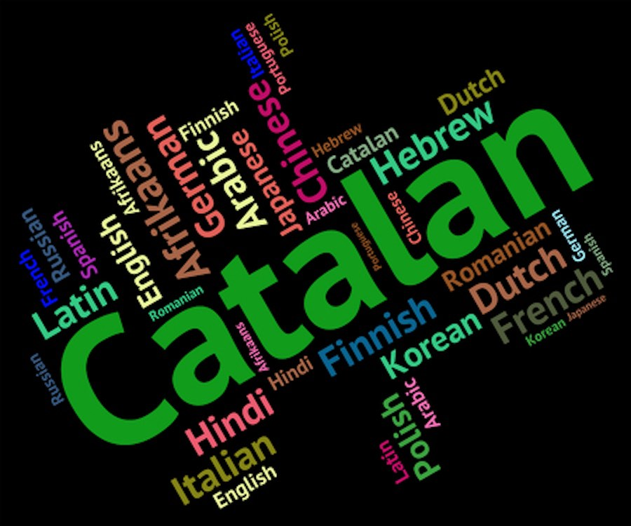

import ListingBlock from '../../components/elements/listing-block.astro';

## Contents

## Learning Catalan in Barcelona

From personal experience, it can actually be quite tricky to find learning resources and courses in which to practice and learn the language -- not to mention people with whom to speak and practice.

This post is aimed at people who are curious or keen to learn even a small amount of Catalan, which from personal experience can open a lot of doors while living in Barcelona.

Also, in my experience, a lot of expats and foreigners don't try to learn Catalan, for many reasons -- the main one's seeming to be:

1. Not having enough time outside of other commitments, such as work and _life_
2. Already focussing on the Spanish language first as a preference
3. Simply not wanting to
4. Not being confident in learning languages in general
5. Not being able to signup or understand signup processes or school marketing, since everything is in Catalan, ironically!
6. A multitude of other commitments already going on in their lives

Having said this, there are still people who have an interest, but might not know where to start and so this post is for you!

## Inscription days

The Catalan lessons typically run between:
1. September -> December
2. January -> March
3. March -> June
4. During summer, I'm not sure if there are classes, but paid schools will have openings, which aren't part of CPNL.

The days in which you can signup to the above term times are very strict, in the sense that if you aren't successful to be enrolled on signup day, you probably will have to wait until the next term!

Furthermore, the window of opportunity is from 9am on the day and most places are filled in the first 15 minutes!

Here's an example of the one in March 2025:

1. 25th March - preferencial signup for people who have already done a 
2. 26th
## Big mistakes to avoid!

From personally trying to sign-up to a Catalan course several times in Barcelona, here's my experience of how the system works.

1. You cannot expect that there will be places in the nearest learning centre near to your house - if you live in Barcelona, be prepared to travel to anywhere in Barcelona.
2. On inscription day ()
2. The demand for B1 and B2 seem very high. I just sign up to a

---
## Should I signup on line or go in person?

This is debatable but I'd say to go in person.

## Which level should I choose

CPNL offer courses from A1 -> C2. The levels are: (taken from their official course level marketing collateral, but translated into English)

---
## Online learning resource to learn Catalan

- Mention stuff in iPhone notes

## Problems with trying to learn Catalan

- You will fairly quickly notice that the things you learn in class are really the building blocks for useful phrases in every day conversation. For example - learning the names of items of clothing doesn't help you much to order a meal in a restaurant!

## Other ways to learn

- Check out Catalan television programmes or TV series. Plats Bruts is often mentioned a lot, but you might prefer something like Joc de Cartes (Barcelona restaurant show).

## What to expect in a class

Basic 1 - more listening, reading, writing, but speaking during class (and in Moodle to complete the course work)
Basic 3 - a focus more on speaking.