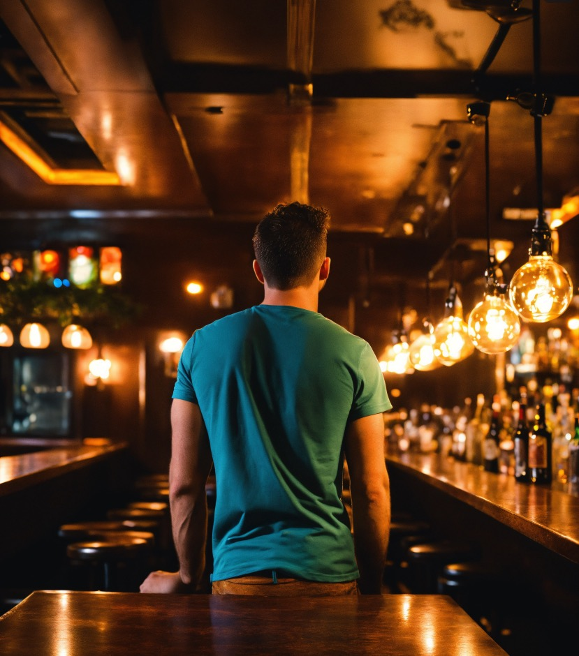

import ListingBlock from '../../components/elements/listing-block.astro';

## Contents

## Recommendations

The best place to watch the football in Barcelona will very much depend on the teams/countries that are playing, the type of game and of course the location and type of atmosphere that you're after.

Here is our **ultimate list** of places (_in no particular order_).

<strong>Note: Check before you arrive if your match is being shown.</strong>

<ul>
  <li>Not all bars show every match.</li>
  <li>Some bars don't show the international games</li>
  <li>The most popular places might turn you away at the door or make you queue for a long time!</li>
</ul>

---

### 1. The George Payne Irish Pub

<ListingBlock
  recommendation='Huge Irish bar with many screens. Usually gets very busy and you might even have to pay to get in for the big games!'
  address={'Pl. Urquinaona, 5, 08010 Barcelona'}
  map='https://maps.app.goo.gl/9PGoTa29j7GKHfxp8'
>
</ListingBlock>

### 2. Dunne’s Irish Bar

<ListingBlock
  recommendation=''
  address='Via Laietana, 19, 08003 Barcelona'
  map='https://maps.app.goo.gl/c8bfyTbtWTgRDD8HA'
>
</ListingBlock>

### 3. Diagonal Pool

<ListingBlock
  recommendation=''
  address="C/ de Joan Güell, 226, Les Corts, 08028 Barcelona"
  map='https://maps.app.goo.gl/bfz4ZzHiZD2P9psn9'
>
</ListingBlock>

### 4. L'Ovella Negra Marina

<ListingBlock
  recommendation="Note - L'Ovella Negre also have another bar - see below. This bar is the much bigger than their Ramblas location."
  address='Address: Carrer de Zamora, 78, Sant Martí, 08018 Barcelona'
  map='https://maps.app.goo.gl/Yj7iVkSUEmB4MtrF6'
>
</ListingBlock>

### 5. L'Ovella Negra Ramblas

<ListingBlock
  recommendation="Note - L'Ovella Negre also have another bar - see above"
  address='Address: Carrer de Zamora, 78, Sant Martí, 08018 Barcelona'
  map='https://maps.app.goo.gl/Yj7iVkSUEmB4MtrF6'
>
</ListingBlock>

### 6. Belushi’s Barcelona

<ListingBlock
  recommendation=''
  address="C/ de Bergara, 3, L'Eixample, 08002 Barcelona"
  map='https://maps.app.goo.gl/fe3UqoENDpbZ7o2V7'
>
</ListingBlock>

### 7. Michael Collins (La Sagrada Familia)

<ListingBlock
  recommendation=''
  address='Plaça Sagrada Família, 4, 08013 Barcelona'
  map='https://maps.app.goo.gl/VxVQ5tHknpVpRinw7'
>
</ListingBlock>

### 8. Capitán K10

<ListingBlock
  recommendation=''
  address='C/ de Padilla, 323, Eixample, 08025 Barcelona'
  map='https://maps.app.goo.gl/8KtNVmS2B7aekuc56'
>
</ListingBlock>

### 9. CocoVail Beer Hall

<ListingBlock
  recommendation=''
  address="C/ d'Aragó, 284, L'Eixample, 08009 Barcelona"
  map='https://maps.app.goo.gl/JRqdmpF12Y84G5im9'
>
</ListingBlock>

### 10. Flaherty’s Irish Pub

<ListingBlock
  address='Plaça de Joaquim Xirau, s/n, 08002 Barcelona'
  map='https://maps.app.goo.gl/y8DXtdzKqcLPEYXK6'
>
</ListingBlock>

### 11. Wild Rover

<ListingBlock
  address="C. de Sta. Mónica, 2, Ciutat Vella, 08001 Barcelona"
  map='https://maps.app.goo.gl/VyfyLvQNSV9BourR7'
>
</ListingBlock>

### 12. Dow Jones (Carrer del Bruc)

<ListingBlock
  address="C/ del Bruc, 97, L'Eixample, 08009 Barcelona"
  map='https://maps.app.goo.gl/F4w2zVALRGXabbss5'
>
</ListingBlock>

### 13. Dow Jones (Av. Diagonal)

<ListingBlock
  address="Av. Diagonal, 430, L'Eixample, 08037 Barcelona"
  map='https://maps.app.goo.gl/xA7erCfKhunY1Bkj9'
>
</ListingBlock>

### 14. McCarthy’s Bar

<ListingBlock
  recommendation=''
  address="Via Laietana, 44, 08003 Barcelona"
  map='https://maps.app.goo.gl/HnK1LWDtRZPaTyaG7'
>
</ListingBlock>

### 15. Cheers

<ListingBlock
  recommendation=''
  address="C/ de la Boqueria, 15, Ciutat Vella, 08002 Barcelona"
  map='https://maps.app.goo.gl/AzeGKrkkGmf9deU78'
>
</ListingBlock>

### 16. The Bullman

<ListingBlock
  recommendation=''
  address='C/ de Muntaner, 1, 08011 Barcelona'
  map='https://maps.app.goo.gl/FvjCP8SF2qFVct339'
>
</ListingBlock>

### 17. The Shamrock Bar

<ListingBlock
  recommendation=''
  address='The Shamrock Bar, C/ dels Tallers, 72, Ciutat Vella, 08001 Barcelona'
  map='https://maps.app.goo.gl/G6KaerhqUAGa63rB8'
>
</ListingBlock>

### 18. Scobies Irish Pub

<ListingBlock
  recommendation=''
  address='Ronda de la Univ., 8, 08007 Barcelona'
  map='https://maps.app.goo.gl/KpqgxDwiyNSmFUD47'
>
</ListingBlock>

### 19. The Fastnet Pub

<ListingBlock
  recommendation=''
  address='Address: Pg. de Joan de Borbó, 22, 08003 Barcelona'
  map='https://maps.app.goo.gl/PNi7yoaA6WJQFBv1A'
>
</ListingBlock>

### 20. The James Joyce

<ListingBlock
  recommendation=''
  address='C/ de Casp, 92, 08010 Barcelona'
  map='https://maps.app.goo.gl/fqKSCM4YQNu5bFZX8'
>
</ListingBlock>

### 21. Bar Amsterdam

<ListingBlock
  recommendation=''
  address="C/ d'Aragó, 305, L'Eixample, 08009 Barcelona"
  map='https://maps.app.goo.gl/U6rKX6aCyeutkwHn7'
>
</ListingBlock>

### 22. Green Room

<ListingBlock
  recommendation=''
  address="Rambla del Poblenou, 20, Sant Martí, 08005 Barcelona"
  map='https://maps.app.goo.gl/MUAeoDAiJdZmgqqXA'
>
</ListingBlock>

### 23. Beercelona Bar

<ListingBlock
  recommendation='Can be hit or miss, so check before you go!'
  address="Rambla del Poblenou, 118, Sant Martí, 08005 Barcelona"
  map='https://maps.app.goo.gl/9A4UvK1QrXycH7h56'
>
</ListingBlock>

### 24. Bloomsday Irish Pub

<ListingBlock
  address='La Rambla, 21, 08002 Barcelona'
  map='https://maps.app.goo.gl/afNA4tJXbegUw7ne6'
>
</ListingBlock>

### 25. Irish Pub Temple Bar

<ListingBlock
  address='C/ de Ferran, 6, Ciutat Vella, 08002 Barcelona'
  map='https://maps.app.goo.gl/t377C8zo3qTFLSvr7'
>
</ListingBlock>

### 26. Sports Bar (Diagonal)

<ListingBlock
  address='Av. Diagonal, 123, Sant Martí, 08018 Barcelona'
  map='https://maps.app.goo.gl/R5Au6DBPxWHrfy4E6'
>
</ListingBlock>

### 27. Sports Bar (Carrer Ample)

<ListingBlock
  address='Carrer Ample, 51, Ciutat Vella, 08002 Barcelona'
  map='https://maps.app.goo.gl/A3Nfy2cfLcjxK1wSA'
>
</ListingBlock>

### 28. Lennox the Pub - Palau
<ListingBlock
  address="Pla de Palau, 9, Ciutat Vella, 08003 Barcelona"
  map='https://maps.app.goo.gl/uLyJQqZhN26nWZfN8'
>
</ListingBlock>

### 29. La República RestoBar

<ListingBlock
  address='Carrer de la Mercè, 13, Ciutat Vella, 08002 Barcelona'
  map='https://maps.app.goo.gl/8fkmmmHm2D7MqCnGA'
>
</ListingBlock>

### 30. La Percera de Pool

<ListingBlock
  address="C. de Calàbria, 171, L'Eixample, 08015 Barcelona"
  map='https://maps.app.goo.gl/7nvBXP19r2Ti2ftb7'
>
</ListingBlock>

### 31. The City Tavern (f.k.a. Beer City)

<ListingBlock
  address='Plaça de Narcís Oller, 9, Gràcia, 08006 Barcelona'
  map='https://maps.app.goo.gl/vqCuNMRofbcu2eNc7'
>
</ListingBlock>

### 32. Retruc
<ListingBlock
  address="Gran Via de les Corts Catalanes, 399, L'Eixample, 08015 Barcelona"
  map='https://maps.app.goo.gl/1kneQ9T15UQTeiRd9'
>
</ListingBlock>

### 33. Dublin Sports Tavern
<ListingBlock
  address='Plaça de Joan Llongueras, 5, Sarrià-Sant Gervasi, 08021 Barcelona'
  map='https://maps.app.goo.gl/XvPPFS6RtA3GpMoK6'
>
</ListingBlock>

### 34. Frankfurt Munich
<ListingBlock
  address='Carrer del Comandant Benítez, 18, Les Corts, 08028 Barcelona'
  map='https://maps.app.goo.gl/WHejEQAp2FGYN8E99'
>
</ListingBlock>

### 35. Bar de Tapas Atlanta

<ListingBlock
  address='Rambla del Raval, 13, Ciutat Vella, 08011 Barcelona'
  map='https://maps.app.goo.gl/6zE7axbvGr2bsDvCA'
>
</ListingBlock>

### 36. El Rincón del Artista
<ListingBlock
  address='C/ Nou de la Rambla, 105, Ciutat Vella, 08001 Barcelona'
  map='https://maps.app.goo.gl/YAfJmKYw5jJpF6hQ7'
>
</ListingBlock>

### 37. Copasetic
<ListingBlock
  address="C/ de la Diputació, 55, L'Eixample, 08015 Barcelona"
  map='https://maps.app.goo.gl/vuWgwEBjpkXNnFfG7'
>
</ListingBlock>

### 38. Almiral
<ListingBlock
  address="C/ d'Aragó, 625, Sant Martí, 08026 Barcelona"
  map='https://maps.app.goo.gl/Bo2cz7b2wfGUCawV6'
>
</ListingBlock>

### 39. Seven Sports Bar Barcelona
<ListingBlock
  address="C/ de Balmes, 64, L'Eixample, 08007 Barcelona"
  map='https://maps.app.goo.gl/i3M3JetLTSS45HfcA'
>
</ListingBlock>

### 40. Bar Sorio
<ListingBlock
  address="C. de la Indústria, 120, L'Eixample, 08025 Barcelona"
  map='https://maps.app.goo.gl/y3dVYCvNDB6gLxd4A'
>
</ListingBlock>

### 41. Equinox
<ListingBlock
  address='C/ de Verdi, 21-23, Gràcia, 08012 Barcelona'
  map='https://maps.app.goo.gl/K6a9MUtWwDv8u6bH9'
>
</ListingBlock>

### 42. Frankfurt & Beer EME
<ListingBlock
  address="Calle de Nazaret, 46, 08902 L'Hospitalet de Llobregat, Barcelona"
  map='https://maps.app.goo.gl/DBdp6ujnFoc2axYZ8'
  recommendation='This bar is just outside Barcelona, located in Hospitalet neighbourhood. Can be useful if you are living or staying in that area.'
>
</ListingBlock>

### 43. Michael's Tavern
<ListingBlock
  address="C/ de Concepción Arenal, 213, Sant Andreu, 08030 Barcelona"
  map='https://maps.app.goo.gl/UYAVDdUtyGrbxFN26'
  recommendation='This bar is a bit further out, located in Sant Andreu neighbourhood. Can be useful if you are living or staying in that area.'
>
</ListingBlock>

### 44. Cerveseria Vaso de Oro

Waiting for confirmation!

<ListingBlock
  address='C/ de Balboa, 6, Ciutat Vella, 08003 Barcelona'
  map='https://maps.app.goo.gl/LVuRB79HW77LZK9f8'
>
</ListingBlock>

### 45. Guingueta Bo Kaap

<ListingBlock
  address='Playa Bogatell, Av. del Litoral, s/n, Q2, Sant Martí, 08005 Barcelona'
  map='https://maps.app.goo.gl/2S3s98yi1PtaGBA6A'
  recommendation='This place and several other Chiringuito beach bars closeby usually show the big matches.'
>
</ListingBlock>

### 46. Chiringuito Mokai Beach

<ListingBlock
  address='Avinguda del Litoral, 08005 Barcelona'
  map='https://maps.app.goo.gl/fZngY1Uhw3HKbtwF6'
  recommendation='This place and several other Chiringuito beach bars closeby usually show the big matches.'
>
</ListingBlock>

### 47. @L13 Sports Bar

<ListingBlock
  address='Carrer del Taulat, 1, Sant Martí, 08005 Barcelona'
  map='https://maps.app.goo.gl/UTwsvCA5H69svE9x6'
  
>
</ListingBlock>

### 48. Alta Galícia

<ListingBlock
  address='Rambla del Poblenou, 93, 95, Sant Martí, 08005 Barcelona'
  map='https://maps.app.goo.gl/Jrd3iTpqmtrs6PSa7'
  
>
</ListingBlock>

### 49. BrewDog Barcelona

<ListingBlock
  address='Carrer de Casanova, 69, Eixample, 08011 Barcelona'
  map='https://maps.app.goo.gl/QEb1xYZAHhFcApUY8'
  
>
</ListingBlock>

### 50. Madre Lievito Sant Martí

<ListingBlock
  address='C/ dels Almogàvers, 148, Sant Martí, 08018 Barcelona'
  map='https://maps.app.goo.gl/TQmXtpKq16vMVcqs5'
  recommendation='Usually they just show the big games and mainly when Italy play, since it is a restaurant'
>
</ListingBlock>

### 51. Restaurant Pasa Tapas Barceloneta

<ListingBlock
  address='C/ del Dr. Aiguader, 8, Ciutat Vella, 08003 Barcelona'
  map='https://maps.app.goo.gl/shiCGXQMcxw1oWu19'
>
</ListingBlock>

—--

That's it for now! Did we miss one? Please let us know and we will add it!

